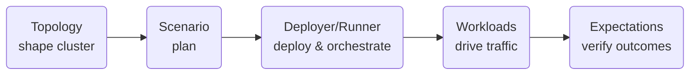
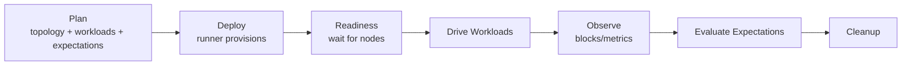
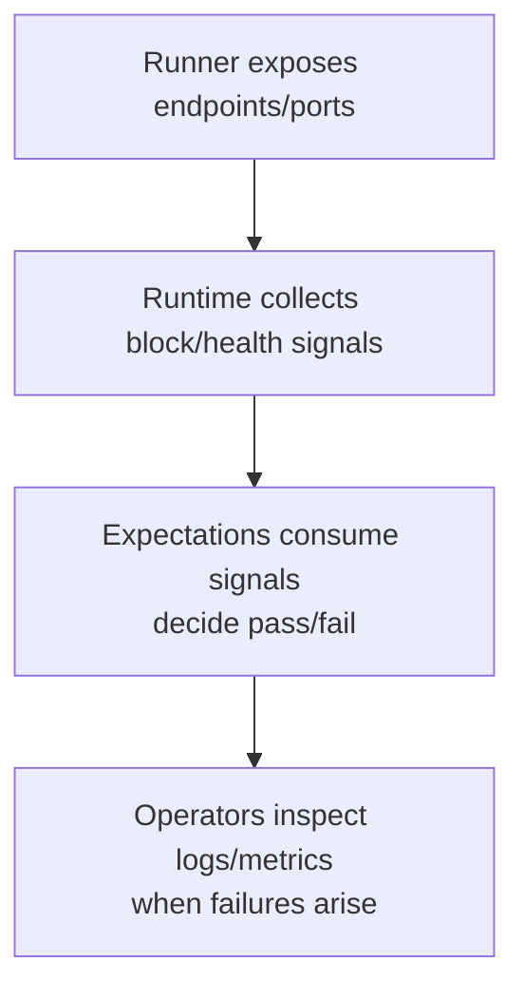

# Nomos Testing Framework — Combined Reference

## Project Context Primer
This book focuses on the Nomos Testing Framework. It assumes familiarity with
the Nomos architecture, but for completeness, here is a short primer.

- **Nomos** is a modular blockchain protocol composed of validators, executors,
  and a data-availability (DA) subsystem.
- **Validators** participate in consensus and produce blocks.
- **Executors** run application logic or off-chain computations referenced by
  blocks.
- **Data Availability (DA)** ensures that data referenced in blocks is
  published and retrievable, including blobs or channel data used by workloads.

These roles interact tightly, which is why meaningful testing must be performed
in multi-node environments that include real networking, timing, and DA
interaction.

## What You Will Learn
This book gives you a clear mental model for Nomos multi-node testing, shows how
to author scenarios that pair realistic workloads with explicit expectations,
and guides you to run them across local, containerized, and cluster environments
without changing the plan.

## Part I — Foundations

### Introduction
The Nomos Testing Framework is a purpose-built toolkit for exercising Nomos in
realistic, multi-node environments. It solves the gap between small, isolated
tests and full-system validation by letting teams describe a cluster layout,
drive meaningful traffic, and assert the outcomes in one coherent plan.

It is for protocol engineers, infrastructure operators, and QA teams who need
repeatable confidence that validators, executors, and data-availability
components work together under network and timing constraints.

Multi-node integration testing is required because many Nomos behaviors—block
progress, data availability, liveness under churn—only emerge when several
roles interact over real networking and time. This framework makes those checks
declarative, observable, and portable across environments.

### Architecture Overview
The framework follows a clear flow: **Topology → Scenario → Runner → Workloads → Expectations**.

- **Topology** describes the cluster: how many nodes, their roles, and the high-level network and data-availability parameters they should follow.
- **Scenario** combines that topology with the activities to run and the checks to perform, forming a single plan.
- **Deployer/Runner** pair turns the plan into a live environment on the chosen backend (local processes, Docker Compose, or Kubernetes) and brokers readiness.
- **Workloads** generate traffic and conditions that exercise the system.
- **Expectations** observe the run and judge success or failure once activity completes.

Conceptual diagram:
```
Topology  →  Scenario  →  Runner  →  Workloads  →  Expectations
 (shape       (plan)      (deploy     (drive         (verify
 cluster)                & orchestrate) traffic)     outcomes)
```

Mermaid view:


Each layer has a narrow responsibility so that cluster shape, deployment choice, traffic generation, and health checks can evolve independently while fitting together predictably.

### Testing Philosophy
- **Declarative over imperative**: describe the desired cluster shape, traffic, and success criteria; let the framework orchestrate the run.
- **Observable health signals**: prefer liveness and inclusion signals that reflect real user impact instead of internal debug state.
- **Determinism first**: default scenarios aim for repeatable outcomes with fixed topologies and traffic rates; variability is opt-in.
- **Targeted non-determinism**: introduce randomness (e.g., restarts) only when probing resilience or operational robustness.
- **Protocol time, not wall time**: reason in blocks and protocol-driven intervals to reduce dependence on host speed or scheduler noise.
- **Minimum run window**: always allow enough block production to make assertions meaningful; very short runs risk false confidence.
- **Use chaos with intent**: chaos workloads are for recovery and fault-tolerance validation, not for baseline functional checks.

### Scenario Lifecycle (Conceptual)
1. **Build the plan**: Declare a topology, attach workloads and expectations, and set the run window. The plan is the single source of truth for what will happen.
2. **Deploy**: Hand the plan to a runner. It provisions the environment on the chosen backend and waits for nodes to signal readiness.
3. **Drive workloads**: Start traffic and behaviors (transactions, data-availability activity, restarts) for the planned duration.
4. **Observe blocks and signals**: Track block progression and other high-level metrics during or after the run window to ground assertions in protocol time.
5. **Evaluate expectations**: Once activity stops (and optional cooldown completes), check liveness and workload-specific outcomes to decide pass or fail.
6. **Cleanup**: Tear down resources so successive runs start fresh and do not inherit leaked state.

Conceptual lifecycle diagram:
```
Plan → Deploy → Readiness → Drive Workloads → Observe → Evaluate → Cleanup
```

Mermaid view:


### Design Rationale
- **Modular crates** keep configuration, orchestration, workloads, and runners decoupled so each can evolve without breaking the others.
- **Pluggable runners** let the same scenario run on a laptop, a Docker host, or a Kubernetes cluster, making validation portable across environments.
- **Separated workloads and expectations** clarify intent: what traffic to generate versus how to judge success. This simplifies review and reuse.
- **Declarative topology** makes cluster shape explicit and repeatable, reducing surprise when moving between CI and developer machines.
- **Maintainability through predictability**: a clear flow from plan to deployment to verification lowers the cost of extending the framework and interpreting failures.

## Part II — User Guide

### Workspace Layout
The workspace focuses on multi-node integration testing and sits alongside a `nomos-node` checkout. Its crates separate concerns to keep scenarios repeatable and portable:

- **Configs**: prepares high-level node, network, tracing, and wallet settings used across test environments.
- **Core scenario orchestration**: the engine that holds topology descriptions, scenario plans, runtimes, workloads, and expectations.
- **Workflows**: ready-made workloads (transactions, data-availability, chaos) and reusable expectations assembled into a user-facing DSL.
- **Runners**: deployment backends for local processes, Docker Compose, and Kubernetes, all consuming the same scenario plan.
- **Test workflows**: example scenarios and integration checks that show how the pieces fit together.

This split keeps configuration, orchestration, reusable traffic patterns, and deployment adapters loosely coupled while sharing one mental model for tests.

### Annotated Tree
High-level view of the workspace and how pieces relate:
```
nomos-testing/
├─ testing-framework/
│  ├─ configs/          # shared configuration helpers
│  ├─ core/             # scenario model, runtime, topology
│  ├─ workflows/        # workloads, expectations, DSL extensions
│  └─ runners/          # local, compose, k8s deployment backends
├─ tests/               # integration scenarios using the framework
└─ scripts/             # supporting setup utilities (e.g., assets)
```

Each area maps to a responsibility: describe configs, orchestrate scenarios, package common traffic and assertions, adapt to environments, and demonstrate end-to-end usage.

### Authoring Scenarios
Creating a scenario is a declarative exercise:

1. **Shape the topology**: decide how many validators and executors to run, and what high-level network and data-availability characteristics matter for the test.
2. **Attach workloads**: pick traffic generators that align with your goals (transactions, data-availability blobs, or chaos for resilience probes).
3. **Define expectations**: specify the health signals that must hold when the run finishes (e.g., consensus liveness, inclusion of submitted activity; see [Core Content: Workloads & Expectations](workloads.md)).
4. **Set duration**: choose a run window long enough to observe meaningful block progression and the effects of your workloads.
5. **Choose a runner**: target local processes for fast iteration, Docker Compose for reproducible multi-node stacks, or Kubernetes for cluster-grade validation. For environment considerations, see [Operations](operations.md).

Keep scenarios small and explicit: make the intended behavior and the success criteria clear so failures are easy to interpret and act upon.

### Core Content: Workloads & Expectations
Workloads describe the activity a scenario generates; expectations describe the signals that must hold when that activity completes. Both are pluggable so scenarios stay readable and purpose-driven.

#### Workloads
- **Transaction workload**: submits user-level transactions at a configurable rate and can limit how many distinct actors participate.
- **Data-availability workload**: drives blob and channel activity to exercise data-availability paths.
- **Chaos workload**: triggers controlled node restarts to test resilience and recovery behaviors (requires a runner that can control nodes).

#### Expectations
- **Consensus liveness**: verifies the system continues to produce blocks in line with the planned workload and timing window.
- **Workload-specific checks**: each workload can attach its own success criteria (e.g., inclusion of submitted activity) so scenarios remain concise.

Together, workloads and expectations let you express both the pressure applied to the system and the definition of “healthy” for that run.

Workload pipeline (conceptual):
```
Inputs (topology + wallets + rates)
    │
    ▼
Workload init → Drive traffic → Collect signals
                                   │
                                   ▼
                           Expectations evaluate
```

Mermaid view:
```mermaid
flowchart TD
    I[Inputs<br/>(topology + wallets + rates)] --> Init[Workload init]
    Init --> Drive[Drive traffic]
    Drive --> Collect[Collect signals]
    Collect --> Eval[Expectations evaluate]
```

### Core Content: ScenarioBuilderExt Patterns
Patterns that keep scenarios readable and reusable:

- **Topology-first**: start by shaping the cluster (counts, layout) so later steps inherit a clear foundation.
- **Bundle defaults**: use the DSL helpers to attach common expectations (like liveness) whenever you add a matching workload, reducing forgotten checks.
- **Intentional rates**: express traffic in per-block terms to align with protocol timing rather than wall-clock assumptions.
- **Opt-in chaos**: enable restart patterns only in scenarios meant to probe resilience; keep functional smoke tests deterministic.
- **Wallet clarity**: seed only the number of actors you need; it keeps transaction scenarios deterministic and interpretable.

These patterns make scenario definitions self-explanatory while staying aligned with the framework’s block-oriented timing model.

### Best Practices
- **State your intent**: document the goal of each scenario (throughput, DA validation, resilience) so expectation choices are obvious.
- **Keep runs meaningful**: choose durations that allow multiple blocks and make timing-based assertions trustworthy.
- **Separate concerns**: start with deterministic workloads for functional checks; add chaos in dedicated resilience scenarios to avoid noisy failures.
- **Reuse patterns**: standardize on shared topology and workload presets so results are comparable across environments and teams.
- **Observe first, tune second**: rely on liveness and inclusion signals to interpret outcomes before tweaking rates or topology.
- **Environment fit**: pick runners that match the feedback loop you need—local for speed, compose for reproducible stacks, k8s for cluster-grade fidelity.
- **Minimal surprises**: seed only necessary wallets and keep configuration deltas explicit when moving between CI and developer machines.

### Examples
Concrete scenario shapes that illustrate how to combine topologies, workloads, and expectations. Adjust counts, rates, and durations to fit your environment.

#### Simple 2-validator transaction workload
- **Topology**: two validators.
- **Workload**: transaction submissions at a modest per-block rate with a small set of wallet actors.
- **Expectations**: consensus liveness and inclusion of submitted activity.
- **When to use**: smoke tests for consensus and transaction flow on minimal hardware.

#### DA + transaction workload
- **Topology**: validators plus executors if available.
- **Workloads**: data-availability blobs/channels and transactions running together to stress both paths.
- **Expectations**: consensus liveness and workload-level inclusion/availability checks.
- **When to use**: end-to-end coverage of transaction and DA layers in one run.

#### Chaos + liveness check
- **Topology**: validators (optionally executors) with node control enabled.
- **Workloads**: baseline traffic (transactions or DA) plus chaos restarts on selected roles.
- **Expectations**: consensus liveness to confirm the system keeps progressing despite restarts; workload-specific inclusion if traffic is present.
- **When to use**: resilience validation and operational readiness drills.

### Advanced & Artificial Examples
These illustrative scenarios stretch the framework to show how to build new workloads, expectations, deployers, and topology tricks. They are intentionally “synthetic” to teach capabilities rather than prescribe production tests.

#### Synthetic Delay Workload (Network Latency Simulation)
- **Idea**: inject fake latency between node interactions using internal timers, not OS-level tooling.
- **Demonstrates**: sequencing control inside a workload, verifying protocol progression under induced lag, using timers to pace submissions.
- **Shape**: wrap submissions in delays that mimic slow peers; ensure the expectation checks blocks still progress.

#### Oscillating Load Workload (Traffic Waves)
- **Idea**: traffic rate changes every block or N seconds (e.g., blocks 1–3 low, 4–5 high, 6–7 zero, repeat).
- **Demonstrates**: dynamic, stateful workloads that use `RunMetrics` to time phases; modeling real-world burstiness.
- **Shape**: schedule per-phase rates; confirm inclusion/liveness across peaks and troughs.

#### Byzantine Behavior Mock
- **Idea**: a workload that drops half its planned submissions, sometimes double-submits, and intentionally triggers expectation failures.
- **Demonstrates**: negative testing, resilience checks, and the value of clear expectations when behavior is adversarial by design.
- **Shape**: parameterize drop/double-submit probabilities; pair with an expectation that documents what “bad” looks like.

#### Custom Expectation: Block Finality Drift
- **Idea**: assert the last few blocks differ and block time stays within a tolerated drift budget.
- **Demonstrates**: consuming `BlockFeed` or time-series metrics to validate protocol cadence; crafting post-run assertions around block diversity and timing.
- **Shape**: collect recent blocks, confirm no duplicates, and compare observed intervals to a drift threshold.

#### Custom Deployer: Dry-Run Deployer
- **Idea**: a deployer that never starts nodes; it emits configs, simulates readiness, provides fake blockfeed/metrics.
- **Demonstrates**: full power of the deployer interface for CI dry-runs, config verification, and ultra-fast feedback without Nomos binaries.
- **Shape**: produce logs/artifacts, stub readiness, and feed synthetic blocks so expectations can still run.

#### Stochastic Topology Generator
- **Idea**: topology parameters change at runtime (random validators, DA settings, network shapes).
- **Demonstrates**: randomized property testing and fuzzing approaches to topology building.
- **Shape**: pick roles and network layouts randomly per run; keep expectations tolerant to variability while still asserting core liveness.

#### Multi-Phase Scenario (“Pipelines”)
- **Idea**: scenario runs in phases (e.g., phase 1 transactions, phase 2 DA, phase 3 restarts, phase 4 sync check).
- **Demonstrates**: multi-stage tests, modular scenario assembly, and deliberate lifecycle control.
- **Shape**: drive phase-specific workloads/expectations sequentially; enforce clear boundaries and post-phase checks.

### Running Scenarios
Running a scenario follows the same conceptual flow regardless of environment:

1. Select or author a scenario plan that pairs a topology with workloads, expectations, and a suitable run window.
2. Choose a runner aligned with your environment (local, compose, or k8s) and ensure its prerequisites are available.
3. Deploy the plan through the runner; wait for readiness signals before starting workloads.
4. Let workloads drive activity for the planned duration; keep observability signals visible so you can correlate outcomes.
5. Evaluate expectations and capture results as the primary pass/fail signal.

Use the same plan across different runners to compare behavior between local development and CI or cluster settings. For environment prerequisites and flags, see [Operations](operations.md).

### Runners
Runners turn a scenario plan into a live environment while keeping the plan unchanged. Choose based on feedback speed, reproducibility, and fidelity. For environment and operational considerations, see [Operations](operations.md):

#### Local runner
- Launches node processes directly on the host.
- Fastest feedback loop and minimal orchestration overhead.
- Best for development-time iteration and debugging.

#### Docker Compose runner
- Starts nodes in containers to provide a reproducible multi-node stack on a single machine.
- Discovers service ports and wires observability for convenient inspection.
- Good balance between fidelity and ease of setup.

#### Kubernetes runner
- Deploys nodes onto a cluster for higher-fidelity, longer-running scenarios.
- Suits CI or shared environments where cluster behavior and scheduling matter.

#### Common expectations
- All runners require at least one validator and, for transaction scenarios, access to seeded wallets.
- Readiness probes gate workload start so traffic begins only after nodes are reachable.
- Environment flags can relax timeouts or increase tracing when diagnostics are needed.

Runner abstraction:
```
Scenario Plan
    │
    ▼
Runner (local | compose | k8s)
    │  provisions env + readiness
    ▼
Runtime + Observability
    │
    ▼
Workloads / Expectations execute
```

Mermaid view:
```mermaid
flowchart TD
    Plan[Scenario Plan] --> RunSel{Runner<br/>(local | compose | k8s)}
    RunSel --> Provision[Provision & readiness]
    Provision --> Runtime[Runtime + observability]
    Runtime --> Exec[Workloads & Expectations execute]
```

### Operations
Operational readiness focuses on prerequisites, environment fit, and clear signals:

- **Prerequisites**: keep a sibling `nomos-node` checkout available; ensure the chosen runner’s platform needs are met (local binaries for host runs, Docker for compose, cluster access for k8s).
- **Artifacts**: some scenarios depend on prover or circuit assets; fetch them ahead of time with the provided helper scripts when needed.
- **Environment flags**: use slow-environment toggles to relax timeouts, enable tracing when debugging, and adjust observability ports to avoid clashes.
- **Readiness checks**: verify runners report node readiness before starting workloads; this avoids false negatives from starting too early.
- **Failure triage**: map failures to missing prerequisites (wallet seeding, node control availability), runner platform issues, or unmet expectations. Start with liveness signals, then dive into workload-specific assertions.

Treat operational hygiene—assets present, prerequisites satisfied, observability reachable—as the first step to reliable scenario outcomes.

Metrics and observability flow:
```
Runner exposes endpoints/ports
    │
    ▼
Runtime collects block/health signals
    │
    ▼
Expectations consume signals to decide pass/fail
    │
    ▼
Operators inspect logs/metrics when failures arise
```

Mermaid view:


## Part III — Developer Reference

### Scenario Model (Developer Level)
The scenario model defines clear, composable responsibilities:

- **Topology**: a declarative description of the cluster—how many nodes, their roles, and the broad network and data-availability characteristics. It represents the intended shape of the system under test.
- **Scenario**: a plan combining topology, workloads, expectations, and a run window. Building a scenario validates prerequisites (like seeded wallets) and ensures the run lasts long enough to observe meaningful block progression.
- **Workloads**: asynchronous tasks that generate traffic or conditions. They use shared context to interact with the deployed cluster and may bundle default expectations.
- **Expectations**: post-run assertions. They can capture baselines before workloads start and evaluate success once activity stops.
- **Runtime**: coordinates workloads and expectations for the configured duration, enforces cooldowns when control actions occur, and ensures cleanup so runs do not leak resources.

Developers extending the model should keep these boundaries strict: topology describes, scenarios assemble, runners deploy, workloads drive, and expectations judge outcomes. For guidance on adding new capabilities, see [Extending the Framework](extending.md).

### Extending the Framework
#### Adding a workload
1) Implement the workload contract: provide a name, optional bundled expectations, validate prerequisites up front, and drive asynchronous activity against the deployed cluster.
2) Export it through the workflows layer and consider adding DSL helpers for ergonomic wiring.

#### Adding an expectation
1) Implement the expectation contract: capture baselines if needed and evaluate outcomes after workloads finish; report meaningful errors to aid debugging.
2) Expose reusable expectations from the workflows layer so scenarios can attach them declaratively.

#### Adding a runner
1) Implement the deployer contract for the target backend, producing a runtime context with client access, metrics endpoints, and optional node control.
2) Preserve cleanup guarantees so resources are reclaimed even when runs fail; mirror readiness and observation signals used by existing runners for consistency.

#### Adding topology helpers
Extend the topology description with new layouts or presets while keeping defaults safe and predictable; favor declarative inputs over ad hoc logic so scenarios stay reviewable.

### Internal Crate Reference
High-level roles of the crates that make up the framework:

- **Configs**: prepares reusable configuration primitives for nodes, networking, tracing, data availability, and wallets, shared by all scenarios and runners.
- **Core scenario orchestration**: houses the topology and scenario model, runtime coordination, node clients, and readiness/health probes.
- **Workflows**: packages workloads and expectations into reusable building blocks and offers a fluent DSL to assemble them.
- **Runners**: implements deployment backends (local host, Docker Compose, Kubernetes) that all consume the same scenario plan.
- **Test workflows**: example scenarios and integration checks that exercise the framework end to end and serve as living documentation.

Use this map to locate where to add new capabilities: configuration primitives in configs, orchestration changes in core, reusable traffic/assertions in workflows, environment adapters in runners, and demonstrations in tests.

### Example: New Workload & Expectation (Rust)
A minimal, end-to-end illustration of adding a custom workload and matching expectation. This shows the shape of the traits and where to plug into the framework; expand the logic to fit your real test.

#### Workload: simple reachability probe
Key ideas:
- **name**: identifies the workload in logs.
- **expectations**: workloads can bundle defaults so callers don’t forget checks.
- **init**: derive inputs from the generated topology (e.g., pick a target node).
- **start**: drive async activity using the shared `RunContext`.

```rust
use std::sync::Arc;
use async_trait::async_trait;
use testing_framework_core::scenario::{
    DynError, Expectation, RunContext, RunMetrics, Workload,
};
use testing_framework_core::topology::GeneratedTopology;

pub struct ReachabilityWorkload {
    target_idx: usize,
    bundled: Vec<Box<dyn Expectation>>,
}

impl ReachabilityWorkload {
    pub fn new(target_idx: usize) -> Self {
        Self {
            target_idx,
            bundled: vec![Box::new(ReachabilityExpectation::new(target_idx))],
        }
    }
}

#[async_trait]
impl Workload for ReachabilityWorkload {
    fn name(&self) -> &'static str {
        "reachability_workload"
    }

    fn expectations(&self) -> Vec<Box<dyn Expectation>> {
        self.bundled.clone()
    }

    fn init(
        &mut self,
        topology: &GeneratedTopology,
        _metrics: &RunMetrics,
    ) -> Result<(), DynError> {
        if topology.validators().get(self.target_idx).is_none() {
            return Err("no validator at requested index".into());
        }
        Ok(())
    }

    async fn start(&self, ctx: &RunContext) -> Result<(), DynError> {
        let client = ctx
            .clients()
            .validators()
            .get(self.target_idx)
            .ok_or("missing target client")?;

        // Pseudo-action: issue a lightweight RPC to prove reachability.
        client.health_check().await.map_err(|e| e.into())
    }
}
```

#### Expectation: confirm the target stayed reachable
Key ideas:
- **start_capture**: snapshot baseline if needed (not used here).
- **evaluate**: assert the condition after workloads finish.

```rust
use async_trait::async_trait;
use testing_framework_core::scenario::{DynError, Expectation, RunContext};

pub struct ReachabilityExpectation {
    target_idx: usize,
}

impl ReachabilityExpectation {
    pub fn new(target_idx: usize) -> Self {
        Self { target_idx }
    }
}

#[async_trait]
impl Expectation for ReachabilityExpectation {
    fn name(&self) -> &str {
        "target_reachable"
    }

    async fn evaluate(&mut self, ctx: &RunContext) -> Result<(), DynError> {
        let client = ctx
            .clients()
            .validators()
            .get(self.target_idx)
            .ok_or("missing target client")?;

        client.health_check().await.map_err(|e| {
            format!("target became unreachable during run: {e}").into()
        })
    }
}
```

#### How to wire it
- Build your scenario as usual and call `.with_workload(ReachabilityWorkload::new(0))`.
- The bundled expectation is attached automatically; you can add more with `.with_expectation(...)` if needed.
- Keep the logic minimal and fast for smoke tests; grow it into richer probes for deeper scenarios.

## Part IV — Appendix

### DSL Cheat Sheet
The framework offers a fluent builder style to keep scenarios readable. Common knobs:

- **Topology shaping**: set validator and executor counts, pick a network layout style, and adjust high-level data-availability traits.
- **Wallet seeding**: define how many users participate and the total funds available for transaction workloads.
- **Workload tuning**: configure transaction rates, data-availability channel and blob rates, and whether chaos restarts should include validators, executors, or both.
- **Expectations**: attach liveness and workload-specific checks so success is explicit.
- **Run window**: set a minimum duration long enough for multiple blocks to be observed and verified.

Use these knobs to express intent clearly, keeping scenario definitions concise and consistent across teams.

### Troubleshooting Scenarios
Common symptoms and likely causes:

- **No or slow block progression**: runner started workloads before readiness, insufficient run window, or environment too slow—extend duration or enable slow-environment tuning.
- **Transactions not included**: missing or insufficient wallet seeding, misaligned transaction rate with block cadence, or network instability—reduce rate and verify wallet setup.
- **Chaos stalls the run**: node control not available for the chosen runner or restart cadence too aggressive—enable control capability and widen restart intervals.
- **Observability gaps**: metrics or logs unreachable because ports clash or services are not exposed—adjust observability ports and confirm runner wiring.
- **Flaky behavior across runs**: mixing chaos with functional smoke tests or inconsistent topology between environments—separate deterministic and chaos scenarios and standardize topology presets.

### FAQ
**Why block-oriented timing?**  
Using block cadence reduces dependence on host speed and keeps assertions aligned with protocol behavior.

**Can I reuse the same scenario across runners?**  
Yes. The plan stays the same; swap runners (local, compose, k8s) to target different environments.

**When should I enable chaos workloads?**  
Only when testing resilience or operational recovery; keep functional smoke tests deterministic.

**How long should runs be?**  
Long enough for multiple blocks so liveness and inclusion checks are meaningful; very short runs risk false confidence.

**Do I always need seeded wallets?**  
Only for transaction scenarios. Data-availability or pure chaos scenarios may not require them, but liveness checks still need validators producing blocks.

**What if expectations fail but workloads “look fine”?**  
Trust expectations first—they capture the intended success criteria. Use the observability signals and runner logs to pinpoint why the system missed the target.

### Glossary
- **Validator**: node role responsible for participating in consensus and block production.
- **Executor**: node role that processes transactions or workloads delegated by validators.
- **DA (Data Availability)**: subsystem ensuring blobs or channel data are published and retrievable for validation.
- **Workload**: traffic or behavior generator that exercises the system during a scenario run.
- **Expectation**: post-run assertion that judges whether the system met the intended success criteria.
- **Topology**: declarative description of the cluster shape, roles, and high-level parameters for a scenario.
- **Blockfeed**: stream of block observations used for liveness or inclusion signals during a run.
- **Control capability**: the ability for a runner to start, stop, or restart nodes, used by chaos workloads.
