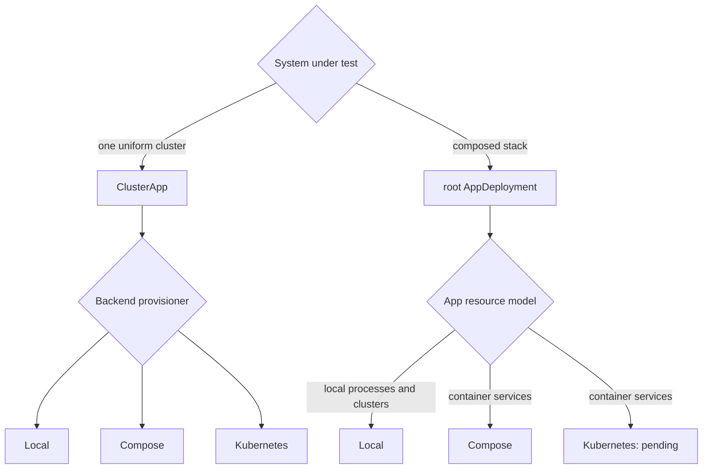

# Backend Scope

Every scenario is composed from application deployments, but the resources an application can ask its backend for differ. This chapter lists what each backend provisions and the APIs missing from the container backends.

---

## What Works Where

| Resource an `AppDeployment` can request | Local | Compose | Kubernetes |
|----------------|-------|---------|------------|
| Node cluster (`deploy_cluster` / `ClusterApp`) | yes | yes | yes |
| Container stack (`deploy_container_stack` / `ContainerServiceSpec`) | no | yes | no — provisioner pending |
| Singleton local process (`LocalProcessApp`) | yes | — | — |

The cluster row is the uniform path: `ClusterApp<E>` runs on all three backends by passing the matching provisioner to `with_app_using` (`LocalClusterProvisioner` is the `with_app` default). Compose is unique in serving **both** contracts from one type — `ComposeProvisioner` implements `ClusterProvisioner<E>` and `ContainerStackProvisioner`. Every cluster and container stack runs in its own compose project attached to one shared session network per provisioner, so clusters and container services reach each other by compose service name. Kubernetes has a cluster provisioner only: there is no k8s container-stack provisioner.

An app deployment that provisions nothing — one that only wraps clients or other handles — works on every backend because it never touches the provisioner. `LocalProcessApp` remains a local adapter for third-party or singleton binaries. Containerized apps describe images, commands, generated files, ports, readiness, and explicit restart policy through `ContainerServiceSpec`; stack containers default to no automatic restart so crashes remain observable.

The kvstore and OpenRaft examples keep dedicated bins per backend (`kvstore_compose_convergence`, `kvstore_k8s_convergence`, `openraft_kv_compose_failover`, `openraft_kv_k8s_failover`); see [Compose Backend](deployer-compose.md) and [Kubernetes Backend](deployer-k8s.md).

---

## Remaining Kubernetes Gap

The container contract is independent from application composition and backend implementation. A Kubernetes `ContainerStackProvisioner` still needs to map it to a shared namespace, workload resources, Services, generated ConfigMaps, readiness, stable runner access, per-service lifecycle control, and cleanup. That should not require changes to containerized app deployments or workloads: `JobStackContainerApp` in `examples/multi_app` is already generic over any `ContainerStackProvisioner`.

---

## Choosing a Shape Today



- **Composed stacks: use Local or Compose.** Local adapters manage binaries, processes, and child clusters. Compose manages portable container declarations, per-service lifecycle operations, and node clusters, each in its own project on one shared session network per provisioner.
- **Single-cluster scenarios: use any backend.** The same `ClusterApp` scenario runs locally, on Compose, or on Kubernetes, subject to the [capability matrix](capability-matrix.md).
- **Keep app handles backend-independent.** The `multi_app` example runs the same workload and expectation over local processes and compose containers; only its resource declaration and provisioner differ.

---

## Keep Workloads Backend-Independent

Write workloads against typed handles and clients, not against backend details. A workload that requires a `ClusterHandle<KvEnv>` does not care which provisioner produced it:

```rust,ignore
async fn start(&self, ctx: &RunContext<AppHostEnv>) -> Result<(), DynError> {
    let store = ctx.require_app::<ClusterHandle<KvEnv>>()?; // no backend visible here
    let client = store.first_client().ok_or("store has no clients")?;
    put_value(&client, "scope-check", "ok").await?;
    Ok(())
}
```

Backend-specific changes remain in provisioners. Workloads and expectations continue using the same typed app handles across local, compose, and k8s runs.

**Note:** containerized `ContainerServiceHandle`s provide `start`, `stop`, `restart`, `wait_ready`, and `is_running`. Node clusters expose the richer `ClusterHandle` API. Kubernetes must implement the same service-handle lifecycle before its container-stack row becomes supported.

---

## See Also

- [Backend Capability Matrix](capability-matrix.md): the full feature-by-backend table.
- [Cluster Provisioning](cluster-provisioning.md): the request/provisioner boundary.
- [AppHost and with_app](app-host.md): the entry point this scope applies to.
