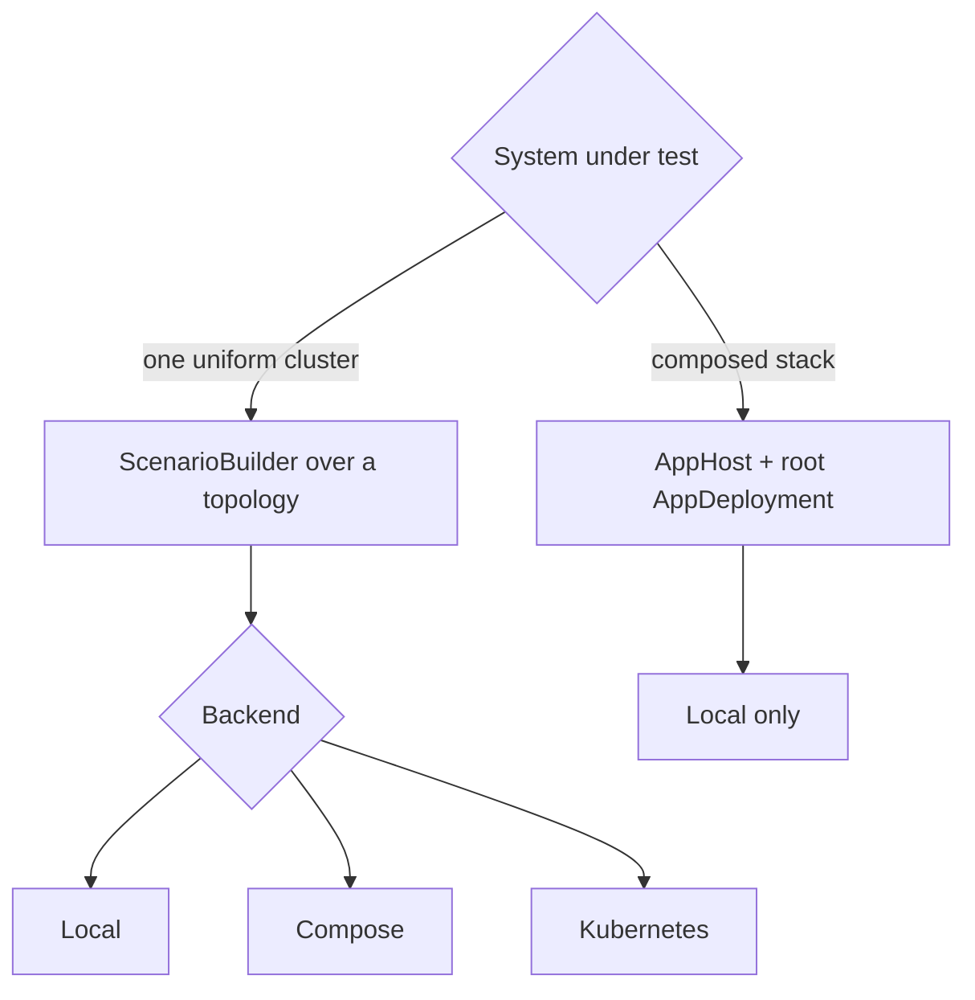

# Backend Scope

The app layer currently deploys components only through the local backend. Compose and Kubernetes support uniform single-application scenarios.

This chapter lists the supported combinations and the APIs missing from the container backends.

---

## What Works Where

| Scenario shape | Local | Compose | Kubernetes |
|----------------|-------|---------|------------|
| Uniform cluster (`ScenarioBuilder<E>` over a topology) | yes | yes | yes |
| AppHost composed stack (`AppHost::scenario().with_app(...)`) | yes | no | no |
| `with_app` presets over an existing uniform scenario | yes | yes | yes |

An app preset that deploys nothing, such as the "existing cluster" presets in [AppHost and with_app](app-host.md), works on every backend because it only wraps `ctx.deployment()` and `ctx.node_clients()` in a typed handle. Deploying new components through the app layer is local-only: `LocalProcessApp` and `LocalAppCluster` use the local deployer's process primitives (`ProcessNode`, `ManualCluster`, `ProcessDeployer`), and `AppHostLocalDeployer` is a local process deployer.

Single-app Compose and Kubernetes deployers are unchanged by the app layer. The kvstore and OpenRaft examples keep dedicated bins for them (`kvstore_compose_convergence`, `kvstore_k8s_convergence`, `openraft_kv_compose_failover`, `openraft_kv_k8s_failover`); see [Compose Deployer](deployer-compose.md) and [Kubernetes Deployer](deployer-k8s.md).

---

## Why the Gap Exists

The app layer starts, addresses, and stops individual units and can run application code between those starts, for example to check readiness or pass an address to a dependent component. The local deployer provides per-unit APIs. Compose and Kubernetes currently render and deploy a complete uniform scenario as one planned unit. Supporting `AppDeployment` on those backends requires corresponding per-unit planning and deployment APIs.

---

## Choosing a Shape Today



- **Composed stacks: run locally.** The local backend provides direct process control and per-unit restarts for heterogeneous stacks (see [Composing Heterogeneous Stacks](composing-stacks.md)).
- **Uniform single-app scenarios: use any supported backend.** A topology containing one application can run locally, with Compose, or on Kubernetes, subject to the capability matrix.
- **Split suites by shape, not by app.** If one system needs both a composed integration stack and a large containerized soak test of its main cluster, express them as two scenarios: an AppHost stack running locally, and a uniform scenario of the main app running on Compose/K8s. The kvstore example uses one environment crate with separate binaries per shape and backend.

---

## Keep Workloads Backend-Independent

Write workloads against typed handles and clients, not against backend details. A workload that requires a `StoreHandle` does not care whether the store came from a `LocalAppCluster` today or a future containerized unit:

```rust,ignore
async fn start(&self, ctx: &RunContext<AppHostEnv>) -> Result<(), DynError> {
    let store = ctx.require_app::<StoreHandle>()?; // no backend visible here
    store.put("/kv/scope-check", "ok").await?;
    Ok(())
}
```

If another backend later supports app composition, backend-specific changes should remain in the root deployment and its child adapters. Workloads and expectations can continue using the same handles. The OpenRaft "existing cluster" preset already works with Compose and Kubernetes because it only reads `ctx.deployment()` and `ctx.node_clients()`.

**Note:** node-control-style fault injection inside a composed stack (restart one child-cluster node) is a handle method on [`LocalAppCluster`](local-app-cluster.md), so it is local-only by construction. Fault injection on containerized uniform scenarios goes through the scenario-level node control capability instead; see the openraft `openraft_kv_k8s_failover` bin.

---

## See Also

- [Capability Matrix](capability-matrix.md): the full feature-by-backend table.
- [Local Deployer](deployer-local.md): the backend the app layer builds on.
- [AppHost and with_app](app-host.md): the entry point this scope applies to.
