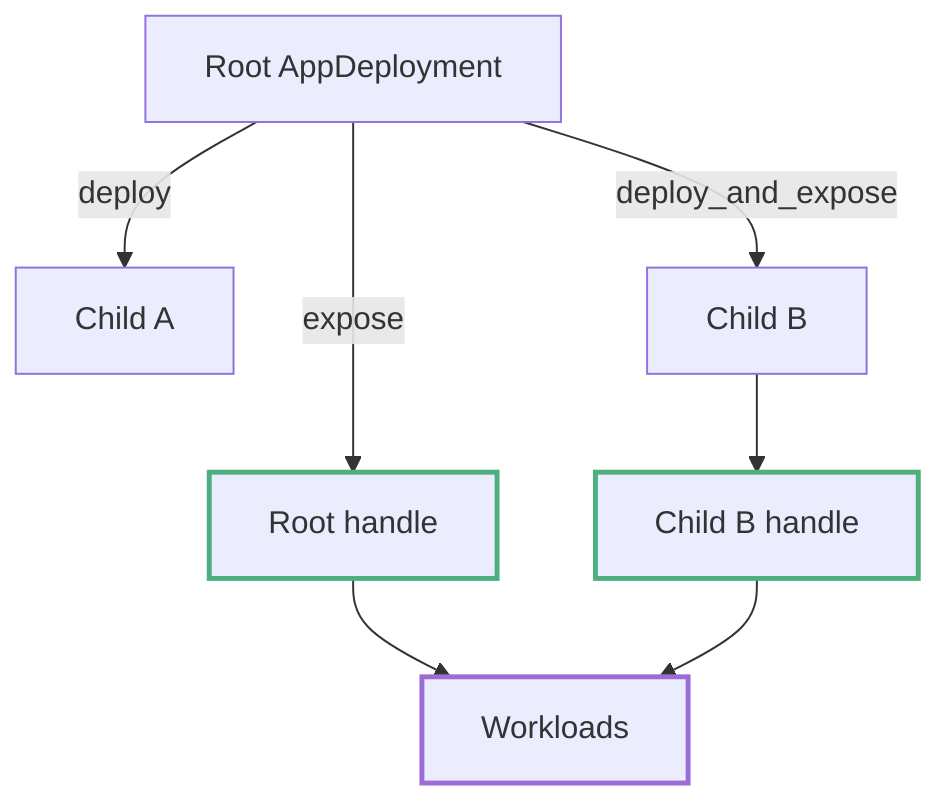

# AppDeployment and DeployContext

Application repositories implement `AppDeployment` for deployable components. The implementation uses `DeployContext` to deploy children, expose handles, and register managed resources with scenario cleanup.

The framework runs deployments, stores handles, and performs teardown without defining application binaries or clients. The application crate decides which components start and which typed handles workloads receive.

---

## The Trait Contract

```rust,ignore
#[async_trait]
pub trait AppDeployment<E: Application, P = LocalClusterProvisioner>: Send + 'static {
    type Handle: AppHandle;

    async fn deploy(self, ctx: &mut DeployContext<E, P>) -> Result<Self::Handle, DynError>;
}
```

The trait has these properties:

- **`deploy` consumes `self`.** A deployment value describes one preparation attempt and returns its runtime access handle.
- **The handle is typed.** `Handle` can be any `Clone + Send + Sync + 'static` type. Managed lifetime is registered separately; see [Handle Ownership and Teardown](handles-teardown.md).
- **`Clone` is required by the factory.** `with_app` needs `A: AppDeployment<E> + Clone + Sync` because `AppDeploymentFactory` clones the description on each `prepare`. Deployment structs should contain configuration such as node counts, ports, and paths rather than live resources.

A minimal implementation, from the kvstore example:

```rust,ignore
// examples/kvstore/testing/integration/src/app.rs
#[derive(Clone)]
pub struct KvLocalApp {
    deployment: KvTopology,
}

#[async_trait]
impl AppDeployment<AppHostEnv> for KvLocalApp {
    type Handle = ClusterHandle<KvEnv>;

    async fn deploy(self, ctx: &mut DeployContext<AppHostEnv>) -> Result<Self::Handle, DynError> {
        ctx.deploy_cluster(ClusterRequest::<KvEnv>::managed(self.deployment))
            .await
    }
}
```

---

## DeployContext API

One context belongs to one scenario preparation. It carries the active cluster provisioner, outer deployment and clients, exposed handles, and a cleanup stack. Routing every managed child through this context registers cleanup as soon as the resource is acquired, including when deployment fails partway.

| Method | Purpose |
|--------|---------|
| `deploy(app)` | Runs a child deployment, returns its handle. Does **not** expose it. |
| `deploy_and_expose(app)` | Runs a child deployment and exposes a clone of its handle. |
| `expose(handle)` | Registers the default (unnamed) handle for its concrete type. |
| `expose_named(name, handle)` | Registers a named handle; allows several instances of one type. |
| `get::<T>()` / `get_named::<T>(name)` | `Option<T>` clone of an exposed handle. |
| `require::<T>()` / `require_named::<T>(name)` | `Result<T, AppDeployError>` — typed missing-handle error. |
| `contains::<T>()` | Whether a default handle for `T` is exposed. |
| `handles()` | Borrows the registry of handles exposed so far. |
| `deployment()` | The outer scenario deployment descriptor (`E::Deployment`). |
| `node_clients()` | Clients for nodes owned by the outer scenario (`NodeClients<E>`). |
| `deploy_cluster(request)` | Provisions a managed, attached, or external cluster (`ClusterRequest<App>`) through the active provisioner; returns a `ClusterHandle<App>`. |
| `deploy_container_stack(request)` | Provisions a backend-managed stack of mutually reachable containers when the provisioner supports it. |
| `defer_cleanup(guard)` | Registers a cleanup guard for auxiliary resources the application starts itself; guards run in reverse registration order. |

`deploy` does not expose its returned handle. Use it when only the parent needs the child handle. Use `deploy_and_expose` when workloads should also be able to request the child directly. Both `expose` and `expose_named` return `AppDeployError::DuplicateHandle` if the type or type/name pair is already registered.

---

## Nested Deployments

A deployment composes children by calling `ctx.deploy(...)` or `ctx.deploy_and_expose(...)` on other `AppDeployment` values. The parent decides what is visible:

```rust,ignore
#[async_trait]
impl AppDeployment<TestEnv> for ParentApp {
    type Handle = ParentHandle;

    async fn deploy(self, ctx: &mut DeployContext<TestEnv>) -> Result<Self::Handle, DynError> {
        let child = ctx.deploy(ChildApp).await?; // child handle NOT exposed
        let parent = ParentHandle { child };

        ctx.expose(parent.clone())?; // only the parent is visible

        Ok(parent)
    }
}
```

Workloads can then require `ParentHandle` but not `ChildHandle`: the child stays an implementation detail. Its managed resources remain registered with scenario cleanup whether or not the returned handle is exposed or embedded. Expose the child too when workloads legitimately need it.



---

## Non-Managed Clusters: attached and external

For `AppHost` scenarios, `deployment()` is the empty `AppHostTopology` and `node_clients()` is empty; everything lives in your handles. A deployment that should use nodes the framework does not own builds the corresponding `ClusterRequest` instead of a managed one:

```rust,ignore
// attach to a live deployment described by ExistingCluster
let cluster = ctx
    .deploy_cluster(ClusterRequest::<KvEnv>::attached(existing))
    .await?;

// or build clients for plain external endpoints
let cluster = ctx
    .deploy_cluster(ClusterRequest::<KvEnv>::external(nodes))
    .await?;
```

Neither request launches nodes; both return a `ClusterHandle` with typed access to the nodes, and cleanup does not stop resources the framework did not start. See [External and Existing Clusters](external-clusters.md).

---

## Root-Handle Auto-Exposure

After the root deployment returns, `AppDeploymentFactory` checks `ctx.contains::<A::Handle>()`. If the root handle type is not already exposed, the factory exposes the returned handle as the default for its type. So:

- A simple root app can just `return Ok(handle)` and workloads can `require_app::<Handle>()` with no explicit `expose`.
- A root app that already exposed its own handle (like the stack apps in [Composing Heterogeneous Stacks](composing-stacks.md)) is left alone, so there is no duplicate error.

---

## See Also

- [AppHost and with_app](app-host.md): how a deployment gets registered and prepared.
- [Handle Ownership and Teardown](handles-teardown.md): what exposure means for resource lifetime.
- [One Binary: LocalProcessApp](local-process-app.md), [Uniform Clusters: ClusterApp and ClusterHandle](local-app-cluster.md): ready-made deployments to compose.
