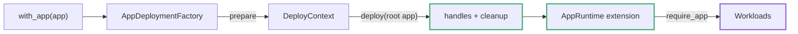

# AppHost and with_app

`AppHost` creates a scenario whose system under test is supplied by application deployments instead of an outer managed node topology.

The core scenario engine models one `Application` and a uniform cluster of its nodes. For a composed stack containing a binary, an additional cluster, or several applications, start from `AppHost::scenario()` and register the stack with `.with_app(...)`. Workloads, expectations, run duration, and teardown follow the lifecycle in [Scenario Model and Lifecycle](scenario-model.md).

---

## The Zero-Node Scenario

`AppHost::scenario()` returns a `ScenarioBuilder<AppHostEnv>` seeded with `AppHostTopology`:

| Type | Role |
|------|------|
| `AppHostTopology` | Deployment descriptor with `node_count() == 0`. The outer scenario manages no nodes. |
| `AppHostEnv` | Null environment: `NodeClient = ()`, and `build_node_client` always errors. Clients come from app handles instead. |
| `AppHostScenarioBuilder` | Alias for `ScenarioBuilder<AppHostEnv>`. |
| `AppHostLocalDeployer` | Alias for `ProcessDeployer<AppHostEnv>` — the local deployer that executes the scenario. |

Because the outer topology is empty, app deployments create the processes and clusters used by the run.

```rust,ignore
use testing_framework_app::{AppHost, AppHostLocalDeployer, AppScenarioBuilderExt};
use testing_framework_core::scenario::Deployer;

let mut scenario = AppHost::scenario()
    .with_app(KvLocalApp::nodes(3))
    .with_run_duration(Duration::from_secs(5))
    .with_workload(KvAppHostConvergence::new(3))
    .build()?;

let deployer = AppHostLocalDeployer::default();
let runner = deployer.deploy(&scenario).await?;
runner.run(&mut scenario).await?;
```

The runnable `kvstore_app_host_convergence` binary uses this structure:

```bash
cargo run -p kvstore-examples --bin kvstore_app_host_convergence
```

---

## How with_app Runs

`AppScenarioBuilderExt::with_app(app)` wraps your [`AppDeployment`](app-deployment.md) in an `AppDeploymentFactory` and registers it as a runtime extension factory, the same lifecycle hook covered in [Runtime Extensions](runtime-extensions.md). Going through the extension mechanism ties managed deployment cleanup to the scenario lifetime and makes exposed handles available during the run.

## Inline root deployments

`with_app` intentionally retains the framework's `Send` runtime-extension
contract. A local in-process harness that needs a non-`Send` deployment future
can use the separate root entrypoint:

```rust,ignore
let runtime = AppHost::deploy_inline(app).await?;
let handle = runtime.require_app::<MyHandle>()?;
// Keep `runtime` alive while using the deployed application.
```

`AppHost::deploy_inline` prepares the root through
`InlineAppDeploymentFactory`, without registering a
`RuntimeExtensionFactory`. The returned `InlineAppRuntime` owns the exposed
handles and cleanup; dropping it tears down resources acquired during
deployment. This path is local/in-process-specific and does not change
Compose, Kubernetes, or ordinary `with_app` scenarios.



During scenario preparation the factory:

1. Clones your app (this is why the factory requires `Clone`) and builds a fresh `DeployContext`.
2. Runs the root deployment's `deploy`, which may deploy and expose child apps.
3. Auto-exposes the returned root handle if the deployment did not expose one of that type itself (`!ctx.contains::<A::Handle>()`).
4. Transfers the handle registry and cleanup stack into an `AppRuntime` extension.

If any step fails, the partially built context is dropped and every resource deployed so far is released (see [Handle Ownership and Teardown](handles-teardown.md)).

A scenario accepts one `with_app` registration. Every `AppDeploymentFactory` produces the same extension type (`AppRuntime`), and the runtime rejects duplicate extension types. A second registration fails during preparation with `duplicate runtime extension type registered: AppRuntime`. Compose several applications inside one root `AppDeployment` and expose the child handles from there, as shown in [Composing Heterogeneous Stacks](composing-stacks.md).

---

## with_app Outside AppHost

`with_app` is defined for every scenario builder, not only `AppHostScenarioBuilder`. On a regular uniform-cluster scenario, an "existing cluster" preset can wrap the outer scenario's deployment and node clients in a typed handle without deploying another resource. The OpenRaft example uses this pattern:

```rust,ignore
// examples/openraft_kv/testing/integration/src/scenario.rs
fn with_existing_openraft_kv_app(app: OpenRaftKvExistingClusterApp) -> Self {
    OpenRaftKvScenarioBuilder::with_deployment(app.topology())
        .with_app(app)
        .with_cluster_observer()
}
```

Here the scenario still manages a uniform OpenRaft cluster, and the app layer just gives workloads a typed `OpenRaftKvCluster` handle over it.

---

## Retrieving Handles in Workloads

Workloads never see the deploy context. They retrieve exposed handles through `AppRunContextExt`, implemented on `RunContext<E>`:

| Method | Returns |
|--------|---------|
| `app::<T>()` | `Option<T>` — default handle for `T`, if exposed |
| `app_named::<T>(name)` | `Option<T>` — named handle for `T` |
| `require_app::<T>()` | `Result<T, DynError>` — errors if missing |
| `require_app_named::<T>(name)` | `Result<T, DynError>` — errors if missing |

```rust,ignore
use testing_framework_app::AppRunContextExt;

async fn start(&self, ctx: &RunContext<AppHostEnv>) -> Result<(), DynError> {
    let cluster = ctx.require_app::<LocalAppCluster<KvEnv>>()?;
    cluster.restart_node("node-0").await?;
    cluster.wait_node_ready("node-0").await?;
    Ok(())
}
```

Workloads normally use the `require_*` variants so that a missing handle produces a typed error containing the requested handle type.

Every retrieval clones the handle. Handles are normally small access values backed by `Arc`; scenario cleanup still determines managed resource lifetime.

---

## Where to Go Next

- [AppDeployment and DeployContext](app-deployment.md): implementing the deployment itself.
- [One Binary: LocalProcessApp](local-process-app.md) and [Uniform Child Clusters: LocalAppCluster](local-app-cluster.md): the two built-in building blocks.
- [Backend Scope](app-backend-scope.md): why AppHost scenarios run on the local deployer today.
