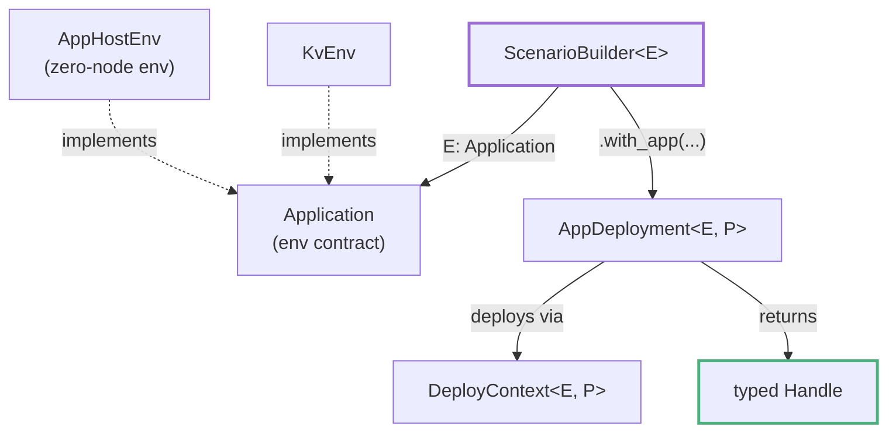

# Application, AppDeployment, and Environments

This chapter distinguishes the `Application` trait, the `AppDeployment` trait, and the concrete environment types that implement `Application`.

---

## The Application Trait

`Application` is the contract between the scenario engine and whatever system you are testing. It bundles the backend-specific types the engine needs, without the engine ever knowing what your application does:

```rust,ignore
use testing_framework_core::scenario::Application;

pub trait Application: Send + Sync + 'static {
    type Deployment: DeploymentDescriptor + Clone + 'static;
    type NodeClient: Clone + Send + Sync + 'static;
    type NodeConfig: Clone + Send + Sync + 'static;

    fn external_node_client(source: &ExternalNodeSource) -> Result<Self::NodeClient, DynError>;
    fn build_node_client(access: &NodeAccess) -> Result<Self::NodeClient, DynError>;
    fn node_readiness_path() -> &'static str; // default: "/"
}
```

The associated types and methods are:

- **`Deployment`**: the topology descriptor, i.e. how many nodes exist and how they relate.
- **`NodeClient`**: the typed client workloads use to talk to one node.
- **`NodeConfig`**: the per-node configuration your binary consumes.
- **Client constructors**: `build_node_client` turns deployer-provided `NodeAccess` into a client; `external_node_client` does the same for nodes the framework did not start. Both return an "unsupported" error by default. An environment must implement the operations it supports ([Ownership and Design Boundaries](boundaries.md)).
- **`node_readiness_path`**: the HTTP path deployers probe during readiness gating.

An implementation of `Application` is called an **environment**. Everything generic in the framework (`ScenarioBuilder<E>`, `Workload<E>`, `Expectation<E>`, `RunContext<E>`) is parameterized over one.

Source: `testing-framework/core/src/env.rs`.

---

## The AppDeployment Trait

`Application` describes a *uniform* node population. A system containing a cluster plus another process, or several different clusters, is represented through `AppDeployment` in `testing-framework-app`:

```rust,ignore
use testing_framework_app::{AppDeployment, AppHandle, DeployContext};

pub trait AppDeployment<E: Application, P = LocalClusterProvisioner>: Send + 'static {
    type Handle: AppHandle;

    async fn deploy(self, ctx: &mut DeployContext<E, P>) -> Result<Self::Handle, DynError>;
}
```

An `AppDeployment` is a deployable unit: it consumes its description, prepares whatever it represents, and returns a typed runtime handle. `AppHandle` is a blanket implementation, so any `Clone + Send + Sync + 'static` type qualifies. The handle provides access and control; managed resources acquired through framework adapters are owned separately by scenario cleanup.

Deployments compose: inside `deploy`, the `DeployContext` lets a parent deployment call `ctx.deploy(child)` or `ctx.deploy_and_expose(child)`, then `ctx.expose(handle)` to publish typed handles to workloads. See [AppDeployment and DeployContext](app-deployment.md) for the full context API.

An `AppDeployment` registered with `.with_app(...)` runs during scenario preparation. It participates in the scenario lifecycle; it does not replace that lifecycle.

Source: `testing-framework/app/src/deployment.rs`.

---

## Concrete Environments

### AppHostEnv: an environment without outer nodes

`AppHostEnv` is an environment with no outer nodes at all. Its topology, `AppHostTopology`, reports a node count of zero; its `NodeClient` and `NodeConfig` are both `()`; asking it for a node client is an error. It exists so that a scenario can be composed *entirely* from application deployments:

```rust,ignore
use testing_framework_app::{AppHost, AppScenarioBuilderExt};

let builder = AppHost::scenario()      // ScenarioBuilder<AppHostEnv>, zero nodes
    .with_app(KvLocalApp::nodes(3));   // apps provide all processes
```

The system is supplied by `with_app` deployments, and workloads access it through typed handles instead of outer node clients. See [AppHost and with_app](app-host.md).

Source: `testing-framework/app/src/host.rs`.

### KvEnv: a uniform node environment

The kvstore example shows a full environment for a real binary:

```rust,ignore
pub struct KvEnv;

impl Application for KvEnv {
    type Deployment = KvTopology;        // ClusterTopology
    type NodeClient = KvHttpClient;
    type NodeConfig = KvNodeConfig;

    fn build_node_client(access: &NodeAccess) -> Result<Self::NodeClient, DynError> {
        Ok(KvHttpClient::new(access.api_base_url()?))
    }

    fn node_readiness_path() -> &'static str {
        "/health/ready"
    }
}
```

`KvEnv` additionally implements `LocalBinaryApp` (in `examples/kvstore/testing/integration/src/local_env.rs`) to tell the local deployer which binary to run, how to render per-node configs, and which port serves the HTTP API. The same environment type also backs `AppDeployment` presets like `KvLocalApp`, whose handle is a whole child cluster. [Implementing Application](implementing-application.md) walks through this in detail.

Source: `examples/kvstore/testing/integration/src/app.rs`.

---

## How the Three Relate



| Role | What it is | What it answers | Example |
|---|---|---|---|
| `Application` | Trait bundling `Deployment`, `NodeClient`, `NodeConfig` for the scenario engine | "What types does the engine plumb around?" | `KvEnv` |
| `AppDeployment` | Trait for one deployable unit returning a typed handle | "How is this piece prepared, and what can test code access?" | `KvLocalApp` |
| Concrete environment | A type implementing `Application` | "Which system am I testing, uniform or zero-node?" | `KvEnv`, `AppHostEnv` |

`Application` and `AppDeployment` are not alternatives. Every scenario has one environment type `E`, and app deployments are registered inside that scenario. A uniform kvstore cluster uses `KvEnv` directly; a heterogeneous stack uses `AppHostEnv` and supplies its components as app deployments.

---

## Where to Go Next

- [Scenario Model and Lifecycle](scenario-model.md): what a scenario is and how it runs.
- [Choosing an Entry Pattern](entry-patterns.md): which combination of these pieces fits your system.
- [Part II — Composing Applications](part-ii.md): the app layer in depth.
- [Part IV — Uniform Clusters and Configuration](part-iv.md): implementing an environment for your own binary.
