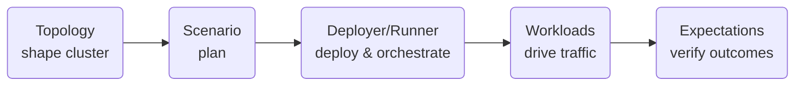

# Architecture Overview

The framework follows a clear flow: **Topology → Scenario → Runner → Workloads → Expectations**.

- **Topology** describes the cluster: how many nodes, their roles, and the high-level network and data-availability parameters they should follow.
- **Scenario** combines that topology with the activities to run and the checks to perform, forming a single plan.
- **Deployer/Runner** pair turns the plan into a live environment on the chosen backend (local processes, Docker Compose, or Kubernetes) and brokers readiness.
- **Workloads** generate traffic and conditions that exercise the system.
- **Expectations** observe the run and judge success or failure once activity completes.

Conceptual diagram:
```
Topology  →  Scenario  →  Runner  →  Workloads  →  Expectations
 (shape       (plan)      (deploy     (drive         (verify
 cluster)                & orchestrate) traffic)     outcomes)
```

Mermaid view:


Each layer has a narrow responsibility so that cluster shape, deployment choice,
traffic generation, and health checks can evolve independently while fitting
together predictably.
