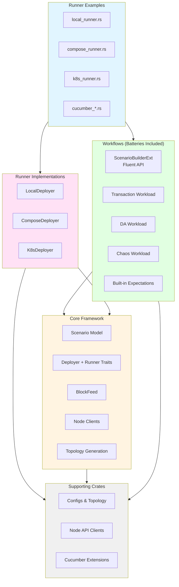

# Architecture Overview

The framework follows a clear flow: **Topology → Scenario → Deployer → Runner → Workloads → Expectations**.

## Core Flow


## Crate Architecture



### Layer Responsibilities

**Runner Examples (Entry Points)**
- Executable binaries that demonstrate framework usage
- Wire together deployers, scenarios, and execution
- Provide CLI interfaces for different modes

**Workflows (High-Level API)**
- `ScenarioBuilderExt` trait provides fluent DSL
- Built-in workloads (transactions, DA, chaos)
- Common expectations (liveness, inclusion)
- Simplifies scenario authoring

**Core Framework (Foundation)**
- `Scenario` model and lifecycle orchestration
- `Deployer` and `Runner` traits (extension points)
- `BlockFeed` for real-time block observation
- `RunContext` providing node clients and metrics
- Topology generation and validation

**Runner Implementations**
- `LocalDeployer` - spawns processes on host
- `ComposeDeployer` - orchestrates Docker Compose
- `K8sDeployer` - deploys to Kubernetes cluster
- Each implements `Deployer` trait

**Supporting Crates**
- `configs` - Topology configuration and generation
- `nodes` - HTTP/RPC client for node APIs
- `cucumber` - BDD/Gherkin integration

### Extension Points


**Extend by implementing:**
- `Workload` - Custom traffic generation patterns
- `Expectation` - Custom success criteria
- `Deployer` - Support for new deployment targets

See [Extending the Framework](extending.md) for details.

### Components

- **Topology** describes the cluster: how many nodes, their roles, and the high-level network and data-availability parameters they should follow.
- **Scenario** combines that topology with the activities to run and the checks to perform, forming a single plan.
- **Deployer** provisions infrastructure on the chosen backend (local processes, Docker Compose, or Kubernetes), waits for readiness, and returns a Runner.
- **Runner** orchestrates scenario execution: starts workloads, observes signals, evaluates expectations, and triggers cleanup.
- **Workloads** generate traffic and conditions that exercise the system.
- **Expectations** observe the run and judge success or failure once activity completes.

Each layer has a narrow responsibility so that cluster shape, deployment choice,
traffic generation, and health checks can evolve independently while fitting
together predictably.

## Entry Points

The framework is consumed via **runnable example binaries** in `examples/src/bin/`:

- `local_runner.rs` — Spawns nodes as host processes
- `compose_runner.rs` — Deploys via Docker Compose (requires `NOMOS_TESTNET_IMAGE` built)
- `k8s_runner.rs` — Deploys via Kubernetes Helm (requires cluster + image)

**Recommended:** Use the convenience script:

```bash
scripts/run/run-examples.sh -t <duration> -v <validators> -e <executors> <mode>
# mode: host, compose, or k8s
```

This handles circuit setup, binary building/bundling, image building, and execution.

**Alternative:** Direct cargo run (requires manual setup):

```bash
POL_PROOF_DEV_MODE=true cargo run -p runner-examples --bin <name>
```

**Important:** All runners require `POL_PROOF_DEV_MODE=true` to avoid expensive Groth16 proof generation that causes timeouts.

These binaries use the framework API (`ScenarioBuilder`) to construct and execute scenarios.

## Builder API

Scenarios are defined using a fluent builder pattern:

```rust
use std::time::Duration;

use testing_framework_core::scenario::ScenarioBuilder;
use testing_framework_workflows::ScenarioBuilderExt;

pub fn scenario_plan() -> testing_framework_core::scenario::Scenario<()> {
    ScenarioBuilder::topology_with(|t| t.network_star().validators(3).executors(2))
        .wallets(50)
        .transactions_with(|txs| txs.rate(5).users(20))
        .da_with(|da| da.channel_rate(1).blob_rate(2))
        .expect_consensus_liveness()
        .with_run_duration(Duration::from_secs(90))
        .build()
}
```

**Key API Points:**
- Topology uses `.topology_with(|t| { t.validators(N).executors(M) })` closure pattern
- Workloads are configured via `_with` closures (`transactions_with`, `da_with`, `chaos_with`)
- Chaos workloads require `.enable_node_control()` and a compatible runner

## Deployers

Three deployer implementations:

| Deployer | Backend | Prerequisites | Node Control |
|----------|---------|---------------|--------------|
| `LocalDeployer` | Host processes | Binaries (built on demand or via bundle) | No |
| `ComposeDeployer` | Docker Compose | Image with embedded assets/binaries | Yes |
| `K8sDeployer` | Kubernetes Helm | Cluster + image loaded | Not yet |

**Compose-specific features:**
- Observability is external (set `NOMOS_METRICS_QUERY_URL` / `NOMOS_METRICS_OTLP_INGEST_URL` / `NOMOS_GRAFANA_URL` as needed)
- Optional OTLP trace/metrics endpoints (`NOMOS_OTLP_ENDPOINT`, `NOMOS_OTLP_METRICS_ENDPOINT`)
- Node control for chaos testing (restart validators/executors)

## Assets and Images

### Docker Image
Built via `scripts/build/build_test_image.sh`:
- Embeds KZG circuit parameters and binaries from `testing-framework/assets/stack/kzgrs_test_params/kzgrs_test_params`
- Includes runner scripts: `run_nomos_node.sh`, `run_nomos_executor.sh`
- Tagged as `NOMOS_TESTNET_IMAGE` (default: `logos-blockchain-testing:local`)
- **Recommended:** Use prebuilt bundle via `scripts/build/build-bundle.sh --platform linux` and set `NOMOS_BINARIES_TAR` before building image

### Circuit Assets
KZG parameters required for DA workloads:
- **Host path:** `testing-framework/assets/stack/kzgrs_test_params/kzgrs_test_params` (note repeated filename—directory contains file `kzgrs_test_params`)
- **Container path:** `/kzgrs_test_params/kzgrs_test_params` (for compose/k8s)
- **Override:** `NOMOS_KZGRS_PARAMS_PATH=/custom/path/to/file` (must point to file)
- **Fetch via:** `scripts/setup/setup-nomos-circuits.sh v0.3.1 /tmp/circuits` or use `scripts/run/run-examples.sh`

### Compose Stack
Templates and configs in `testing-framework/runners/compose/assets/`:
- `docker-compose.yml.tera` — Stack template (validators, executors)
- Cfgsync config: `testing-framework/assets/stack/cfgsync.yaml`
- Monitoring assets (not deployed by the framework): `testing-framework/assets/stack/monitoring/`

## Logging Architecture

**Two separate logging pipelines:**

| Component | Configuration | Output |
|-----------|--------------|--------|
| **Runner binaries** | `RUST_LOG` | Framework orchestration logs |
| **Node processes** | `NOMOS_LOG_LEVEL`, `NOMOS_LOG_FILTER` (+ `NOMOS_LOG_DIR` on host runner) | Consensus, DA, mempool logs |

**Node logging:**
- **Local runner:** Writes to temporary directories by default (cleaned up). Set `NOMOS_TESTS_TRACING=true` + `NOMOS_LOG_DIR` for persistent files.
- **Compose runner:** Default logs to container stdout/stderr (`docker logs`). To write per-node files, set `tracing_settings.logger: !File` in `testing-framework/assets/stack/cfgsync.yaml` (and mount a writable directory).
- **K8s runner:** Logs to pod stdout/stderr (`kubectl logs`). To write per-node files, set `tracing_settings.logger: !File` in `testing-framework/assets/stack/cfgsync.yaml` (and mount a writable directory).

**File naming:** Per-node files use prefix `nomos-node-{index}` or `nomos-executor-{index}` (may include timestamps).

## Observability

**Prometheus-compatible metrics querying (optional):**
- The framework does **not** deploy Prometheus/Grafana.
- Provide a Prometheus-compatible base URL (PromQL API) via `NOMOS_METRICS_QUERY_URL`.
- Accessible in expectations when configured: `ctx.telemetry().prometheus().map(|p| p.base_url())`

**Grafana dashboards (optional):**
- Dashboards live in `testing-framework/assets/stack/monitoring/grafana/dashboards/` and can be imported into your Grafana.
- If you set `NOMOS_GRAFANA_URL`, the deployer prints it in `TESTNET_ENDPOINTS`.

**Node APIs:**
- HTTP endpoints per node for consensus info, network status, DA membership
- Accessible in expectations: `ctx.node_clients().validator_clients().get(0)`

**OTLP (optional):**
- Trace endpoint: `NOMOS_OTLP_ENDPOINT=http://localhost:4317`
- Metrics endpoint: `NOMOS_OTLP_METRICS_ENDPOINT=http://localhost:4318`
- Disabled by default (no noise if unset)

For detailed logging configuration, see [Logging & Observability](logging-observability.md).
