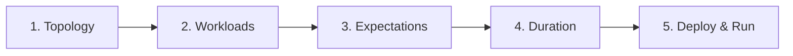

# Authoring Scenarios

Creating a scenario is a declarative exercise. This page walks you through the core authoring loop with concrete examples, explains the units and timing model, and shows how to structure scenarios in Rust test suites.

---

## The Core Authoring Loop

Every scenario follows the same pattern:



1. **Shape the topology** — How many nodes, what roles, what network shape
2. **Attach workloads** — What traffic to generate (transactions, blobs, chaos)
3. **Define expectations** — What success looks like (liveness, inclusion, recovery)
4. **Set duration** — How long to run the experiment
5. **Choose a runner** — Where to execute (local, compose, k8s)

---

## Hello Scenario: Your First Test

Let's build a minimal consensus liveness test step-by-step.

### Step 1: Shape the Topology

```rust,ignore
use testing_framework_core::scenario::ScenarioBuilder;
use testing_framework_workflows::ScenarioBuilderExt;

let scenario = ScenarioBuilder::topology_with(|t| {
    t.network_star()      // Star network (one gateway + nodes)
        .validators(3)     // 3 validator nodes
})
```

**What goes in topology?**
- Node counts (validators)
- Network shape (`network_star()` is currently the only built-in layout)

**What does NOT go in topology?**
- Traffic rates (that's workloads)
- Success criteria (that's expectations)
- Runtime configuration (that's duration/runner)

### Step 2: Attach Workloads

```rust,ignore
.wallets(20) // Seed funded wallet accounts for transaction workloads
.transactions_with(|tx| {
    tx.rate(10)    // 10 transactions per block
      .users(5)    // distributed across 5 wallets
})
```

**What goes in workloads?**
- Transaction traffic (rate, users)
- DA traffic (channels, blobs)
- Chaos injection (restarts, delays)

**Units explained:**
- `.rate(10)` = **10 transactions per block** (not per second!)
- `.users(5)` = use 5 distinct wallet accounts
- The framework adapts to block time automatically

### Step 3: Define Expectations

```rust,ignore
.expect_consensus_liveness()
```

**What goes in expectations?**
- Health checks that run after the scenario completes
- Liveness (blocks produced)
- Inclusion (workload activity landed on-chain)
- Recovery (system survived chaos)

**When do expectations run?**
After the duration window ends, during the **evaluation phase** of the scenario lifecycle.

### Step 4: Set Duration

```rust,ignore
use std::time::Duration;

.with_run_duration(Duration::from_secs(60))
```

**How long is enough?**
- Minimum: 2× the expected block time × number of blocks you want
- For consensus liveness: 30-60 seconds
- For transaction inclusion: 60-120 seconds
- For chaos recovery: 2-5 minutes

**What happens during this window?**
- Nodes are running
- Workloads generate traffic
- Metrics/logs are collected
- BlockFeed broadcasts observations in real-time

### Step 5: Build and Deploy

```rust,ignore
.build();

// Choose a runner
use testing_framework_core::scenario::Deployer;
use testing_framework_runner_local::LocalDeployer;

let deployer = LocalDeployer::default();
let runner = deployer.deploy(&scenario).await?;
let _result = runner.run(&mut scenario).await?;
```

---

## Complete "Hello Scenario"

Putting it all together:

```rust,ignore
use std::time::Duration;

use anyhow::Result;
use testing_framework_core::scenario::{Deployer, ScenarioBuilder};
use testing_framework_runner_local::LocalDeployer;
use testing_framework_workflows::ScenarioBuilderExt;

#[tokio::test]
async fn hello_consensus_liveness() -> Result<()> {
    let mut scenario = ScenarioBuilder::topology_with(|t| {
        t.network_star()
            .validators(3)
    })
    .wallets(20)
    .transactions_with(|tx| tx.rate(10).users(5))
    .expect_consensus_liveness()
    .with_run_duration(Duration::from_secs(60))
    .build();

    let deployer = LocalDeployer::default();
    let runner = deployer.deploy(&scenario).await?;
    runner.run(&mut scenario).await?;

    Ok(())
}
```

**Run it:**
```bash
POL_PROOF_DEV_MODE=true cargo test hello_consensus_liveness
```

---

## Understanding Units & Timing

### Transaction Rate: Per-Block, Not Per-Second

**Wrong mental model:** `.rate(10)` = 10 tx/second

**Correct mental model:** `.rate(10)` = 10 tx/block

**Why?** The blockchain produces blocks at variable rates depending on consensus timing. The framework submits the configured rate **per block** to ensure predictable load regardless of block time.

**Example:**
- Block time = 2 seconds
- `.rate(10)` → 10 tx/block → 5 tx/second average
- Block time = 5 seconds
- `.rate(10)` → 10 tx/block → 2 tx/second average

### Duration: Wall-Clock Time

`.with_run_duration(Duration::from_secs(60))` means the scenario runs for **60 seconds of real time**, not 60 blocks.

**How many blocks will be produced?**
Depends on consensus timing (slot time, active slot coefficient). Typical: 1-2 seconds per block.

**Rule of thumb:**
- 60 seconds → ~30-60 blocks
- 120 seconds → ~60-120 blocks

---

## Structuring Scenarios in a Test Suite

### Pattern 1: Integration Test Module

```rust,ignore
// tests/integration_test.rs
use std::time::Duration;

use anyhow::Result;
use testing_framework_core::scenario::{Deployer, ScenarioBuilder};
use testing_framework_runner_local::LocalDeployer;
use testing_framework_workflows::ScenarioBuilderExt;

#[tokio::test]
async fn test_consensus_liveness() -> Result<()> {
    let mut scenario = ScenarioBuilder::topology_with(|t| {
        t.network_star().validators(3)
    })
    .expect_consensus_liveness()
    .with_run_duration(Duration::from_secs(30))
    .build();

    let deployer = LocalDeployer::default();
    let runner = deployer.deploy(&scenario).await?;
    runner.run(&mut scenario).await?;
    Ok(())
}

#[tokio::test]
async fn test_transaction_inclusion() -> Result<()> {
    let mut scenario = ScenarioBuilder::topology_with(|t| {
        t.network_star().validators(2)
    })
    .wallets(10)
    .transactions_with(|tx| tx.rate(5).users(5))
    .expect_consensus_liveness()
    .with_run_duration(Duration::from_secs(60))
    .build();

    let deployer = LocalDeployer::default();
    let runner = deployer.deploy(&scenario).await?;
    runner.run(&mut scenario).await?;
    Ok(())
}
```

### Pattern 2: Shared Scenario Builders

Extract common topology patterns:

```rust,ignore
// tests/helpers.rs
use testing_framework_core::scenario::ScenarioBuilder;
use testing_framework_workflows::ScenarioBuilderExt;

pub fn minimal_topology() -> ScenarioBuilder {
    ScenarioBuilder::topology_with(|t| {
        t.network_star().validators(2)
    })
}

pub fn production_like_topology() -> ScenarioBuilder {
    ScenarioBuilder::topology_with(|t| {
        t.network_star().validators(7)
    })
}

// tests/consensus_tests.rs
use std::time::Duration;

use helpers::*;

#[tokio::test]
async fn small_cluster_liveness() -> anyhow::Result<()> {
    let mut scenario = minimal_topology()
        .expect_consensus_liveness()
        .with_run_duration(Duration::from_secs(30))
        .build();
    // ... deploy and run
    Ok(())
}

#[tokio::test]
async fn large_cluster_liveness() -> anyhow::Result<()> {
    let mut scenario = production_like_topology()
        .expect_consensus_liveness()
        .with_run_duration(Duration::from_secs(60))
        .build();
    // ... deploy and run
    Ok(())
}
```

### Pattern 3: Parameterized Scenarios

Test the same behavior across different scales:

```rust,ignore
use std::time::Duration;

use anyhow::Result;
use testing_framework_core::scenario::{Deployer, ScenarioBuilder};
use testing_framework_runner_local::LocalDeployer;
use testing_framework_workflows::ScenarioBuilderExt;

async fn test_liveness_with_topology(validators: usize) -> Result<()> {
    let mut scenario = ScenarioBuilder::topology_with(|t| {
        t.network_star()
            .validators(validators)
    })
    .expect_consensus_liveness()
    .with_run_duration(Duration::from_secs(60))
    .build();

    let deployer = LocalDeployer::default();
    let runner = deployer.deploy(&scenario).await?;
    runner.run(&mut scenario).await?;
    Ok(())
}

#[tokio::test]
async fn liveness_small() -> Result<()> {
    test_liveness_with_topology(2, 1).await
}

#[tokio::test]
async fn liveness_medium() -> Result<()> {
    test_liveness_with_topology(5, 2).await
}

#[tokio::test]
async fn liveness_large() -> Result<()> {
    test_liveness_with_topology(10, 3).await
}
```

---

## What Belongs Where?

### Topology

**Do include:**
- Node counts (`.validators(3)`)
- Network shape (`.network_star()`)

**Don't include:**
- Traffic rates (workload concern)
- Expected outcomes (expectation concern)
- Runtime behavior (runner/duration concern)

### Workloads

**Do include:**
- Transaction traffic (`.transactions_with(|tx| ...)`)
- DA traffic (`.da_with(|da| ...)`)
- Chaos injection (`.with_workload(RandomRestartWorkload::new(...))`)
- Rates, users, timing

**Don't include:**
- Node configuration (topology concern)
- Success criteria (expectation concern)

### Expectations

**Do include:**
- Health checks (`.expect_consensus_liveness()`)
- Inclusion verification (built-in to workloads)
- Custom assertions (`.with_expectation(MyExpectation::new())`)

**Don't include:**
- Traffic generation (workload concern)
- Cluster shape (topology concern)

---

## Best Practices

1. **Keep scenarios focused**: One scenario = one behavior under test
2. **Start small**: 2-3 validators, 30-60 seconds
3. **Use descriptive names**: `test_consensus_survives_validator_restart` not `test_1`
4. **Extract common patterns**: Shared topology builders, helper functions
5. **Document intent**: Add comments explaining what you're testing and why
6. **Mind the units**: `.rate(N)` is per-block, `.with_run_duration()` is wall-clock
7. **Set realistic durations**: Allow enough time for multiple blocks + workload effects

---

## Next Steps

- **[Core Content: Workloads & Expectations](workloads.md)** — Comprehensive reference for built-in workloads and expectations
- **[Examples](examples.md)** — More scenario patterns (DA, chaos, advanced topologies)
- **[Running Scenarios](running-scenarios.md)** — How execution works, artifacts produced, per-runner details
- **[API Levels](api-levels.md)** — When to use builder DSL vs. direct instantiation
