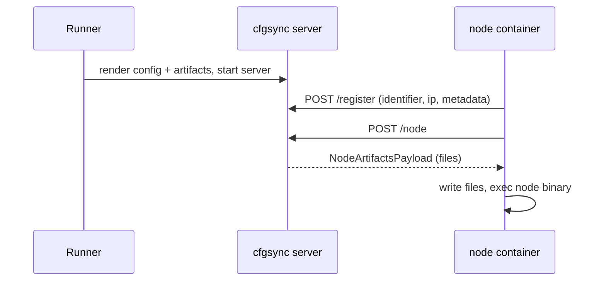
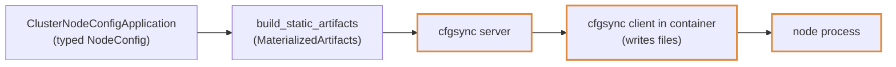

# Static Artifacts and cfgsync

This chapter covers how typed app configs become per-node file artifacts and how containerized backends deliver them to nodes that cannot see your filesystem.

---

## Why cfgsync Exists

The local deployer writes each node's rendered config into the node's working directory. Compose and Kubernetes nodes run in containers without access to the host directory where the framework generated those configs. cfgsync transfers the generated per-node files at startup and when a node is restarted with overridden options.

cfgsync consists of a typed artifact model and an HTTP service. A node container starts, registers with the cfgsync server, fetches its artifact set, writes the files locally, and then starts the application. The same artifact types support runtime config overrides through `replace_node_artifacts` for dynamic node starts on Kubernetes.



---

## The Crates

| Crate | Role |
|---|---|
| `cfgsync-artifacts` | Pure data model: `ArtifactFile { path, content }`, `ArtifactSet` (with `ensure_unique_paths`) |
| `cfgsync-core` | Protocol types, HTTP server/router, protocol client, config sources, render helpers |
| `cfgsync-adapter` | App-facing materialization: registrations in, artifacts out |
| `cfgsync-runtime` | Runnable server/client: `cfgsync-server` and `cfgsync-client` binaries, env-driven client |

**Protocol (`cfgsync-core`).** `NodeRegistration` carries a stable `identifier`, an IPv4 address, and an opaque `RegistrationPayload`, adapter-owned JSON metadata the framework never interprets (`with_metadata(&T)` / `from_json_str`). The server answers `/node` with a `NodeArtifactsPayload` (schema version + files) or a structured error: `MissingConfig` (unknown node), `NotReady` (registered, artifacts pending), `Internal`. `Client` wraps the endpoints: `register_node`, `fetch_node_config`, `fetch_node_config_status` (→ `ConfigFetchStatus::{Ready, NotReady, Missing}`), and the administrative `ReplaceNodeArtifactsRequest` for swapping one node's served files.

**Sources.** A server serves whatever its `NodeConfigSource` resolves:

- `StaticConfigSource`: an in-memory map of identifier → payload, built from payloads or from a `NodeArtifactsBundle` (per-node entries plus `shared_files` served to everyone). Registration succeeds only for known identifiers. Supports `replace_node_artifacts`.
- `RegistrationConfigSource<M>` (`cfgsync-adapter`) is registration-aware: it records registrations, snapshots them, and asks a materializer for artifacts on every resolve. Per-node overrides installed via `replace_node_artifacts` win over materialized files (shared files are still appended).

**Materialization (`cfgsync-adapter`).** The adapter contract is one trait:

```rust,ignore
pub trait RegistrationSnapshotMaterializer: Send + Sync {
    fn materialize_snapshot(
        &self,
        registrations: &RegistrationSnapshot,
    ) -> Result<MaterializationResult, DynCfgsyncError>;
}
```

`RegistrationSnapshot` is the current registration set, sorted by identifier for determinism. The result is `NotReady` (keep polling) or `Ready(MaterializedArtifacts)`: per-node `ArtifactSet`s keyed by identifier plus a shared set appended to every node (`resolve(identifier)` merges them). Wrappers: `CachedSnapshotMaterializer` caches results per snapshot, `PersistingSnapshotMaterializer` additionally pushes ready artifacts into a `MaterializedArtifactsSink`. A prebuilt `MaterializedArtifacts` value is itself a materializer that is always ready.

**Runtime (`cfgsync-runtime`).** `ServerConfig { port, source }` loads from YAML; `ServerSource` is `static` (serve precomputed artifacts, no registration required) or `registration` (require registration first). The runtime `Client` adds local materialization: `OutputMap` routes artifact paths to disk (`OutputMap::under(root)`, `config_and_shared(config_path, shared_dir)`, or explicit `route(...)`), and `run_client_from_env` drives the whole register-fetch-write loop from `CFG_SERVER_ADDR`, `CFG_HOST_IDENTIFIER`, `CFG_HOST_IP`, `CFG_REGISTRATION_METADATA_JSON`, and output paths (`CFG_FILE_PATH`, `CFG_DEPLOYMENT_PATH`). This is what runs inside node containers before the app binary starts.

---

## From Typed Config to Artifacts

The boundary between your typed `NodeConfig` and cfgsync lives in `testing-framework/core/src/cfgsync/mod.rs`.

Apps that implement `ClusterNodeConfigApplication` (see [Implementing Application](implementing-application.md)) get `StaticNodeConfigProvider` for free: build a config for node `i`, rewrite it for backend hostnames (`node-0.svc` instead of `127.0.0.1`), and serialize it. On top of that:

- `build_static_artifacts::<E>(deployment, hostnames)` produces a `MaterializedArtifacts` with one `/config.yaml` per `node-<i>` identifier. Hostname count must match the node count.
- `render_and_write_registration_server::<E, _>(...)` renders both the cfgsync server config YAML and the precomputed artifacts YAML to disk, with an `enrich_artifacts` hook for app-specific extras (shared files, additional per-node files).
- `build_node_artifact_override::<E>(deployment, index, hostnames, options)` builds the replacement artifact set for a node started with non-default `StartNodeOptions`; `PeerSelection`, `config_override`, and `config_patch` are interpreted for container backends here (see [node-config.md](node-config.md)).

The backends consume these directly: the Compose deployer calls `write_registration_server_compose_configs` to render the server config and artifacts into the generated stack directory before `docker compose up` ([Compose Deployer](deployer-compose.md)); the K8s deployer exposes `cfgsync_service`, `cfgsync_hostnames`, and `build_cfgsync_override_artifacts` hooks on its environment trait and pushes override artifacts through `replace_node_artifacts` when its manual cluster starts nodes with options ([Kubernetes Deployer](deployer-k8s.md)).



---

## Choosing a Shape

**Precomputed (used by the framework deployers):** all registrations are known up front, so the deployer materializes every artifact before the stack starts and serves them through a `registration`-kind source. The rendered `cfgsync.artifacts.yaml` remains in the stack directory for inspection.

**Registration-driven:** when artifacts depend on runtime facts (e.g. which IPs registered), implement `RegistrationSnapshotMaterializer` yourself and return `NotReady` until the snapshot is complete. The runnable examples in `cfgsync/runtime/examples/` (`minimal_cfgsync.rs`, `precomputed_registration_cfgsync.rs`, `wait_for_registrations_cfgsync.rs`) show both shapes end to end.

The framework deployers currently use the precomputed path. The registration-driven materializer is public API for integrations whose per-node configs cannot be finalized before nodes start.
