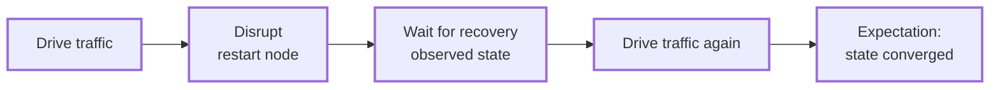

# Chaos and Controlled Failure

Chaos scenarios deliberately stop or restart nodes and then check recovery. Ordinary workloads perform these operations through the node-control capability.

---

## The Shape of a Chaos Scenario

A chaos test is three ordinary pieces wired together:

1. A scenario built with `.with_node_control()` (see [Scenario Capabilities](capabilities.md)).
2. A workload that drives traffic, disrupts a node via `ctx.node_control()`, waits for recovery, and drives traffic again.
3. An expectation that verifies the end state converged despite the disruption.



No `ManualCluster` is involved: the deployer provides a `NodeControlHandle` because the scenario declared the capability.

---

## Worked Example: OpenRaft Leader Failover

The openraft_kv failover test bootstraps a three-node Raft cluster, expands it to three voters, writes a batch, restarts the *leader*, then writes a second batch through the node elected next. Its workload is in `examples/openraft_kv/testing/workloads/src/failover.rs`:

```rust,ignore
#[async_trait]
impl Workload<OpenRaftKvEnv> for OpenRaftKvFailoverWorkload {
    fn name(&self) -> &str {
        "openraft_kv_failover_workload"
    }

    async fn start(&self, ctx: &RunContext<OpenRaftKvEnv>) -> Result<(), DynError> {
        let clients = ctx.node_clients().snapshot();
        let observer = ctx.require_extension::<ObservationHandle<OpenRaftClusterObserver>>()?;

        ensure_cluster_size(&clients, 3)?;
        self.bootstrap_cluster(&clients).await?;

        let initial_leader = wait_for_observed_leader(&observer, self.timeout, None).await?;
        let membership = OpenRaftMembership::discover(&clients).await?;

        self.promote_cluster(&observer, &clients, initial_leader, &membership).await?;
        self.write_initial_batch(&clients, initial_leader).await?;

        let new_leader = self
            .restart_leader_and_wait_for_failover(ctx, &observer, initial_leader)
            .await?;
        self.write_second_batch(&clients, new_leader).await?;

        Ok(())
    }
}
```

The disruption itself is a few lines:

```rust,ignore
let Some(control) = ctx.node_control() else {
    return Err("openraft failover workload requires node control".into());
};

control.restart_node(&format!("node-{leader_id}")).await?;

let new_leader = wait_for_observed_leader(observer, self.timeout, Some(leader_id)).await?;
```

The guard returns a clear error if the capability is missing.

### Assembling the Scenario

`build_failover_scenario` (`examples/openraft_kv/examples/src/lib.rs`) puts workload, expectation, and capability together:

```rust,ignore
pub fn build_failover_scenario(
    run_duration: Duration,
    workload_timeout: Duration,
) -> anyhow::Result<Scenario<OpenRaftKvEnv, NodeControlCapability>> {
    Ok(OpenRaftKvScenarioBuilder::with_existing_openraft_kv_app(
        OpenRaftKvExistingClusterApp::nodes(3),
    )
    .enable_node_control()
    .with_run_duration(run_duration)
    .with_workload(OpenRaftKvClusterAccessible::new(3))
    .with_workload(
        OpenRaftKvFailoverWorkload::new()
            .first_batch(INITIAL_WRITE_BATCH)
            .second_batch(SECOND_WRITE_BATCH)
            .timeout(workload_timeout)
            .key_prefix(RAFT_KEY_PREFIX),
    )
    .with_expectation(
        OpenRaftKvConverges::new(TOTAL_WRITES)
            .timeout(run_duration)
            .key_prefix(RAFT_KEY_PREFIX),
    )
    .build()?)
}
```

The return type is `Scenario<OpenRaftKvEnv, NodeControlCapability>`, so only deployers that provide node control will accept it. Run it locally or on compose:

```bash
cargo run -p openraft-kv-examples --bin openraft_kv_basic_failover
cargo run -p openraft-kv-examples --bin openraft_kv_compose_failover
```

The `openraft_kv_k8s_failover` bin executes the same failover flow on Kubernetes, but uses `ManualCluster` imperatively (`start_node` per node, `restart_node`, `wait_network_ready`). See [ManualCluster: Imperative Node Control](manual-cluster.md).

---

## Patterns

**Restart-and-verify.** The minimal chaos loop: write known data, `restart_node`, wait for readiness, verify the data survived. Restarts reuse the node's existing working directory, so on-disk state survives them by default; use `with_snapshot_dir` to seed a restore from saved state; details are in [Persistence, Snapshots, and Recovery Testing](persistence.md).

**Leader failover.** Restart the node that currently holds a distinguished role. The failover workload discovers the leader from observed cluster state instead of assuming a node index. Passing the old identity to the wait (`different_from: Some(leader_id)` above) verifies that leadership changed rather than accepting the old leader after it restarts.

**Readiness waits after disruption.** Wait before sending traffic after a restart. The example waits on *observed application state* (an agreed leader across all nodes) via an [observation handle](observation.md), which checks more than an HTTP readiness probe. In imperative flows, `ManualCluster::wait_network_ready()` covers transport-level readiness (the k8s bin calls it right after `restart_node`); inside a declarative workload, wait on observed state.

**Pair chaos with continuous observation.** A background observer polls every node through the disruption, so waits read stored snapshots and can report the last observation (`timed out waiting for observed leader agreement ...; last observation: node=0 leader=None ...`). A workload can also poll clients directly, but must then track the polling state itself.

Managed clusters get a minimum 30-second cooldown window after the workload phase before expectations run, allowing post-chaos state to settle; see [Expectations and Evaluation](expectations.md).

---

## See Also

- [Scenario Capabilities](capabilities.md) — `with_node_control` and `StartNodeOptions`
- [Continuous Observation](observation.md) — the observer used for recovery waits
- [Persistence, Snapshots, and Recovery Testing](persistence.md) — restart with retained state
- [ManualCluster: Imperative Node Control](manual-cluster.md) — the imperative variant
