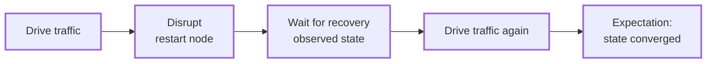

# Chaos and Controlled Failure

Chaos scenarios deliberately stop or restart nodes and then check recovery. Ordinary workloads perform these operations through the deployed cluster's `ClusterHandle`.

---

## The Shape of a Chaos Scenario

A chaos test is three ordinary pieces wired together:

1. A cluster deployed with node control — `ClusterApp` requests `ClusterControlRequest::Full` by default ([Cluster Control and Observability](capabilities.md)).
2. A workload that drives traffic, disrupts a node via the handle, waits for recovery, and drives traffic again — or the reusable `ClusterRestartChaos` workload for random restarts.
3. An expectation that verifies the end state converged despite the disruption.



No `ManualCluster` is involved: the provisioner wires a node-control surface into the handle because the cluster request asked for it, and this works on every backend whose provisioner grants control.

---

## The Built-In Restart Workload

`ClusterRestartChaos<E>` (`testing-framework-app`) randomly restarts nodes of one deployed cluster application. It resolves the cluster through its exposed `ClusterHandle<E>` and drives restarts through that handle:

```rust,ignore
let mut scenario = AppHost::scenario()
    .with_app_using(
        ClusterApp::<KvEnv>::new(KvTopology::new(3)),
        K8sClusterProvisioner,
    )
    .with_run_duration(Duration::from_secs(90))
    .with_workload(
        ClusterRestartChaos::<KvEnv>::new()
            .every_secs(10, 20)        // random delay window between restarts
            .cooldown_secs(60)         // per-node minimum time between restarts
            .excluding_nodes(["node-0"]),
    )
    .with_workload(
        KvWriteWorkload::new()
            .operations(300)
            .key_count(20)
            .rate_per_sec(10)
            .key_prefix("kv-chaos"),
    )
    .with_expectation(KvConverges::new("kv-chaos", 20).timeout(Duration::from_secs(60)))
    .build()?;

let runner = AppHostDeployer.deploy(&scenario).await?;
runner.run(&mut scenario).await?;
```

This is the shipped `kvstore_k8s_restart_chaos` binary, verifying managed k8s node control end to end; swap the provisioner for `LocalClusterProvisioner` (or plain `with_app`) and the same scenario runs on local processes.

The knobs:

| Method | Effect |
|---|---|
| `every_secs(min, max)` / `every(min, max)` | Random delay window between restarts |
| `cooldown_secs(n)` / `cooldown(d)` | Minimum time before the same node is restarted again |
| `excluding_nodes([...])` | Never restart these node names |
| `named(name)` | Target a named `ClusterHandle` instead of the default one |

Targets are the cluster's `node-<index>` names; a cluster with one node (or none after exclusions) fails fast with "no eligible targets". The workload runs until the scenario's run duration elapses.

The queue verb DSL exposes the same workload as a verb: `.restart_nodes_randomly().every_secs(5, 15).done()` ([The Verb Layer](verb-layer.md)).

---

## Worked Example: OpenRaft Leader Failover

The openraft_kv failover test bootstraps a three-node Raft cluster, expands it to three voters, writes a batch, restarts the *leader*, then writes a second batch through the node elected next. Its workload is in `examples/openraft_kv/testing/workloads/src/failover.rs`:

```rust,ignore
#[async_trait]
impl Workload<AppHostEnv> for OpenRaftKvFailoverWorkload {
    fn name(&self) -> &str {
        "openraft_kv_failover_workload"
    }

    async fn start(&self, ctx: &RunContext<AppHostEnv>) -> Result<(), DynError> {
        let cluster = ctx.require_app::<ClusterHandle<OpenRaftKvEnv>>()?;
        let clients = cluster.clients();
        let observer = ctx.require_app::<ObservationHandle<OpenRaftClusterObserver>>()?;

        ensure_cluster_size(&clients, 3)?;
        self.bootstrap_cluster(&clients).await?;

        let initial_leader = wait_for_observed_leader(&observer, self.timeout, None).await?;
        let membership = OpenRaftMembership::discover(&clients).await?;

        self.promote_cluster(&observer, &clients, initial_leader, &membership).await?;
        self.write_initial_batch(&clients, initial_leader).await?;

        let new_leader = self
            .restart_leader_and_wait_for_failover(&cluster, &observer, initial_leader)
            .await?;
        self.write_second_batch(&clients, new_leader).await?;

        Ok(())
    }
}
```

The disruption itself is a few lines:

```rust,ignore
cluster.restart_node(&leader_name).await?;

let new_leader = wait_for_observed_leader(observer, self.timeout, Some(leader_id)).await?;
```

If the cluster was deployed without control, `restart_node` returns a clear "cluster node control is not available" error.

### Assembling the Scenario

`build_failover_scenario` (`examples/openraft_kv/examples/src/lib.rs`) puts workload, expectation, and cluster together, parameterized by the backend provisioner:

```rust,ignore
pub fn build_failover_scenario<P>(
    run_duration: Duration,
    workload_timeout: Duration,
    provisioner: P,
) -> anyhow::Result<Scenario<AppHostEnv>>
where
    P: ClusterProvisioner<OpenRaftKvEnv>,
{
    Ok(AppHost::scenario()
        .with_app_using(OpenRaftKvClusterApp::nodes(3), provisioner)
        .with_run_duration(run_duration)
        .with_workload(OpenRaftKvClusterAccessible::new(3))
        .with_workload(
            OpenRaftKvFailoverWorkload::new()
                .first_batch(INITIAL_WRITE_BATCH)
                .second_batch(SECOND_WRITE_BATCH)
                .timeout(workload_timeout)
                .key_prefix(RAFT_KEY_PREFIX),
        )
        .with_expectation(
            OpenRaftKvConverges::new(TOTAL_WRITES)
                .timeout(run_duration)
                .key_prefix(RAFT_KEY_PREFIX),
        )
        .build()?)
}
```

Run it locally or on compose:

```bash
cargo run -p openraft-kv-examples --bin openraft_kv_basic_failover
cargo run -p openraft-kv-examples --bin openraft_kv_compose_failover
```

The `openraft_kv_k8s_failover` bin executes the same failover flow on Kubernetes, but uses `ManualCluster` imperatively (`start_node` per node, `restart_node`, `wait_network_ready`). See [ManualCluster: Imperative Node Control](manual-cluster.md).

---

## Patterns

**Restart-and-verify.** The minimal chaos loop: write known data, `restart_node`, wait for readiness, verify the data survived. Restarts reuse the node's existing working directory, so on-disk state survives them by default; use `with_snapshot_dir` to seed a restore from saved state; details are in [Persistence, Snapshots, and Recovery Testing](persistence.md).

**Leader failover.** Restart the node that currently holds a distinguished role. The failover workload discovers the leader from observed cluster state instead of assuming a node index. Passing the old identity to the wait (`different_from: Some(leader_id)` above) verifies that leadership changed rather than accepting the old leader after it restarts.

**Readiness waits after disruption.** Wait before sending traffic after a restart. The example waits on *observed application state* (an agreed leader across all nodes) via an [observation handle](observation.md), which checks more than an HTTP readiness probe. In imperative flows, `ManualCluster::wait_network_ready()` covers transport-level readiness (the k8s bin calls it right after `restart_node`); inside a declarative workload, wait on observed state or `cluster.wait_node_ready(name)`.

**Pair chaos with continuous observation.** A background observer polls every node through the disruption, so waits read stored snapshots and can report the last observation (`timed out waiting for observed leader agreement ...; last observation: node=0 leader=None ...`). A workload can also poll clients directly, but must then track the polling state itself.

**Give state time to settle.** Set `with_expectation_cooldown(...)` on the builder when post-chaos state needs a settle window between the workload phase and evaluation; see [Expectations and Evaluation](expectations.md).

---

## See Also

- [Cluster Control and Observability](capabilities.md) — control requests and `StartNodeOptions`
- [Continuous Observation](observation.md) — the observer used for recovery waits
- [Persistence, Snapshots, and Recovery Testing](persistence.md) — restart with retained state
- [ManualCluster: Imperative Node Control](manual-cluster.md) — the imperative variant
