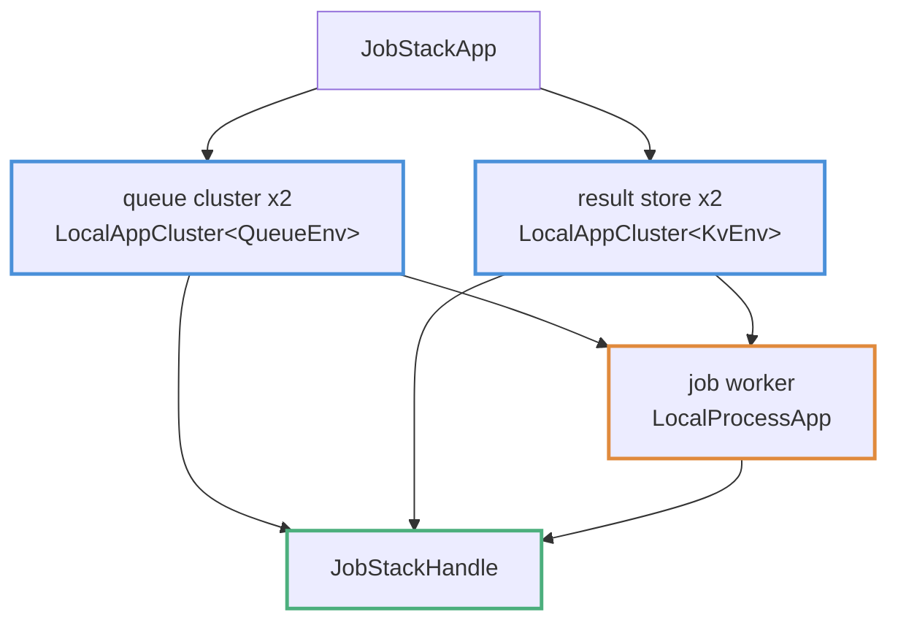

# Composing Heterogeneous Stacks

A root `AppDeployment` deploys the components, passes dependency addresses between them, and exposes typed handles.

A scenario accepts one `with_app` registration (see [AppHost and with_app](app-host.md)), so the root deployment composes its children. It exposes component handles needed by workloads and may also expose an aggregate stack handle. The `examples/multi_app` fixture contains a queue cluster, job-worker process, and kv result-store cluster in one job-processing pipeline.

---

## The Root App

```rust,ignore
// examples/multi_app/fixture/src/lib.rs
#[derive(Clone)]
struct JobStackApp {
    queue_nodes: usize,
    result_nodes: usize,
}

impl JobStackApp {
    fn new() -> Self {
        Self {
            queue_nodes: 2,
            result_nodes: 2,
        }
    }
}

#[async_trait]
impl AppDeployment<AppHostEnv> for JobStackApp {
    type Handle = JobStackHandle;

    async fn deploy(self, ctx: &mut DeployContext<AppHostEnv>) -> Result<Self::Handle, DynError> {
        let queue = ctx
            .deploy_and_expose(QueueLocalApp::nodes(self.queue_nodes))
            .await?;
        let results = ctx
            .deploy_and_expose(KvLocalApp::nodes(self.result_nodes))
            .await?;

        let queue_url = queue
            .first_client()
            .ok_or("queue cluster has no clients")?
            .base_url()
            .clone();
        let results_url = results
            .first_client()
            .ok_or("result store has no clients")?
            .base_url()
            .clone();
        let worker = ctx
            .deploy_and_expose(JobWorkerApp::new(queue_url, results_url))
            .await?;

        let stack = JobStackHandle { queue, results, worker };
        ctx.expose(stack.clone())?;

        Ok(stack)
    }
}
```

The example establishes these relationships:

- **Children are deployed through the context** (`deploy_and_expose`), so each cluster and the worker process are owned by the runtime for the whole run.
- **Dependencies are constructor arguments.** The worker receives the queue and result-store URLs from the already-deployed clusters, so the root deployment shows the dependency graph.
- **Both levels are exposed**: each component handle and the aggregate `JobStackHandle`, allowing workloads to request the smallest handle they need.



---

## Workloads Require What They Need

Each workload asks for exactly the handles it uses, the whole stack or one component:

```rust,ignore
async fn start(&self, ctx: &RunContext<AppHostEnv>) -> Result<(), DynError> {
    let stack = ctx.require_app::<JobStackHandle>()?;
    let queue = stack.queue.first_client().ok_or("queue cluster has no clients")?;

    for index in 0..self.count {
        let response: EnqueueResponse = queue
            .post("/queue/enqueue", &EnqueueRequest { payload: job_key(index) })
            .await?;
        if !response.accepted {
            return Err(format!("queue rejected job {index}").into());
        }
    }
    Ok(())
}
```

Assembling and running the scenario is unchanged from any other AppHost run:

```rust,ignore
let mut scenario = AppHost::scenario()
    .with_app(JobStackApp::new())
    .with_run_duration(Duration::from_secs(10))
    .with_workload(EnqueueJobs::new(10))
    .with_expectation(AllJobsCompleted::new(10))
    .build()?;

let deployer = AppHostLocalDeployer::default();
let runner = deployer.deploy(&scenario).await?;
runner.run(&mut scenario).await?;
```

```bash
cargo test -p multi-app-e2e
```

---

## Wiring Dependencies Between Components

**Pass dependencies through constructors.** Deploy the dependency first and pass its handle or address into the dependent's constructor, as `JobWorkerApp::new(queue_url, results_url)` does above. This records the dependency graph and acquisition order in the root deployment. A child can call `ctx.require::<T>()`, but then it depends on another deployment having exposed `T` earlier. If that did not happen, deployment fails at run time with `HandleMissing`.

The same rule applies to process-level wiring. The job worker is a [`LocalProcessApp`](local-process-app.md) whose `LaunchSpec` receives the queue and store URLs as command-line arguments: deploy the dependency, read its client's `base_url()`, and feed the address into the process. Do not have the process guess.

**Use named handles for two instances of one type.** The registry allows one default handle per concrete type; a second `expose` of the same type is a duplicate error (see [Handle Ownership and Teardown](handles-teardown.md)). Two kv clusters in one stack therefore need names:

```rust,ignore
ctx.expose_named("primary", primary)?;
ctx.expose_named("replica", replica)?;

// in the workload:
let primary = ctx.require_app_named::<LocalAppCluster<KvEnv>>("primary")?;
```

**Expose components as well as the stack when both are used.** A workload that touches one component can request its handle directly, while stack-level workloads can request the aggregate handle.

---

## See Also

- [AppDeployment and DeployContext](app-deployment.md): the composition API in detail.
- [Uniform Child Clusters: LocalAppCluster](local-app-cluster.md): the child clusters used here.
- [Backend Scope](app-backend-scope.md): where composed stacks can run today.
