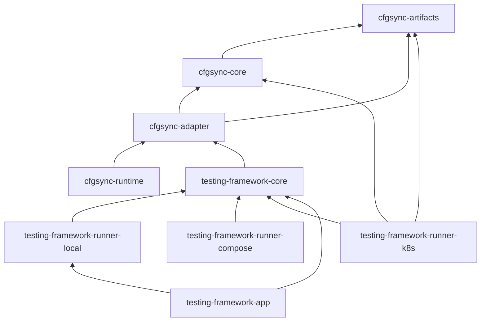

# Crate and API Map

This chapter maps which crate owns which concept, what each one exports, and how they depend on each other.

The workspace splits into three layers: the app-agnostic core, the deployment backends, and the cfgsync configuration pipeline. Example applications live in their own workspace layout under `examples/` and depend on the framework, never the other way around.



---

## testing-framework-core

Path: `testing-framework/core`. The scenario engine and everything app-agnostic: builder, runtime, topology, observation, sources, capabilities. Every other framework crate depends on it.

| Module | Contents |
|---|---|
| `env` | The `Application` trait (re-exported from `scenario`) |
| `scenario` | `ScenarioBuilder`, `Scenario`, `Workload`, `Expectation`, `RunContext`, `RunHandle`, `Runner`, `Deployer`, `RuntimeExtensionFactory`, `DeploymentPolicy`, cluster provisioning (`ClusterRequest`, `ClusterSource`, `ClusterHandle`, `ClusterProvisioner`), control traits, capability markers, sources, observability inputs |
| `topology` | `DeploymentDescriptor`, `DeploymentProvider`, `FixedDeploymentProvider`, `DeploymentSeed`, `DeploymentPlan`, `TopologyShapeBuilder`, `ClusterTopology`, `NodeCountTopology` |
| `observation` | `Observer`, `SourceProvider`, `StaticSourceProvider`, `SourceProviderFactory`, `ObservationExtensionFactory`, `ObservationRuntime`, `ObservationHandle`, `ObservationConfig` |
| `workloads` | Generic reusable workloads and verbs: `ChaosBuilderExt`, `RestartChaosBuilderExt`, `RandomRestartWorkload`, `NetworkPartitionWorkload` |
| `runtime` | `manual` (the `ManualClusterHandle` interface), `process`, `retry` |
| `cfgsync` | Bridges deployments to the cfgsync pipeline (re-exports `cfgsync-adapter`, rendering output types) |

Key builder entry points: `ScenarioBuilder::with_deployment`, `::new(provider)`, and the capability-gated variants `with_node_control()` and `with_observability()`. `ObservabilityBuilderExt` and `CoreBuilderExt` live here too.

---

## testing-framework-app

Path: `testing-framework/app`. The app layer for heterogeneous stacks: singleton processes, extra clusters, or several applications composed into one system. Depends on core plus the local deployer; the app layer is local-only today (see [Backend Scope](app-backend-scope.md)).

| Export | Role |
|---|---|
| `AppHost`, `AppHostEnv`, `AppHostTopology`, `AppHostScenarioBuilder`, `AppHostLocalDeployer` | Zero-node scenario entry point: `AppHost::scenario().with_app(...)` |
| `AppDeployment`, `AppHandle` | The composition trait and its blanket handle bound |
| `DeployContext` | Deploy children, expose typed/named handles, provision clusters through `deploy_cluster` |
| `AppDeploymentFactory`, `AppScenarioBuilderExt`, `AppRunContextExt` | Builder registration (`with_app`) and workload-side handle lookup (`app`, `require_app`, ...) |
| `LocalProcessApp`, `LocalProcessHandle` | One supervised local process as an app |
| `LocalAppCluster` | Alias for the common `ClusterHandle` used by local child clusters |
| `AppRuntime`, `HandleRegistry`, `AppDeployError` | Runtime handle storage and errors; managed cleanup is kept separately |

---

## Deployment Backends

Each backend implements `Deployer<E>` for its environment trait and returns the same core `Runner<E>`.

**`testing-framework-runner-local`** (`testing-framework/deployers/local`) spawns nodes as local processes. Exports `ProcessDeployer`, `ManualCluster`, `NodeManager`, the `LocalDeployerEnv` / `LocalBinaryApp` environment traits with config/port helpers (`LocalProcessSpec`, `LocalNodePorts`, `build_local_cluster_node_config`, ...), process primitives (`LaunchSpec`, `NodeEndpoints`, `ProcessNode`), and the whole `binary` module (`BinaryProvider` and its implementations). Honors `TF_KEEP_LOGS` for tempdir retention.

**`testing-framework-runner-compose`** (`.../compose`) renders a Docker Compose stack. Exports `ComposeDeployer`, `ComposeDeployEnv`, descriptor builders (`ComposeDescriptor`, `NodeDescriptor`), compose lifecycle commands (`compose_up`, `compose_down`, `dump_compose_logs`), and the Docker config-server support used to serve cfgsync artifacts to containers.

**`testing-framework-runner-k8s`** (`.../k8s`) installs a Helm release. Exports `K8sDeployer`, `K8sDeployEnv`, `ManualCluster` (K8s variant), Helm/chart-value infrastructure (`HelmInstallSpec`, `RunnerChartValues`, `render_binary_config_node_chart_assets`, ...), and wait/cleanup helpers. Depends directly on `cfgsync-core` and `cfgsync-artifacts` for artifact delivery.

---

## cfgsync

cfgsync is the typed pipeline that turns app config into per-node files: app config → registration snapshot → per-node artifact sets → backend rendering. Consumed by the compose and k8s deployers (locally, configs are written straight to disk). See [Static Artifacts and cfgsync](cfgsync.md).

| Crate | Responsibility | Key exports |
|---|---|---|
| `cfgsync-artifacts` | App-agnostic artifact model | `ArtifactFile`, `ArtifactSet` |
| `cfgsync-core` | Protocol, client/server, template rendering, bundles | `Client`, `serve_cfgsync`, `NodeRegistration`, `NodeArtifactsPayload`, `RenderedCfgsync`, `NodeArtifactsBundle`, config sources |
| `cfgsync-adapter` | Materializing registration snapshots into artifacts | `RegistrationSnapshotMaterializer`, `CachedSnapshotMaterializer`, `PersistingSnapshotMaterializer`, `MaterializedArtifacts`, `RegistrationConfigSource` |
| `cfgsync-runtime` | Standalone server/client binaries-facing runtime | `serve_from_config`, `run_client_from_env`, `ServerConfig` |

---

## Examples Workspace Layout

Every example app follows the same four-part shape under `examples/<app>/`:

```text
examples/kvstore/
├── kvstore-node/            # the application binary under test
├── testing/
│   ├── integration/         # crate kvstore-runtime-ext: Application impl,
│   │                        #   local/compose/k8s env impls, observation
│   └── workloads/           # crate kvstore-runtime-workloads: Workloads + Expectations
└── examples/                # crate kvstore-examples: runnable bins
```

The naming is uniform: `<app>-runtime-ext`, `<app>-runtime-workloads`, `<app>-examples`. `nats` and `redis_streams` have no node crate because they run upstream binaries or images. `multi_app` uses an acceptance-suite layout instead: a `job-worker/` binary crate, a `fixture/` crate (`multi-app-fixture`: the stack deployment, handles, workload, and expectation), and an `e2e/` crate (`multi-app-e2e`) whose integration tests drive the fixture. It demonstrates application composition.

Run any example bin with:

```bash
cargo run -p kvstore-examples --bin kvstore_basic_convergence
```

**Note:** the dependency arrows only ever point from examples toward the framework and from backends toward core. If you find yourself wanting an arrow in the other direction, read [Framework vs Application Boundaries](tf-boundaries.md). The trait-level view of the same surface is in [Public Extension Points](extension-points.md).
