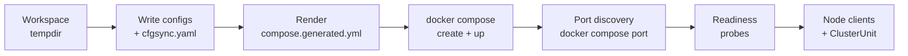

# Compose Backend

`ComposeProvisioner` runs each node as a Docker Compose service generated from your deployment descriptor. The same type also provisions heterogeneous container stacks. Each cluster and container stack runs in its **own** compose project, and every participant attaches its services to one shared session network the provisioner creates lazily — so every service reaches every other by compose service name while owning its file, project, and teardown outright.

The compose backend lives in the `testing-framework-runner-compose` crate. For a managed cluster it generates a compose file per run, brings the stack up, discovers the host ports Docker assigned, probes readiness, and returns the cluster unit. It requires a running Docker daemon; otherwise provisioning fails with `ComposeRunnerError::DockerUnavailable`.

```rust,ignore
use testing_framework_runner_compose::{ComposeProvisioner, ComposeRunnerError};

let mut scenario = AppHost::scenario()
    .with_app_using(
        ClusterApp::<KvEnv>::new(KvTopology::new(3)),
        ComposeProvisioner::default(),
    )
    .build()?;

let runner = match AppHostDeployer.deploy(&scenario).await {
    Ok(runner) => runner,
    Err(error) if docker_unavailable(&error) => return Ok(()), // skip without Docker
    Err(error) => return Err(error.into()),
};
runner.run(&mut scenario).await?;
```

(`docker_unavailable` downcasts the deploy error's source to `ComposeRunnerError::DockerUnavailable`; the shipped compose bins show the exact helper.) Run the demonstration binary with `cargo run -p kvstore-examples --bin kvstore_compose_convergence`.

---

## Provisioning Pipeline



1. **Workspace.** A temporary `ComposeWorkspace` is created; the app's `ComposeDeployEnv::prepare_compose_configs` writes per-node config files (for `ComposeBinaryApp` environments, one static config per node under `stack/configs/`, rewritten for service hostnames `node-0`, `node-1`, ...).
2. **cfgsync.** If the environment enables `ComposeConfigServerMode::Docker`, a cfgsync config server container is started on an ephemeral port and the provisioner waits for it to accept TCP connections before proceeding. The default mode is `Disabled`. See [Static Artifacts and cfgsync](cfgsync.md).
3. **Compose file.** The env's `compose_descriptor` (image, entrypoint, volumes, ports, environment, optional platform per service) is rendered through the Tera template at `testing-framework/deployers/compose/assets/docker-compose.yml.tera` into `compose.generated.yml`. The template is resolved relative to the repository root (`CARGO_WORKSPACE_DIR` override respected). Required images are checked with `docker image inspect` up front. The provisioner never builds or pulls them; a missing image fails the deploy with `MissingImage`.
4. **Bring-up.** `docker compose create` and `docker compose up` run under a unique project name (`compose-stack-<uuid>`). On failure, container logs are dumped before cleanup.
5. **Ports.** Container ports map to ephemeral host ports; the provisioner resolves each with `docker compose port` and records them as `NodeHostPorts { api, testing }`. The host defaults to `127.0.0.1` and can be overridden with `COMPOSE_RUNNER_HOST`.
6. **Readiness.** Per the env's `ComposeReadinessProbe`: HTTP GET against `Application::node_readiness_path()` on each mapped API port, or raw TCP reachability. Gated by `DeploymentPolicy.readiness_enabled`; when disabled, the stack gets a short fixed grace period instead. See [Readiness, Retry, and Artifact Preservation](deployment-policies.md).
7. **Clients.** `build_node_client` runs against the discovered host/port pairs, producing the cluster's typed node clients; external node sources are appended through `external_node_client`.

**Retry.** When the request's `DeploymentPolicy` carries a `retry_policy`, the whole managed provisioning attempt is retried with exponential backoff and jitter up to the configured attempts; without one, provisioning is a single attempt.

**Start mode.** `ClusterStartMode::OnDemand` is not supported: the provisioner rejects it with `ComposeRunnerError::OnDemandUnsupported`.

---

## Node Control

When the request asks for `ClusterControlRequest::Full` — the `ClusterApp` default — the provisioner attaches a `ComposeNodeControl` handle bound to the generated compose file and project. It supports **restart only**: `restart_node(name)` shells out to `docker compose restart <service>`. Start and stop of individual node services are not wired for managed compose clusters. The openraft_kv failover scenario runs on this backend: `cargo run -p openraft-kv-examples --bin openraft_kv_compose_failover`.

---

## Container Stacks

`ComposeProvisioner` also implements `ContainerStackProvisioner`, the heterogeneous-service contract from `testing-framework-container`. An app declares `ContainerServiceSpec` values and deploys them through `DeployContext::deploy_container_stack`. Each stack runs as its own compose project attached to the provisioner's shared session network, so an app can prepare container dependencies in order and use their internal endpoints when declaring dependents.

Node clusters attach to the same network, in either deploy order. A stack that mixes clusters and container services therefore has compose-internal DNS between them — a sidecar can reach `node-0` by service name without going through published host ports — while each participant keeps its own project: tearing one down never touches the others' files or containers. The network is labeled `testing-framework=session`; the last participant to leave removes it, and a crashed process can leak it (prune with `docker network rm` on that label).

A session holds any number of managed clusters as long as they are named. `ClusterRequest::with_name("alpha")` (or `ClusterApp::with_name`) namespaces that cluster's services, config hostnames, and config files as `alpha-node-0`, `alpha-node-1`, ..., and gives it its own cfgsync configuration; an unnamed cluster keeps the plain `node-N` names. One cluster per session may stay unnamed — a second unnamed request fails with an error pointing at `with_name`, a duplicate name fails with `ClusterAlreadyProvisioned`, and a service name colliding with any registered participant fails with `ServiceNameConflict`. Cluster names must be short DNS labels. Terminal errors (duplicate clusters, name conflicts, invalid names, unsupported on-demand start) are never retried, so the first real failure propagates instead of burning the retry budget.

Preservation is aggregated at session level and independent of deploy order: when any participant requests `preserve_artifacts` (or the `COMPOSE_RUNNER_PRESERVE`/`TESTNET_RUNNER_PRESERVE` env vars are set), every participant's cleanup skips teardown, persists its workspace, leaves cfgsync running, and keeps the session network.

Published runner ports are allocated explicitly and remain stable across container lifecycle changes. Each `ContainerServiceHandle` supports `start`, `stop`, `restart`, `wait_ready`, and `is_running`. The complete examples are `cargo test -p multi-app-e2e --test compose_happy_path` and, for mixed cluster-plus-container sessions in both orders, `cargo test -p multi-app-e2e --test compose_mixed_cluster`.

Stack containers default to `ContainerRestartPolicy::Never`, keeping crashes visible to workloads and expectations consistently across backends. An app can request `OnFailure` or `Always` explicitly when automatic recovery is part of the behavior under test. Managed node-cluster services use an `on-failure` policy.

---

## Attaching to an Existing Stack

The compose provisioner fully supports attached clusters. A request built with `ClusterRequest::attached(ExistingCluster::for_compose_project("my-project"))` skips workspace generation entirely: services are discovered from the running project (or taken from `for_compose_services`), each container's labeled API port is inspected, and clients are built through `Application::external_node_client`. Attached node control gains `stop_node` in addition to `restart_node`, implemented with `docker container stop` / `docker container restart` against discovered container IDs. A service name listed in `for_compose_services` that does not exist in the project fails attachment with an error naming the unknown and available services, and an attached readiness wait whose requested services are all stopped fails instead of returning instantly. A managed compose cluster records its own project and node service names as an `ExistingCluster` attachment exposed through `ClusterHandle::attachment()`, so deploy-then-attach flows do not need hand-written identifiers. See [Existing and External Clusters](external-clusters.md).

---

## Observability

The provisioner resolves `ObservabilityInputs` by merging the `LOGOS_BLOCKCHAIN_METRICS_QUERY_URL`, `LOGOS_BLOCKCHAIN_METRICS_OTLP_INGEST_URL`, and `LOGOS_BLOCKCHAIN_GRAFANA_URL` env vars with the request's per-cluster values (request values win). The OTLP ingest URL is passed into config preparation so node configs can point at your collector; the resolved inputs land on the cluster handle, whose `metrics()` returns a Prometheus-backed handle. Setting `TESTNET_PRINT_ENDPOINTS` prints Prometheus/Grafana endpoints and per-node pprof profile URLs to stdout. See [Telemetry and External Observability](telemetry.md).

---

## Cleanup

The cluster's cleanup guard runs `docker compose down`, shuts down the cfgsync container if one was started, and removes the workspace. Setting `COMPOSE_RUNNER_PRESERVE` (or `TESTNET_RUNNER_PRESERVE`) keeps the stack running and persists the workspace directory for post-mortem inspection; the preserved path is logged.

---

**Requirements recap:**

| Requirement | Why |
|---|---|
| Docker daemon running | `ensure_docker_available` gates every deploy |
| Node container images | Must exist locally before deploy; missing images fail with `MissingImage` |
| Repository checkout | The compose Tera template is read from the repo tree |
