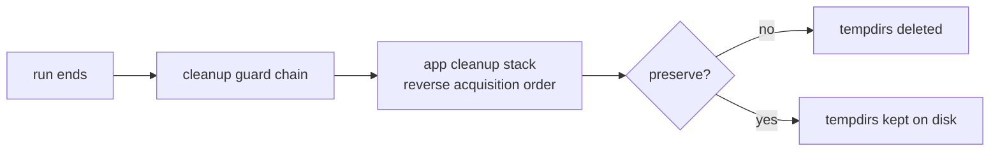

# Diagnostics and Retained Artifacts

This chapter explains where node output and generated files go, how to keep them after a run, and how to turn a failed run into a diagnosis.

---

## Where Output Goes

**Process output.** Local node processes are spawned with inherited stdout/stderr (`testing-framework/deployers/local/src/process.rs`). Node logs interleave with your test's own output on the terminal; they are not redirected to files by the framework. Control node verbosity with the process env, e.g. `LocalProcessSpec::with_rust_log("my_node=debug")` or `with_env("RUST_LOG", ...)`.

**Files.** Every local node runs inside its own temporary working directory, created per node per run **under the current working directory of the test process** (a `TempDir` with a random `.tmp*` name). The directory contains:

- the materialized launch files: for the standard spec, the rendered config (`config.yaml` by default, `LocalProcessSpec::with_config_file` to change it) plus any extra `LaunchFile` entries;
- anything the node itself writes, since the process is spawned with the directory as its `current_dir` (databases, application logs, snapshots);
- state seeded before start: `with_snapshot_dir(path)` copies a snapshot into the directory before spawn.

A typical kvstore node directory looks like:

```text
.tmpAbC123/
├── config.yaml    # rendered by the framework before spawn
└── data/          # whatever the node itself created
```

If a persistent location was requested (`with_persist_dir(path)` on `LocalProcessApp`, or `persist_dir` in `StartNodeOptions`), the directory is instead created next to `path` with a `<dirname>_` prefix, so restarts and recovery tests can find it; see [Persistence, Snapshots, and Recovery Testing](persistence.md).

Compose runs render their whole stack (compose file, per-node configs under `stack/configs/`, cfgsync artifacts) into a `compose-stack-*` workspace in the system temp directory. Kubernetes runs render Helm charts into temporary chart directories and install them into a per-run namespace.

---

## Keeping Artifacts

By default all of the above is deleted at teardown. Three mechanisms retain it:

| Mechanism | Scope | How |
|---|---|---|
| `CleanupPolicy` | one scenario | `with_deployment_policy(DeploymentPolicy { cleanup_policy: CleanupPolicy::new(true), .. })` |
| `keep_tempdir` | one process | `LocalProcessApp::keep_tempdir(true)` at build time, or `handle.keep_tempdir().await` at run time |
| `TF_KEEP_LOGS` | whole process | env var, no code change |

The local orchestrator preserves node directories when **either** the policy or the env var asks for it: `policy.cleanup_policy.preserve_artifacts || keep_tempdir_from_env()`. `TF_KEEP_LOGS` accepts `1`, `true`, or `yes` (case-insensitive) and is also honored by `ManualCluster` node starts. See [Readiness, Retry, and Artifact Preservation](deployment-policies.md) for the full policy type.

A panicking test thread preserves its node working directories automatically (`thread::panicking()` is checked in the process drop path), so a failed assertion usually leaves the directory behind without an additional flag.

The container backends have their own preserve switches: `COMPOSE_RUNNER_PRESERVE` (or `TESTNET_RUNNER_PRESERVE`) keeps the compose workspace and skips `docker compose down`; `K8S_RUNNER_PRESERVE` skips Helm uninstall and namespace deletion; `K8S_RUNNER_DEBUG` additionally logs Helm install output. All are listed in [Environment Variables](environment-variables.md).

---

## Teardown Ordering (What Preservation Does Not Change)

Preservation only controls file deletion; it does not change stop order. At the end of a run the runner executes its cleanup guards. App-layer managed resources form one LIFO guard stack within that chain, so dependants acquired later stop before their dependencies. Handle-registry release is separate and does not own process or cluster lifetime. Details in [Handle Ownership and Teardown](handles-teardown.md).



---

## Post-Mortem Workflow

1. **Reproduce with preservation.** Re-run the failing binary or test with `TF_KEEP_LOGS=1` (plus `COMPOSE_RUNNER_PRESERVE=1` for compose). On panic, artifacts are often already there from the first failure.

2. **Locate the directories.** Local node dirs are the `.tmp*` entries under the directory you launched from (named `<persist>_*` when a persist dir was set). The `working_dir()` accessor on `LocalProcessHandle` and the spawn-time log lines give exact paths.

3. **Inspect configs first.** Many deploy-time failures come from configuration. Check the rendered `config.yaml` for the ports, peer lists, and paths the framework generated. For Compose, diff the rendered files under the preserved workspace's `stack/` directory; for Kubernetes, re-run with `K8S_RUNNER_DEBUG=1` to see Helm output.

4. **Read the node's own output.** Scroll the interleaved terminal output for the failing node's log lines, or raise its `RUST_LOG` and re-run. Anything the node writes to files is in its working directory.

5. **Re-run deterministically.** If the deployment was generated from a seed, replay it with the same one via `with_deployment_seed` so the topology and generated identities match the failing run exactly; see [Seeds and Reproducibility](seeds.md). Combined with preserved state and `with_snapshot_dir`, you can restart a node from the exact bytes it crashed with.

6. **Use imperative control when needed.** To inspect the cluster interactively, start one node at a time, or restart with modified options, rebuild the situation with [ManualCluster](manual-cluster.md). It uses the same working-directory and `TF_KEEP_LOGS` behavior.
