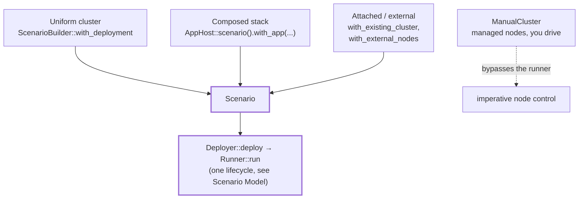

# Choosing an Entry Pattern

The framework supports three scenario-based entry patterns and one imperative entry pattern. This chapter compares them.

---

## The Four Patterns

**1. Uniform managed cluster.** Your system is N identical nodes of one application. Implement `Application` (and the deployer-specific traits), describe a topology, and build a `ScenarioBuilder<E>` over it. The framework spawns, gates, and tears down every node.

```rust,ignore
let mut scenario = KvScenarioBuilder::deployment_with(|t| t)   // 3-node default topology
    .with_run_duration(Duration::from_secs(30))
    .with_workload(KvWriteWorkload::new().operations(300))
    .with_expectation(KvConverges::new("demo", 30))
    .build()?;

let runner = KvLocalDeployer::default().deploy(&scenario).await?;
runner.run(&mut scenario).await?;
```

(The shipped `kvstore_basic_convergence` binary wraps the same topology in the `with_existing_kvstore_app` convenience preset; that hybrid is covered in [AppHost and with_app](app-host.md).)

**2. Composed application stack.** Your system is heterogeneous: several clusters, singleton processes, or both. Start from `AppHost::scenario()` (a zero-node `ScenarioBuilder<AppHostEnv>`) and register one root `AppDeployment` with `.with_app(...)`. The deployment composes children through `DeployContext` and exposes typed handles that workloads retrieve with `AppRunContextExt`.

```rust,ignore
let mut scenario = AppHost::scenario()
    .with_app(JobStackApp::new())              // queue cluster + worker + result store
    .with_run_duration(Duration::from_secs(10))
    .with_workload(EnqueueJobs::new(10))
    .with_expectation(AllJobsCompleted::new(10))
    .build()?;

let runner = AppHostLocalDeployer::default().deploy(&scenario).await?;
runner.run(&mut scenario).await?;
```

A scenario accepts one `with_app` registration. A second registration fails at prepare time with a duplicate-runtime-extension error; compose multiple apps inside one root deployment instead ([Composing Heterogeneous Stacks](composing-stacks.md)).

**3. Attached and external nodes.** The system already runs somewhere else: a staging network, a long-lived cluster, another team's deployment. You plug it in as a source instead of deploying it: `with_existing_cluster(...)` / `with_existing_cluster_from(...)` attach a cluster description, `with_external_node(...)` / `with_external_nodes(...)` add endpoint-only nodes, and `with_external_only_nodes(...)` declares a scenario with no framework-managed nodes at all. `Application::external_node_client` turns each `ExternalNodeSource` into a typed client. Workloads and expectations are unchanged. See [Existing and External Clusters](external-clusters.md).

**4. ManualCluster: imperative control.** Your code decides when nodes start, stop, and restart, step by step. `ManualCluster::from_topology(descriptors)` (or `ProcessDeployer::manual_cluster_from_descriptors`) gives you `start_node`, `start_node_with(StartNodeOptions)`, `stop_node`, `restart_node`, `wait_network_ready`, `wait_node_ready`, and `node_client`, but no workloads, no expectations, no runner. See [ManualCluster: Imperative Node Control](manual-cluster.md).

**Note:** needing to restart nodes does *not* push you to ManualCluster. Declarative scenarios gain restart-capable workloads via `with_node_control()` on the builder ([Scenario Capabilities](capabilities.md)), and app-layer child clusters expose `restart_node` on their handles.

---

## One Runtime, Three Declarative Patterns



All three declarative patterns produce a `Scenario` and use the same [lifecycle](scenario-model.md), so workloads and expectations can be reused across them when their required clients and capabilities are available. `ManualCluster` uses the node-startup implementation without the scenario runtime. Its nodes remain framework-managed while test code controls the sequence.

---

## Decision Table

| Shape of the system under test | Pattern | Read next |
|---|---|---|
| N identical nodes of one binary, framework-managed | Uniform managed cluster | [Part IV](part-iv.md) |
| Several apps or clusters composed into one stack | `AppHost` + `with_app` | [Part II](part-ii.md) |
| Already-running nodes you must not deploy | Attached / external sources | [Part V](part-v.md) |
| An external driver dictates every step | `ManualCluster` | [ManualCluster](manual-cluster.md) |

---

## Choosing by Example

**"Three kvstore nodes, write traffic, convergence check."** Uniform managed cluster. `KvEnv` already models the node; the framework owns the whole population. This is `cargo run -p kvstore-examples --bin kvstore_basic_convergence`.

**"A queue cluster, a worker process, and a result-store cluster forming one pipeline."** Composed stack. One root `AppDeployment` deploys both clusters, wires the worker to them by URL, and exposes each handle plus a stack handle; a workload enqueues jobs and an expectation verifies the results. The `multi-app-e2e` acceptance test covers this shape; run it with `cargo test -p multi-app-e2e`.

**"Run our smoke workload against the live staging network."** Attach. There is nothing to deploy: declare the endpoints with `with_external_only_nodes`, let `external_node_client` build clients, and keep the exact same workloads and expectations you use locally.

**"A Gherkin suite where each step starts or kills a node."** ManualCluster. The BDD runner owns sequencing, and its steps call `start_node_with`, `stop_node`, and `wait_node_ready` directly.

> **External example:** logos-blockchain's cucumber suite is a real example of the fourth pattern: Gherkin steps drive `ManualCluster` for dependency-ordered starts, restarts, and snapshot/restore flows, all in its own repository.

---

## Where to Go Next

- [Scenario Model and Lifecycle](scenario-model.md): the runtime every declarative pattern converges on.
- [Application, AppDeployment, and Environments](application-model.md): the types behind patterns 1 and 2.
- [Ownership and Design Boundaries](boundaries.md): what stays yours regardless of pattern.
