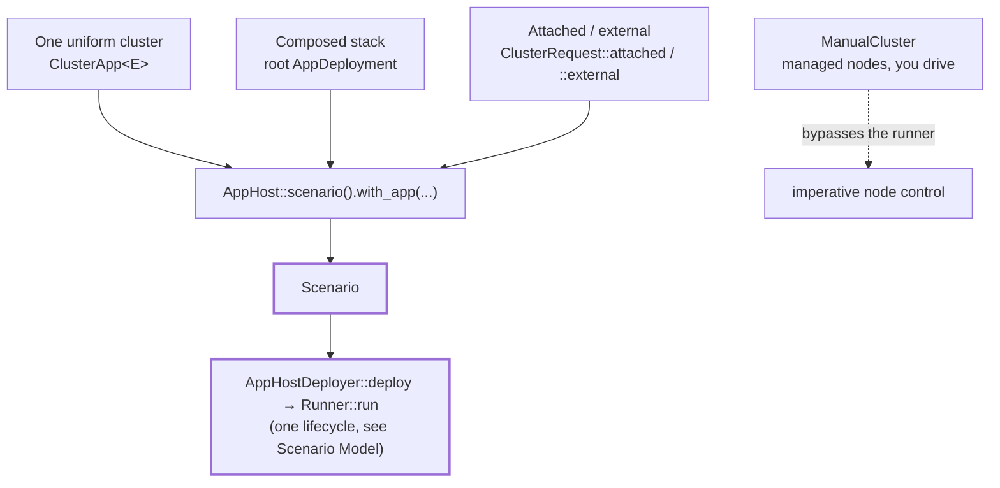

# Choosing an Entry Pattern

The framework has one composition model: every declarative scenario starts from `AppHost::scenario()` and registers its applications with `.with_app(...)` — one root application for a coupled stack, or several independent apps whose handle registries merge. What varies is what those applications are, where their clusters come from, and which backend provisions them. One imperative escape hatch — `ManualCluster` — sits outside the scenario runtime for tests where your code dictates every step.

---

## One Model, Four Shapes

**1. One uniform cluster.** The degenerate — and most common — composed application is a single node cluster. `ClusterApp<E>` deploys N identical nodes of one `Application` and exposes a backend-neutral `ClusterHandle<E>` to workloads:

```rust,ignore
let mut scenario = AppHost::scenario()
    .with_app(ClusterApp::<KvEnv>::new(KvTopology::new(3)))
    .with_run_duration(Duration::from_secs(30))
    .with_workload(KvWriteWorkload::new().operations(300))
    .with_expectation(KvConverges::new("demo", 30))
    .build()?;

let runner = AppHostDeployer.deploy(&scenario).await?;
runner.run(&mut scenario).await?;
```

`with_app` uses the default `LocalClusterProvisioner`; `with_app_using(app, provisioner)` runs the same scenario on Docker Compose (`ComposeProvisioner`) or Kubernetes (`K8sClusterProvisioner`). This is `cargo run -p kvstore-examples --bin kvstore_basic_convergence` and its `_compose_` / `_k8s_` siblings.

**2. Composed application stack.** Your system is heterogeneous: several clusters, singleton processes, or both. Write one root `AppDeployment` that composes children through `DeployContext` and exposes typed handles that workloads retrieve with `AppRunContextExt`:

```rust,ignore
let mut scenario = AppHost::scenario()
    .with_app(JobStackApp::new())              // queue cluster + worker + result store
    .with_run_duration(Duration::from_secs(10))
    .with_workload(EnqueueJobs::new(10))
    .with_expectation(AllJobsCompleted::new(10))
    .build()?;

let runner = AppHostDeployer.deploy(&scenario).await?;
runner.run(&mut scenario).await?;
```

A scenario accepts one `with_app` registration. A second registration fails at prepare time with a duplicate-runtime-extension error; compose multiple apps inside one root deployment instead ([Composing Heterogeneous Stacks](composing-stacks.md)).

**3. Attached and external clusters.** The system already runs somewhere else: a staging network, a long-lived cluster, another team's deployment. This is not a separate entry pattern — it is a different arm of the same per-cluster request. `ClusterRequest::attached(existing)` connects to a cluster the framework can discover (a compose project or a k8s label selector), `ClusterRequest::external(nodes)` wraps plain endpoints, and `ClusterApp::with_external_nodes(...)` mixes external endpoints into a managed cluster. `Application::external_node_client` turns each `ExternalNodeSource` into a typed client. Workloads and expectations are unchanged. See [Existing and External Clusters](external-clusters.md).

**4. ManualCluster: imperative control.** Your code decides when nodes start, stop, and restart, step by step. `ManualCluster` gives you `start_node`, `start_node_with(StartNodeOptions)`, `stop_node`, `restart_node`, `wait_network_ready`, `wait_node_ready`, and `node_client`, but no workloads, no expectations, no runner. It exists for local processes (`testing_framework_runner_local::ManualCluster::from_topology`) and Kubernetes (`testing_framework_runner_k8s::ManualCluster::from_topology`). See [ManualCluster: Imperative Node Control](manual-cluster.md).

**Note:** needing to restart nodes does *not* push you to `ManualCluster`. `ClusterApp` requests full node control by default, so its `ClusterHandle` exposes `restart_node` and friends to any workload ([Cluster Control and Observability](capabilities.md)). Manual mode is also available *inside* the model: `ClusterApp::with_start_mode(ClusterStartMode::OnDemand)` prepares a cluster whose nodes your workloads start explicitly.

---

## One Runtime, One Declarative Path



Every declarative shape produces a `Scenario<AppHostEnv>` and uses the same [lifecycle](scenario-model.md), so workloads and expectations are reused across shapes and backends whenever their required handles are available. `ManualCluster` uses the node-startup implementation without the scenario runtime. Its nodes remain framework-managed while test code controls the sequence.

---

## Decision Table

| Shape of the system under test | Pattern | Read next |
|---|---|---|
| N identical nodes of one binary, framework-managed | `ClusterApp` | [Part IV](part-iv.md) |
| Several apps or clusters composed into one stack | root `AppDeployment` | [Part II](part-ii.md) |
| Already-running nodes you must not deploy | `ClusterRequest::attached` / `::external` | [Part V](part-v.md) |
| An external driver dictates every step | `ManualCluster` | [ManualCluster](manual-cluster.md) |

---

## Choosing by Example

**"Three kvstore nodes, write traffic, convergence check."** One uniform cluster. `KvEnv` already models the node; `ClusterApp` owns the whole population. This is `cargo run -p kvstore-examples --bin kvstore_basic_convergence`.

**"A queue cluster, a worker process, and a result-store cluster forming one pipeline."** Composed stack. One root `AppDeployment` deploys both clusters, wires the worker to them by URL, and exposes each handle plus a stack handle; a workload enqueues jobs and an expectation verifies the results. The `multi-app-e2e` acceptance test covers this shape; run it with `cargo test -p multi-app-e2e`.

**"Run our smoke workload against the live staging network."** External. There is nothing to deploy: build the cluster from `ClusterRequest::external(endpoints)`, let `external_node_client` build clients, and keep the exact same workloads and expectations you use locally.

**"A Gherkin suite where each step starts or kills a node."** `ManualCluster`. The BDD runner owns sequencing, and its steps call `start_node_with`, `stop_node`, and `wait_node_ready` directly.

> **External example:** logos-blockchain's cucumber suite is a real example of the fourth pattern: Gherkin steps drive `ManualCluster` for dependency-ordered starts, restarts, and snapshot/restore flows, all in its own repository.

---

## Where to Go Next

- [Scenario Model and Lifecycle](scenario-model.md): the runtime every declarative shape converges on.
- [Application, AppDeployment, and Environments](application-model.md): the types behind the model.
- [Cluster Provisioning](cluster-provisioning.md): the request/provisioner boundary that makes backends interchangeable.
- [Ownership and Design Boundaries](boundaries.md): what stays yours regardless of shape.
