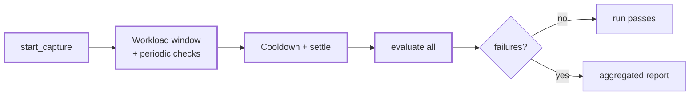

# Expectations and Evaluation

Expectations define success conditions. They can capture state before workloads start, check invariants while traffic runs, and evaluate the final state after the run settles.

---

## The Expectation Trait

`Expectation<E>` lives in `testing-framework/core/src/scenario/expectation.rs`:

```rust,ignore
use async_trait::async_trait;
use testing_framework_core::scenario::{DynError, Expectation, RunContext};

#[async_trait]
pub trait Expectation<E: Application>: Send + Sync {
    fn name(&self) -> &str;

    fn init(
        &mut self,
        _descriptors: &E::Deployment,
        _run_metrics: &RunMetrics,
    ) -> Result<(), DynError> {
        Ok(())
    }

    async fn start_capture(&mut self, _ctx: &RunContext<E>) -> Result<(), DynError> {
        Ok(())
    }

    /// Optional periodic check used by fail-fast expectation mode.
    async fn check_during_capture(&mut self, _ctx: &RunContext<E>) -> Result<(), DynError> {
        Ok(())
    }

    async fn evaluate(&mut self, ctx: &RunContext<E>) -> Result<(), DynError>;
}
```

The trait methods are:
- **`init`** runs at `build()` time with the resolved deployment and run metrics; a failure aborts the build.
- **`start_capture`** runs once per expectation *before any workload starts*. Use it to record a baseline (initial counters, starting state). A failure here is `ScenarioError::ExpectationCapture` and stops the run before traffic begins.
- **`check_during_capture`** is a fail-fast hook. The runner calls it on every expectation roughly once per second for the whole workload window (and the cooldown window). The default is a no-op, so existing end-of-run expectations are unaffected. The first check that returns `Err` aborts the run immediately with `ScenarioError::ExpectationFailedDuringCapture`. Use it for invariants that must hold throughout the run.
- **`evaluate`** checks the final condition after the run settles. It takes `&mut self`, so it can consume state accumulated during capture.

---

## Registration

Two paths feed the scenario's expectation list:

1. **Explicit**: `.with_expectation(exp)` or `.with_expectation_boxed(boxed)` on any builder.
2. **Workload-attached**: when you call `.with_workload(w)`, the builder also collects `w.expectations()` (see [Workloads and Concurrency](workloads.md)). The default implementation returns none.

Both end up in the same list and are treated identically at run time.

Workload-attached expectations let a workload register the checks associated with its own traffic. Adding the workload also adds those checks.

---

## Evaluation and Failure Aggregation



At the end of the run the runner evaluates **every** registered expectation, even after failures. Each failure is recorded as `name: error`, and the results are joined into a single `ScenarioError::Expectations` report:

```text
expectations failed:
kv_converges: kv convergence not reached within 20s for 20 keys
openraft_kv_converges: timed out waiting for observed replicated state convergence ...
```

This is different from workload failures and capture-check failures, which abort immediately.

---

## Cooldown: with_expectation_cooldown

Workload traffic may need time to settle before evaluation: replication lags, queues drain, and restarted nodes rejoin. The builder exposes:

```rust,ignore
.with_expectation_cooldown(Duration::from_secs(20))
```

Verified behavior (`runner.rs` and `definition/validation.rs`):

- If you never call it, the cooldown defaults to **10 seconds**. (`build()` also enforces a minimum run duration of 10 seconds.)
- After the workload window, the runner keeps the run alive for the cooldown window, still joining unfinished workloads and still running `check_during_capture` ticks.
- When the framework owns the node lifecycle (managed clusters), the cooldown window is raised to a **minimum of 30 seconds** so restarted or freshly deployed nodes stabilize.
- Before calling `evaluate`, the runner additionally sleeps a short settle wait derived from the same setting (at least 2 seconds when a cooldown is configured or node control is active) so runtime extensions such as [observers](observation.md) catch up.

Set the cooldown to zero only for scenarios without managed nodes where staleness cannot matter.

---

## Worked Example: Convergence Checks

The kvstore example's `KvConverges` (`examples/kvstore/testing/workloads/src/expectations.rs`) is a plain polling expectation. It only implements `evaluate` and does its own retry loop against the node clients:

```rust,ignore
use async_trait::async_trait;
use kvstore_runtime_ext::KvEnv;
use testing_framework_core::scenario::{DynError, Expectation, RunContext};

#[async_trait]
impl Expectation<KvEnv> for KvConverges {
    fn name(&self) -> &str {
        "kv_converges"
    }

    async fn evaluate(&mut self, ctx: &RunContext<KvEnv>) -> Result<(), DynError> {
        let clients = ctx.node_clients().snapshot();
        if clients.is_empty() {
            return Err("no kv node clients available".into());
        }

        let deadline = tokio::time::Instant::now() + self.timeout;
        while tokio::time::Instant::now() < deadline {
            if self.is_converged(&clients).await? {
                return Ok(());
            }
            tokio::time::sleep(self.poll_interval).await;
        }

        Err(format!(
            "kv convergence not reached within {:?} for {} keys",
            self.timeout, self.key_count
        )
        .into())
    }
}
```

The example follows two conventions:

- **Poll with a deadline inside `evaluate`.** Eventual consistency is the common case; a one-shot read makes flaky tests.
- **Make the error message carry the diagnosis.** State what was expected, how long you waited, and (where available) what was last observed.

The openraft_kv variant, `OpenRaftKvConverges` (`examples/openraft_kv/testing/workloads/src/convergence.rs`), reads the cluster observer registered as a runtime extension instead of querying nodes directly:

```rust,ignore
async fn evaluate(&mut self, ctx: &RunContext<OpenRaftKvEnv>) -> Result<(), DynError> {
    let expected = expected_kv(&self.key_prefix, self.total_writes);
    let observer = ctx.require_extension::<ObservationHandle<OpenRaftClusterObserver>>()?;

    wait_for_observed_replication(&observer, &expected, self.timeout).await?;

    Ok(())
}
```

The observer polls every node in the background, and the expectation waits for a matching snapshot without maintaining its own client polling state. See [Continuous Observation](observation.md) for the mechanism.

---

## See Also

- [Workloads and Concurrency](workloads.md) — the traffic these checks judge
- [Continuous Observation](observation.md) — snapshot-based state for expectations
- [Runtime Extensions](runtime-extensions.md) — how extension handles reach `evaluate`
- [Telemetry and External Observability](telemetry.md) — asserting on Prometheus metrics
