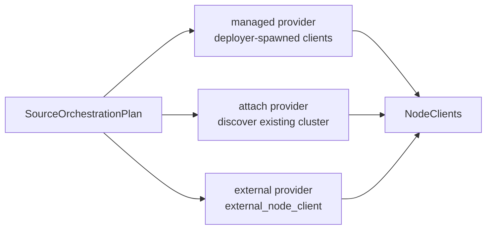

# Existing and External Clusters

Scenarios can run against nodes the framework did not deploy: an attached existing cluster, standalone external endpoints, or a mix.

Every scenario draws its node clients from three source classes: **managed** nodes the deployer spawns, **attached** nodes discovered in an existing cluster, and **external** nodes named by static endpoints. The builder records which sources you want; the deployer resolves them into one `NodeClients` inventory at deploy time.

---

## The Source Model

The source model uses these types from `testing-framework-core`:

| Type | Shape |
|---|---|
| `ExistingCluster` | Typed descriptor of a cluster to attach to — a k8s label selector (optionally namespaced) or a compose project (optionally with explicit services) |
| `IntoExistingCluster` | Conversion trait; implemented by `ExistingCluster` itself and by deployer metadata types |
| `ExternalNodeSource` | A label plus an endpoint string, e.g. `http://10.0.0.5:8080` |
| `ClusterMode` | `Managed`, `ExistingCluster`, or `ExternalOnly` |
| `ClusterControlProfile` | `FrameworkManaged`, `ExistingClusterAttached`, `ExternalUncontrolled`, `ManualControlled` |

`ExistingCluster` is constructed with `for_k8s_selector(selector)`, `for_k8s_selector_in_namespace(namespace, selector)`, `for_compose_project(project)`, or `for_compose_services(project, services)`. `ExternalNodeSource::new(label, endpoint)` wraps a plain endpoint string.

The mode is derived, not set: a scenario with only a topology is `Managed`; adding an existing cluster makes it `ExistingCluster`; `with_external_only` makes it `ExternalOnly`. Invalid combinations (managed **and** attached at once) are unrepresentable. Each mode maps to a `ClusterControlProfile`, which workloads can consult to know whether the framework owns node lifecycles (`framework_owns_lifecycle()` is true only for `FrameworkManaged`).

---

## Builder Methods

```rust,ignore
use testing_framework_core::scenario::{ExistingCluster, ExternalNodeSource};

// Attach to a running compose project instead of deploying nodes.
let scenario = KvScenarioBuilder::deployment_with(|_| KvTopology::new(3))
    .with_existing_cluster(ExistingCluster::for_compose_project("compose-stack-1234".into()))
    .with_workload(KvWriteWorkload::new().operations(100))
    .build()?;

// Add a standalone external endpoint alongside managed nodes.
let scenario = KvScenarioBuilder::deployment_with(|_| KvTopology::new(2))
    .with_external_node(ExternalNodeSource::new(
        "staging-gateway".into(),
        "http://staging.example.net:8080".into(),
    ))
    .build()?;
```

| Method | Effect |
|---|---|
| `with_existing_cluster(cluster)` | Switch to existing-cluster mode with this descriptor |
| `with_existing_cluster_from(value)` | Same, converting through `IntoExistingCluster` (fallible) |
| `with_attach_source(attach)` | Alias for `with_existing_cluster` |
| `with_external_node(node)` | Add one external endpoint to the current mode |
| `with_external_nodes(nodes)` | Add several |
| `with_external_only()` | Drop the managed topology; keep only external nodes |
| `with_external_only_nodes(nodes)` | `with_external_nodes` + `with_external_only` in one call |

External nodes compose with every mode: managed + external and attached + external are both valid hybrids.

---

## From Source to Typed Client

External and attached sources become typed clients through one hook on the `Application` trait:

```rust,ignore
fn external_node_client(source: &ExternalNodeSource) -> Result<Self::NodeClient, DynError>;
```

The default implementation errors with "external node sources are not supported"; an application opts in by parsing `source.endpoint()` and constructing its client. The local deployer additionally falls back to a generic parser that resolves `http://host:port` endpoints and builds the client from the socket address when the app has not overridden the hook.

---

## Resolution at Runtime

At deploy time the scenario's sources become a `SourceOrchestrationPlan`, and each deployer supplies a `SourceProviders` set: a managed provider (the clients it just deployed), an attach provider, and an external provider. `orchestrate_sources_with_providers` resolves the plan:



The final inventory is ordered managed, then attached, then external. Managed mode with zero managed nodes is rejected; existing-cluster and external-only modes require at least one resolved client overall.

**Per-deployer attach support:**

- **Local**: no attach. `ProcessDeployer` rejects `ClusterMode::ExistingCluster` outright; external nodes are supported.
- **Compose**: requires a compose descriptor. Services are taken from the descriptor or discovered from the running project; each container's labeled API port is inspected and turned into an `ExternalNodeSource` fed to `external_node_client`. Attached mode also wires restart/stop node control. See [Compose Deployer](deployer-compose.md).
- **K8s**: requires a k8s descriptor. Services matching the label selector are listed in the namespace (default `default`); each service's single TCP NodePort (preferring ports named `http` or `api`) becomes the endpoint. See [Kubernetes Deployer](deployer-k8s.md).

---

## Deploy-Then-Attach

Both container deployers return metadata that converts back into an attach descriptor, so one process can deploy a stack and a second scenario can attach to it:

```rust,ignore
let (runner, metadata) = ComposeDeployer::<KvEnv>::new()
    .deploy_with_metadata(&scenario)
    .await?;

// Later, or elsewhere: attach to the same project.
let attached = KvScenarioBuilder::deployment_with(|_| KvTopology::new(3))
    .with_existing_cluster_from(&metadata)?
    .build()?;
```

`K8sDeployer::deploy_with_metadata` provides the equivalent `K8sDeploymentMetadata` (namespace + label selector).

---

## Use Cases

- **Staging and live networks.** Point `with_external_only_nodes` at long-lived endpoints and run workloads and expectations against them; the framework never touches their lifecycle (`ExternalUncontrolled`).
- **Shared test stacks.** Deploy a compose or k8s stack once, attach many fast scenarios to it, and preserve the stack between runs with the deployer preserve env vars (see [Readiness, Retry, and Artifact Preservation](deployment-policies.md)).
- **Hybrid scenarios.** Combine managed nodes with an external dependency, for example a locally deployed cluster that must interoperate with a fixed remote peer.

Manual clusters have their own external hooks: `add_external_sources` and `add_external_clients` on `ManualCluster` merge external endpoints into an imperatively driven cluster (see [ManualCluster](manual-cluster.md)).
