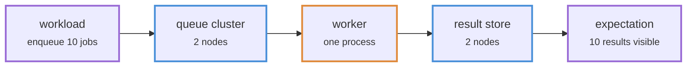
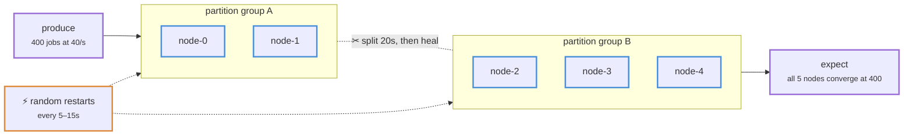
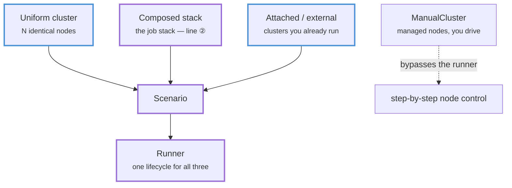
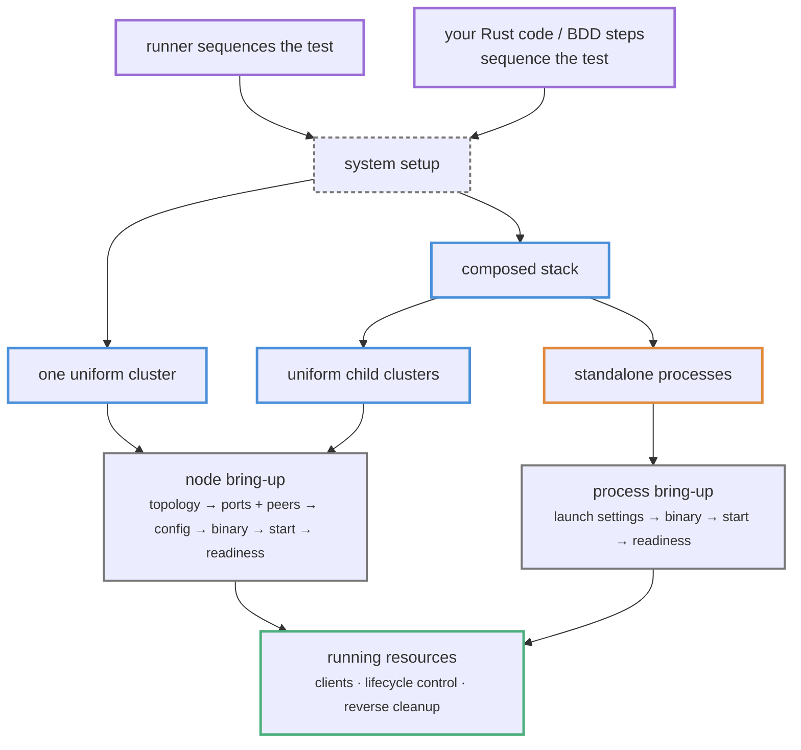
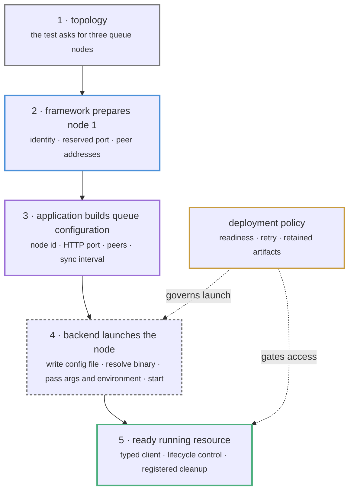
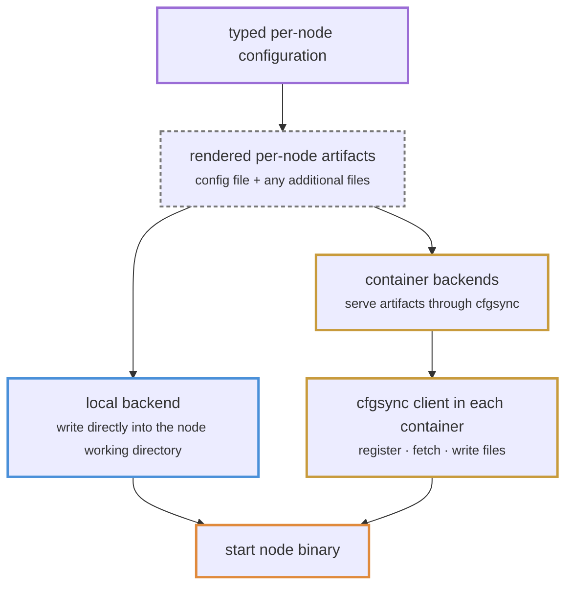

<div class="tour">

# The Framework in Brief

<div class="slide slide--top">
<p class="slide-kick">the framework</p>
<p class="slide-line">The testing framework runs system-level tests against multi-process and multi-node deployments, from ordinary Rust code.</p>
<p class="nlabel">every test has four parts</p>
<div class="nodes"><span class="ndw"><span class="nd">start the system</span><span class="nd-sub">local · Compose · Kubernetes</span></span><span class="nda">→</span><span class="ndw"><span class="nd">drive traffic</span><span class="nd-sub">workloads</span></span><span class="nda">→</span><span class="ndw"><span class="nd">verify outcomes</span><span class="nd-sub">expectations</span></span><span class="nda">→</span><span class="ndw"><span class="nd">tear down</span><span class="nd-sub">automatic, reverse</span></span></div>
<p class="nlabel">the system under test can be</p>
<div class="nodes nodes--list"><span class="ndw"><span class="nd nd-cluster">uniform clusters</span><span class="nd-sub">N nodes of one binary</span></span><span class="ndw"><span class="nd nd-process">single binaries</span><span class="nd-sub">yours or third-party</span></span><span class="ndw"><span class="nd nd-scenario">composed stacks</span><span class="nd-sub">clusters + processes, wired</span></span><span class="ndw"><span class="nd nd-cluster nd--dash">already running</span><span class="nd-sub">attached / external</span></span></div>
<p class="nlabel">two ways to drive the test, using the same deployment code</p>
<div class="nodes"><span class="ndw"><span class="nd nd-scenario">a scenario</span><span class="nd-sub">declarative — the runner drives</span></span><span class="nda">or</span><span class="ndw"><span class="nd">your own code</span><span class="nd-sub">imperative — <code>ManualCluster</code></span></span></div>
<p class="slide-note">an <b>Application</b> defines the config, client, and deployment shape for one node kind</p>

<div class="fold" data-label="details — the four parts, and the example system">

The testing framework runs system-level tests against multi-process and multi-node deployments. A test starts the system — as local processes, a Compose project, or a Kubernetes deployment — drives traffic against it, verifies outcomes, and tears everything down, all from ordinary Rust code. The sections below explain the APIs used for each part.

This page summarizes the main concepts and links each one to a full chapter. It uses the **job-processing stack** from `examples/multi_app` throughout: jobs enter a <span class="tk tk-cluster">queue cluster</span>, a <span class="tk tk-process">worker process</span> consumes them, and results are written to a <span class="tk tk-cluster">result-store cluster</span>.



</div>
</div>

<div class="slide slide--top">
<p class="slide-kick">six terms</p>
<p class="spine">A <b>Builder</b> creates a <span class="tk tk-scenario">Scenario</span>. A <b>Deployer</b> starts the system. The <b>Runner</b> starts its <b>Workloads</b> and evaluates its <b>Expectations</b>.</p>

<div class="gcards">
<div class="gcard">
<span class="gcard-label">describe the test</span>
<div class="gterm"><svg viewBox="0 0 24 24" fill="none" stroke="#9b6dd6" stroke-width="1.8" stroke-linecap="round" stroke-linejoin="round" aria-hidden="true"><path d="M6 3h9l4 4v14H6z"/><path d="M15 3v4h4"/><path d="M9 12h7M9 16h7"/></svg><span><span class="tk tk-scenario">Scenario</span><span class="ggloss">deployment and test plan</span></span></div>
<div class="gterm"><svg viewBox="0 0 24 24" fill="none" stroke="currentColor" stroke-width="1.8" stroke-linecap="round" stroke-linejoin="round" aria-hidden="true"><rect x="4" y="14" width="7" height="6" rx="1"/><rect x="13" y="14" width="7" height="6" rx="1"/><rect x="8.5" y="5" width="7" height="6" rx="1"/></svg><span><b>Builder</b><span class="ggloss">assembles the scenario</span></span></div>
</div>
<div class="gcard">
<span class="gcard-label">act and check</span>
<div class="gterm"><svg viewBox="0 0 24 24" fill="none" stroke="currentColor" stroke-width="1.8" stroke-linecap="round" stroke-linejoin="round" aria-hidden="true"><path d="M13 2 5 14h6l-1 8 8-12h-6z"/></svg><span><b>Workload</b><span class="ggloss">creates activity</span></span></div>
<div class="gterm"><svg viewBox="0 0 24 24" fill="none" stroke="currentColor" stroke-width="1.8" stroke-linecap="round" stroke-linejoin="round" aria-hidden="true"><rect x="4" y="4" width="16" height="16" rx="2"/><path d="m8.5 12.5 2.5 2.5 5-6"/></svg><span><b>Expectation</b><span class="ggloss">verifies an outcome</span></span></div>
</div>
<div class="gcard">
<span class="gcard-label">execute it</span>
<div class="gterm"><svg viewBox="0 0 24 24" fill="none" stroke="currentColor" stroke-width="1.8" stroke-linecap="round" stroke-linejoin="round" aria-hidden="true"><path d="M4 14v6h16v-6"/><path d="M12 4v9M8 8l4-4 4 4"/></svg><span><b>Deployer</b><span class="ggloss">starts the system</span></span></div>
<div class="gterm"><svg viewBox="0 0 24 24" fill="none" stroke="currentColor" stroke-width="1.8" stroke-linecap="round" stroke-linejoin="round" aria-hidden="true"><path d="M7 4.5v15l12-7.5z"/></svg><span><b>Runner</b><span class="ggloss">runs it end to end</span></span></div>
</div>
</div>

<p class="slide-note">these six terms appear throughout the examples below</p>

<div class="fold" data-label="full definitions — the six terms in one grid">

<div class="gloss">
<span class="g-term"><span class="tk tk-scenario">Scenario</span></span><span class="g-gloss">deployment and test plan</span><span class="g-def">what to deploy, what activity to run, what to verify, and for how long</span>
<span class="g-term">Builder</span><span class="g-gloss">assembles the scenario</span><span class="g-def">the chain of <code>with_*</code> calls</span>
<span class="brk"></span>
<span class="g-term">Workload</span><span class="g-gloss">creates activity</span><span class="g-def">code that runs against the live system: send jobs, restart nodes, cut the network</span>
<span class="g-term">Expectation</span><span class="g-gloss">verifies an outcome</span><span class="g-def">code that checks the result after the activity: all results present, cluster converged</span>
<span class="brk"></span>
<span class="g-term">Deployer</span><span class="g-gloss">starts the system</span><span class="g-def">for real, as local processes, a Compose project, or a Kubernetes deployment</span>
<span class="g-term">Runner</span><span class="g-gloss">runs it end to end</span><span class="g-def">wait until ready, run workloads, evaluate expectations, tear down</span>
</div>

</div>
</div>

<div class="fold" data-label="map — every concept on this page, end to end">

This map shows how the concepts on the page relate. Each §N badge links the concept to the section that explains it.

<div class="arch-map">

{{#include framework-map.svg}}

</div>

<p class="map-help">Click an empty area to enlarge the map. Drag to pan; press Escape or use Close to return.</p>

</div>

<div class="slide slide--top">
<p class="slide-kick">the whole test</p>
<p class="slide-line">This is the main body of the <code>multi-app-e2e</code> acceptance test. Run it with <code>cargo test -p multi-app-e2e</code>.</p>
<p class="nlabel">example used throughout: enqueue ten jobs in the <code>examples/multi_app</code> stack and check that ten results are stored</p>

```rust,ignore
let mut scenario = AppHost::scenario()                // ①
    .with_app(JobStackApp::new())                     // ②
    .with_run_duration(Duration::from_secs(10))       // ③
    .with_workload(EnqueueJobs::new(10))              // ④
    .with_expectation(AllJobsCompleted::new(10))      // ⑤
    .build()?;

let runner = AppHostLocalDeployer::default()
    .deploy(&scenario)                                // ⑥
    .await?;

runner.run(&mut scenario).await?;                     // ⑦
```

<p class="slide-note">① create the scenario · ② add the stack · ③ set the run limit · ④ add traffic · ⑤ add a check · ⑥ start locally · ⑦ run and clean up</p>

<div class="fold" data-label="notes — each line and its detailed section">

<ul class="code-notes">
<li>① a <span class="tk tk-scenario">scenario</span> with no framework-managed nodes of its own — the composed stack provides the system → section 1</li>
<li>② deploy the stack: two <span class="tk tk-cluster">clusters</span> and a <span class="tk tk-process">process</span>, wired together → section 3</li>
<li>③ the run window (a maximum, not a timer you must fill) → section 4</li>
<li>④ ⑤ create activity, verify outcomes → section 4</li>
<li>⑥ where it runs: local processes here; other backends → section 10</li>
<li>⑦ the runner order: readiness → workloads → cooldown → evaluate → teardown → section 1</li>
</ul>

</div>
</div>

<div class="slide slide--top">
<p class="slide-kick">the same builder, further</p>
<p class="slide-line">The helper API expresses a partition, random restarts, and a convergence check in one chain. Runnable as <code>cargo run -p queue-examples --bin queue_dsl_demo</code>.</p>
<div class="nodes"><span class="ndw"><span class="nd nd-scenario">produce</span><span class="nd-sub">400 jobs at 40/s</span></span><span class="nda">→</span><span class="ndw"><span class="nd nd-cluster">group A ✂ group B</span><span class="nd-sub">split 20 s, then heal</span></span><span class="nda">+</span><span class="ndw"><span class="nd nd-process">⚡ random restarts</span><span class="nd-sub">every 5–15 s</span></span><span class="nda">→</span><span class="ndw"><span class="nd nd-scenario">expect convergence</span><span class="nd-sub">all 5 nodes at 400</span></span></div>

```rust,ignore
QueueScenario::nodes(5)
    .produce(400).rate_per_sec(40).done()
    .restart_nodes_randomly().every_secs(5, 15).done()
    .partition(["node-0", "node-1"], ["node-2", "node-3", "node-4"]).hold_secs(20).done()
    .expect_converged(400).within_secs(60)
    .run_secs(120)
    .await?;
```

<p class="slide-note">each helper adds ordinary workloads, expectations, and the capabilities they require. Tests can also use the explicit API</p>

<div class="fold" data-label="details — the system under chaos, and the explicit form">

The next two blocks use a second, simpler system, because chaos reads clearest on a uniform cluster: one five-node <span class="tk tk-cluster">queue cluster</span>, no worker or store. The scenario produces jobs against it while restarting random nodes and cutting the network in two, then checks that every node still converges:



First in the explicit API, compile-checked:

```rust,ignore
let mut scenario = QueueScenarioBuilder::deployment_with(|_| QueueTopology::new(5))
    .enable_node_control()                                //  restarts allowed
    .with_network_control()                               //  partitions allowed
    .with_workload(
        QueueProduceWorkload::new()                       //  steady traffic
            .operations(400)
            .rate_per_sec(40)
            .payload_prefix("soak"),
    )
    .with_workload(RandomRestartWorkload::new(            //  random node restarts
        Duration::from_secs(5),
        Duration::from_secs(15),
        Duration::from_secs(10),
    ))
    .with_workload(NetworkPartitionWorkload::new(         //  split, hold, heal
        NetworkPartitionSpec::new(vec![
            vec!["node-0", "node-1"],
            vec!["node-2", "node-3", "node-4"],
        ]),
        Duration::from_secs(20),
        Duration::from_secs(20),
    ))
    .with_expectation(QueueConverges::new(400).timeout(Duration::from_secs(60)))
    .with_run_duration(Duration::from_secs(120))
    .build()?;

let runner = QueueLocalDeployer::default().deploy(&scenario).await?;

runner.run(&mut scenario).await?;
```

Each helper in the shorter chain adds these same workloads, expectations, and capabilities. Tests can use the explicit API whenever the helpers do not cover what they need.

The framework began with an API sketch in this style. Its current implementation separates that idea into scenarios, workloads, expectations, and deployment backends. The sections below show how those parts fit together.

</div>
</div>

The numbered sections first explain this test, then cover manual control, state, existing deployments, backends, and observation.

---

## 1 · Mental Model

<p class="unpacks">lines ① and ⑦: scenario contents and runner order.</p>

<div class="slide">
<p class="slide-line">A scenario records what to deploy, what to run, what to check, and the runtime settings.</p>
<div class="nodes"><span class="nd nd-scenario">deploy</span><span class="nda">→</span><span class="nd nd-scenario">readiness</span><span class="nda">→</span><span class="nd nd-scenario">run workloads</span><span class="nda">→</span><span class="nd nd-scenario">cooldown</span><span class="nda">→</span><span class="nd nd-scenario">evaluate</span><span class="nda">→</span><span class="nd nd-scenario">reverse teardown</span></div>
<p class="slide-note">the runner executes the same order for uniform clusters, composed stacks, and existing deployments</p>
</div>

<p class="lead">The framework does not contain queue- or blockchain-specific node logic. An <strong>Application</strong> supplies the deployment shape, client type, config type, and readiness contract for one node kind. A <span class="tk tk-scenario">scenario</span> combines the system to deploy, the test behavior, and the runtime settings.</p>

The framework sees an application only through those four things, and `Application` captures exactly that (deploying is the deployer's job):

```rust,ignore
pub trait Application: Send + Sync + 'static {
    type Deployment: DeploymentDescriptor + Clone;   // cluster shape
    type NodeClient: Clone + Send + Sync;            // how tests reach a node
    type NodeConfig: Clone + Send + Sync;            // per-node config type
}
```

Running a scenario (line ⑦) always follows the one lifecycle shown above.

`Application` and `AppDeployment` answer different questions:

| Concept | Describes | Example |
|---|---|---|
| `Application` | one node kind: topology, client, config, readiness | `QueueEnv` |
| `AppDeployment` | how one component or composed stack is prepared and exposed | `JobStackApp` |

A uniform scenario is parameterized directly by an `Application`. A composed scenario uses `AppDeployment` values, which may provision clusters of several application types plus standalone processes.

Tests can also target nodes the framework did not start. A cluster is *managed* when TF starts and removes it, *attached* when TF connects to it and has some control, or *external* when TF only has clients. The example uses managed clusters. Section 8 shows all three modes.

<p class="recap"><b>Next:</b> the available ways to run a test.</p>

<p class="goes-deeper"><a href="application-model.html">Application, AppDeployment, and Environments</a> · <a href="scenario-model.html">Scenario Model and Lifecycle</a></p>

---

## 2 · Entry Patterns

<p class="unpacks">runner-driven scenarios and direct, step-by-step control.</p>

<div class="slide">
<p class="slide-line">The runner can drive a uniform cluster, a composed stack, or an existing deployment. <code>ManualCluster</code> leaves the test sequence to your code.</p>
<div class="nodes"><span class="nd nd-cluster">uniform cluster</span><span class="nda">·</span><span class="nd nd-scenario">composed stack</span><span class="nda">·</span><span class="nd nd-cluster">attached / external</span><span class="nda">→</span><span class="nd nd-scenario">runner</span></div>
<p class="slide-note"><code>ManualCluster</code> still starts and cleans up managed nodes. Your test code replaces the scenario runner</p>
</div>

<p class="lead">Most tests let the runner perform deployment, readiness checks, workloads, evaluation, and teardown. Tests that need step-by-step control can perform those actions directly. This choice is independent of ownership: <code>ManualCluster</code>, for example, gives your code control of the sequence while TF still starts and removes the nodes.</p>

<div class="fold" data-label="diagram — who drives each entry pattern">



</div>

Bypassing the runner changes who drives the nodes, not who owns them: `ManualCluster` nodes are still framework-managed.

<details>
<summary>Decision table: which pattern fits which system</summary>

| Shape of the system under test | Pattern | Read |
|---|---|---|
| N identical nodes of one binary | Uniform managed cluster | [Part IV](part-iv.md) |
| Several apps composed into one stack | `AppHost` + `AppDeployment` | [Part II](part-ii.md) |
| Already-running nodes you must not deploy | Attached / external sources | [section 8](#8--sources-and-ownership) |
| An external driver dictates every step | `ManualCluster`, or direct `DeployContext` for a composed stack | [section 5](#5--imperative-control) |

</details>

<p class="recap"><b>Next:</b> what line ② deploys for the job-processing example.</p>

<p class="goes-deeper"><a href="entry-patterns.html">Choosing an Entry Pattern</a></p>

---

## 3 · Composed Applications: the Job Stack

<p class="unpacks">line ②: <code>.with_app(JobStackApp::new())</code>.</p>

<div class="slide">
<p class="slide-line"><code>JobStackApp</code> starts the queue and result store, passes their addresses to the worker, and returns access to all three.</p>
<div class="nodes"><span class="nd nd-scenario">root deployment</span><span class="nda">→</span><span class="nd nd-cluster">deploy dependencies</span><span class="nda">→</span><span class="nd">inject addresses</span><span class="nda">→</span><span class="nd nd-process">deploy dependants</span><span class="nda">→</span><span class="nd nd-handle">stack handle</span></div>
<p class="slide-note">each resource is registered for cleanup as soon as it starts. Teardown stops the worker before its dependencies</p>
</div>

<p class="lead"><code>JobStackApp</code> implements <strong>AppDeployment</strong>. Its <code>deploy</code> method starts the two clusters, reads their runtime addresses, then starts the worker with both addresses.</p>

```rust,ignore
async fn deploy(self, ctx: &mut DeployContext<AppHostEnv>) -> Result<Self::Handle, DynError> {
    let queue = ctx
        .deploy_and_expose(QueueLocalApp::nodes(self.queue_nodes))     // ①
        .await?;

    let results = ctx
        .deploy_and_expose(KvLocalApp::nodes(self.result_nodes))
        .await?;

    let queue_url = queue.first_client().ok_or("queue cluster has no clients")?.base_url().clone();
    let results_url = results.first_client().ok_or("result store has no clients")?.base_url().clone();

    let worker = ctx
        .deploy_and_expose(JobWorkerApp::new(queue_url, results_url))   // ②
        .await?;

    let stack = JobStackHandle { queue, results, worker };              // ③
    ctx.expose(stack.clone())?;

    Ok(stack)
}
```

The aggregate returned to test code contains two uniform-cluster handles and one process handle:

```rust,ignore
struct JobStackHandle {
    queue: LocalAppCluster<QueueEnv>,
    results: LocalAppCluster<KvEnv>,
    worker: LocalProcessHandle<WorkerClient>,
}
```

<ul class="code-notes">
<li>① <code>deploy_and_expose</code> starts a child and publishes its <span class="tk tk-handle">handle</span> for test code. Registering a second unnamed handle of the same type returns an error.</li>
<li>② dependencies travel by constructor: the <span class="tk tk-process">worker</span> receives the URLs of the already-running <span class="tk tk-cluster">clusters</span>. The dependency endpoints are passed explicitly.</li>
<li>③ the stack handle contains all three members. A test can retrieve the stack or retrieve an exposed child by type.</li>
</ul>

The worker is the single-binary member. A `LaunchSpec` declares the process; a readiness closure gates it:

```rust,ignore
let launch = LaunchSpec {
    binary: worker_binary_provider().resolve()?,          // section 9
    args: vec!["--queue-url".to_owned(), queue_url.to_string(), /* … */],
    ..LaunchSpec::default()
};

let process = LocalProcessApp::new("job-worker", launch, endpoints, client)
    .with_readiness(|_, client| async move { client.wait_ready().await });
```

The deployment APIs provide the following lifecycle behavior:

- Managed <span class="tk tk-cluster">clusters</span> use their configured HTTP or TCP readiness probe. A <span class="tk tk-process">process</span> uses its readiness closure. A custom deployment must not return from `deploy` until it is usable.
- Managed resources register for cleanup when they start. Cleanup runs in reverse order, so this example stops the worker before either cluster. If `deploy` fails partway through, resources already started are still removed.

<details>
<summary>Which lifecycle operations each deployment path provides</summary>

| Deployment path | Automatic teardown | Explicit control |
|---|---|---|
| uniform cluster | yes | `start_node`, `stop_node`, `restart_node`, readiness waits |
| `LocalProcessApp` | yes | `start`, `stop`, `restart`, `is_running` |
| custom deployment | when it composes managed adapters (they register with scenario cleanup) | only methods its handle implements |
| external | no | none without an adapter |

</details>

<p class="recap"><b>Next:</b> how lines ③④⑤ send work through the deployed stack and check the result.</p>

<p class="goes-deeper"><a href="app-deployment.html">AppDeployment and DeployContext</a> · <a href="local-process-app.html">One Binary: LocalProcessApp</a> · <a href="handles-teardown.html">Handle Ownership and Teardown</a> · <a href="composing-stacks.html">Composing Heterogeneous Stacks</a></p>

---

## 4 · Test Behavior

<p class="unpacks">lines ③ ④ ⑤: duration, workload, and expectation.</p>

<div class="slide">
<p class="slide-line">The runner starts workloads, waits for the cooldown, then evaluates expectations.</p>
<div class="nodes"><span class="ndw"><span class="nd nd-scenario">workload</span><span class="nd-tag">⌁ through handles</span></span><span class="nda">→</span><span class="nd">deployed stack</span><span class="nda">→</span><span class="ndw"><span class="nd nd-scenario">expectation</span><span class="nd-tag">⌁ through handles</span></span></div>
<p class="slide-note">lines ③④⑤: workloads start concurrently, expectation failures are collected, and duration is a maximum</p>
</div>

<p class="lead">A <strong>workload</strong> sends requests or performs other activity against the deployed system. An <strong>expectation</strong> checks the resulting state. Both receive the scenario's typed <span class="tk tk-handle">handles</span>, but the runner executes them in separate phases.</p>

The scenario registers both objects. `runner.run` calls them at the appropriate phases:

```rust,ignore
let mut scenario = AppHost::scenario()
    .with_app(JobStackApp::new())
    .with_run_duration(Duration::from_secs(10))
    .with_workload(EnqueueJobs::new(10))             // register activity
    .with_expectation(AllJobsCompleted::new(10))     // register the check
    .build()?;

let runner = AppHostLocalDeployer::default().deploy(&scenario).await?;

runner.run(&mut scenario).await?;                    // TF invokes both
```

<div class="seq"><span>deploy + readiness</span><span class="arr">→</span><span><code>Workload::start(ctx)</code></span><span class="arr">→</span><span>cooldown</span><span class="arr">→</span><span><code>Expectation::evaluate(ctx)</code></span><span class="arr">→</span><span>cleanup</span></div>

The runner supplies the same `RunContext` to both callbacks. In an `AppHost` scenario, they use it to retrieve the typed handles exposed by `JobStackApp`.

### The Workload

`EnqueueJobs` implements TF's `Workload` trait. During the workload phase, the runner calls `start`; returning an error fails the run.

```rust,ignore
#[async_trait]
impl Workload<AppHostEnv> for EnqueueJobs {
    fn name(&self) -> &str {
        "enqueue_jobs"
    }

    async fn start(&self, ctx: &RunContext<AppHostEnv>) -> Result<(), DynError> {
        let stack = ctx.require_app::<JobStackHandle>()?;
        let queue = stack
            .queue()
            .first_client()
            .ok_or("queue cluster has no clients")?;

        for index in 0..self.count {
            let response: EnqueueResponse = queue
                .post("/queue/enqueue", &EnqueueRequest { payload: job_key(index) })
                .await?;

            if !response.accepted {
                return Err(format!("queue rejected job {index}").into());
            }
        }

        Ok(())
    }
}
```

### The Expectation

`AllJobsCompleted` implements TF's `Expectation` trait. After workloads and cooldown, the runner calls `evaluate`; `Ok(())` passes this check and `Err(...)` reports an expectation failure.

```rust,ignore
#[async_trait]
impl Expectation<AppHostEnv> for AllJobsCompleted {
    fn name(&self) -> &str {
        "all_jobs_completed"
    }

    async fn evaluate(&mut self, ctx: &RunContext<AppHostEnv>) -> Result<(), DynError> {
        let stack = ctx.require_app::<JobStackHandle>()?;
        let clients = stack.results().clients();
        let deadline = Instant::now() + self.timeout;

        while Instant::now() < deadline {
            if all_results_are_visible(&clients, self.count).await? {
                if !stack.worker().is_running().await {
                    return Err("job worker stopped before evaluation".into());
                }

                return Ok(());
            }

            tokio::time::sleep(Duration::from_millis(200)).await;
        }

        Err(format!("job results did not converge within {:?}", self.timeout).into())
    }
}
```

This expectation polls every result-store node until all ten keys read `completed`, and checks that the worker is still running.

The runner behaves as follows:

- All workloads start **concurrently**; a panic is reported as a workload failure; an error ends the run immediately.
- The duration is a **maximum**: when every workload finishes early, cooldown starts early.
- Expectations have four phases: `init`, `start_capture`, `check_during_capture` (~1 s tick), and `evaluate` after cooldown. Failures **aggregate** rather than short-circuit.
- **Cooldown** is the settle window between traffic and evaluation.
- **Runtime extensions** are typed scenario-lifetime services prepared after readiness; the app layer is one, which is why `with_app` is once per scenario.

### Responsibility Split

| TF behavior | Application or test responsibility |
|---|---|
| Nodes are ready before any workload starts | Readiness paths and probes are correct for your node |
| Workloads run concurrently and panics are reported as failures | Every workload terminates; an unbounded one blocks the run |
| Every expectation evaluates and failures aggregate | Expectations poll with their own deadline instead of assuming fresh state |
| Managed resources release in reverse acquisition order, also on partial failure | Custom adapters register cleanup immediately after acquiring a resource |
| Artifacts survive a panic or an explicit preservation setting | Compose images are built beforehand; env-provider binaries are pointed at real files |

<p class="recap"><b>Next:</b> running the same deployments without workloads and expectations.</p>

<p class="goes-deeper"><a href="workloads.html">Workloads and Concurrency</a> · <a href="expectations.html">Expectations and Evaluation</a> · <a href="runtime-extensions.html">Runtime Extensions</a></p>

---

## 5 · Imperative Control

<p class="unpacks">direct control from a Rust test or an external harness.</p>

<div class="slide">
<p class="slide-line">Tests can control a uniform cluster or deploy a composed stack directly, without using the scenario runner.</p>
<div class="seq"><span>your test</span><span class="arr">→</span><span>start</span><span class="arr">→</span><span>call + assert</span><span class="arr">→</span><span>restart</span><span class="arr">→</span><span>cleanup</span></div>
<p class="slide-note"><code>ManualCluster</code> for one uniform cluster · <code>DeployContext</code> for an <code>AppDeployment</code> tree</p>
</div>

<p class="lead">A BDD harness, debugging tool, or ordinary Rust test can control a uniform cluster through <code>ManualCluster</code>. It can also deploy an existing composed stack through <code>DeployContext</code>. In both cases the test code decides when to call, stop, or restart each component.</p>

Runner-driven and manually driven tests use the same cluster and process deployment code:



A uniform cluster can be the whole system or one child of a composed stack. Both use the same node startup path. A composed stack can also contain standalone processes. The runner, <code>ManualCluster</code>, and <code>DeployContext</code> call these shared deployment APIs in different ways.

In API terms, `ManualCluster<QueueEnv>` reuses the `Application` definition and local cluster implementation for `QueueEnv`. It does not execute `AppDeployment::deploy` or create a `DeployContext`; direct composed-stack deployment is the separate path shown later in this section.

### One Uniform Cluster: `ManualCluster`

This test uses the queue from the same job-stack example. It is a normal async test: TF starts and owns the processes, while the test owns the sequence and assertions.

```rust,ignore
#[tokio::test]
async fn drives_queue_cluster_without_a_scenario() -> Result<(), DynError> {
    let cluster = ManualCluster::<QueueEnv>::from_topology(QueueTopology::new(2));

    let node0 = cluster.start_node("node-0").await?.client;
    let node1 = cluster.start_node("node-1").await?.client;
    cluster.wait_network_ready().await?;

    enqueue(&node0, "manual-job").await?;
    wait_for_queue_len(&[node0, node1], 1).await?;

    cluster.restart_node("node-1").await?;
    cluster.wait_node_ready("node-1").await?;

    let restarted = cluster
        .node_client("node-1")
        .ok_or("node-1 client missing after restart")?;
    wait_for_queue_len(&[restarted], 1).await?;

    Ok(())
}
```

Dropping the cluster stops every child process, including on an early `?` or panic. `StartNodeOptions` adds peer selection, config overrides and patches, persistent or snapshot directories, extra arguments, and per-start timeouts.

### A Composed Stack: Direct `AppDeployment`

The same `JobStackApp` recipe used by `.with_app(...)` can be deployed directly. The returned aggregate exposes every component handle, so ordinary Rust can use and control the queue cluster, result-store cluster, and worker process:

```rust,ignore
let mut deployment =
    DeployContext::<AppHostEnv>::new(AppHostTopology, NodeClients::default());
let stack = deployment.deploy(JobStackApp::new()).await?;

assert_eq!(stack.queue().node_count(), 2);
assert_eq!(stack.results().node_count(), 2);

let queue = stack.queue().first_client().ok_or("queue has no clients")?;
let results = stack.results().clients();
let worker = stack.worker().clone();

worker.restart().await?;
enqueue(&queue, "imperative-job").await?;
wait_for_completed_result(&results, "imperative-job").await?;

drop(deployment);                         // reverse cleanup for the whole stack
assert!(!worker.is_running().await);
```

In this form, `DeployContext` keeps the child `AppDeployment`s, their typed handles, and the cleanup callbacks. Dropping it runs cleanup in reverse order, just as scenario teardown does.

| | Declarative scenario | `ManualCluster` | Direct `AppDeployment` |
|---|---|---|---|
| Who sequences behavior? | TF's runner | Your Rust code or external harness | Your Rust code or external harness |
| System shape | Uniform cluster or composed stack | One uniform cluster | One component or composed stack |
| Reusable definition | `Application`, optionally `AppDeployment` | `Application` | `AppDeployment` and its child apps |
| Test behavior | Workloads and expectations | Client calls, helpers, assertions | Handle calls, helpers, assertions |
| Cleanup owner | Scenario runtime | `ManualCluster` | `DeployContext` |

Manual control is also available without abandoning a scenario. A scenario can opt into node control with `with_node_control()`, and app deployments return `ClusterHandle` / `LocalAppCluster` and `LocalProcessHandle` values with direct lifecycle methods.

<p class="recap"><b>Next:</b> how TF assigns ports and how applications produce node configuration.</p>

<p class="goes-deeper"><a href="capabilities.html">Scenario Capabilities</a> · <a href="chaos.html">Chaos and Controlled Failure</a> · <a href="manual-cluster.html">ManualCluster: Imperative Node Control</a></p>

---

## 6 · Configuration and Deployment Policy

<p class="unpacks">ports, peer addresses, node config, readiness, and retry.</p>

<div class="slide">
<p class="slide-line">TF assigns ports and peers. Application code builds the node config. The selected backend writes the files and starts the process.</p>
<div class="nodes"><span class="nd nd-cluster">framework inputs</span><span class="nda">→</span><span class="nd">typed app config</span><span class="nda">→</span><span class="nd nd-process">launched + ready node</span></div>
<p class="slide-note">deployment policy controls readiness, retry, and retained artifacts without changing the application config</p>
</div>

<p class="lead">TF allocates collision-free ports and prepares each node's peer list. Application code converts those values into the config and command expected by its binary. The local, Compose, or Kubernetes backend delivers the files, starts the binary, and applies the requested readiness and retry policy.</p>



### Application-Owned Configuration

The queue's real config builder receives one framework-generated node view plus all peer views and returns the value understood by the queue binary:

```rust,ignore
fn build_cluster_node_config(
    node: &ClusterNodeView,
    peers: &[ClusterPeerView],
) -> Result<QueueNodeConfig, Error> {
    Ok(QueueNodeConfig {
        node_id: node.index() as u64,
        http_port: node.network_port(),
        peers: peers
            .iter()
            .map(|peer| QueuePeerInfo {
                node_id: peer.index() as u64,
                http_address: peer.authority(),
            })
            .collect(),
        sync_interval_ms: 500,
    })
}
```

The local adapter then says where the binary comes from, how to serialize that typed config, and which port is its API:

```rust,ignore
fn local_process_spec() -> LocalProcessSpec {
    LocalProcessSpec::new("QUEUE_NODE_BIN")
        .with_binary_provider(queue_binary_provider())
        .with_rust_log("queue_node=info")
}

fn render_local_config(config: &QueueNodeConfig) -> Result<Vec<u8>, DynError> {
    yaml_node_config(config)
}

fn http_api_port(config: &QueueNodeConfig) -> u16 {
    config.http_port
}
```

Scenario deployment, `ManualCluster`, and uniform child clusters all call these same application functions.

### Delivering Configuration: Local Files and cfgsync

TF renders the same per-node artifacts for each backend. The local backend writes them directly, while container backends deliver them through cfgsync:



Locally, TF writes files into the process working directory. Compose and Kubernetes nodes cannot see that host directory. For those backends, a cfgsync server holds each node's artifacts, and a client inside the container fetches and writes them before executing the node. cfgsync only transports generated configuration. It does not preserve application state or create snapshots.

### Test-Side Changes for One Start

Tests normally keep the generated ports and peers and patch only the behavior they care about. The Section 5 manual-cluster test really starts its second node with a faster synchronization interval:

```rust,ignore
let node1 = cluster
    .start_node_with(
        "node-1",
        StartNodeOptions::<QueueEnv>::default().create_patch(|mut config| {
            config.sync_interval_ms = 50;
            Ok(config)
        }),
    )
    .await?
    .client;
```

Use `config_override` only when the test intends to replace the complete generated config. `config_patch` preserves framework-assigned values unless the callback deliberately changes them.

### Deployment Policy

The node config is passed to the application binary. `DeploymentPolicy` separately controls TF's readiness checks, retry behavior, cleanup, and artifact retention:

```rust,ignore
let policy = DeploymentPolicy {
    readiness_enabled: true,
    readiness_requirement: HttpReadinessRequirement::AtLeast(2),
    retry_policy: Some(RetryPolicy::new(
        5,
        Duration::from_millis(500),
        Duration::from_secs(5),
    )),
    cleanup_policy: CleanupPolicy::new(true),
    ..DeploymentPolicy::default()
};
```

For the primary scenario cluster, set this through `.with_deployment_policy(policy)`. A child cluster created by an `AppDeployment` carries policy on its `ClusterRequest`. `deploy_local_cluster(...)` uses the default policy.

<div class="facts">
<b>Readiness</b><span>requirement (all nodes / quorum) + probe (HTTP path or TCP) with retry budgets; <code>SLOW_TEST_ENV</code> doubles timeouts</span>
<b>Retry</b><span>the local backend respawns a failed cluster attempt with backoff; Compose and Kubernetes currently do not repeat deployment</span>
<b>Artifacts</b><span>local files live in node working directories; container backends receive rendered config through cfgsync</span>
<b>Retention</b><span><code>preserve_artifacts</code>, <code>TF_KEEP_LOGS</code>, or a panic keep local working directories for post-mortems</span>
</div>

<p class="recap"><b>Next:</b> what happens to node state during restart and restore.</p>

<p class="goes-deeper"><a href="node-config.html">Ports, Peers, Node Config, and Readiness</a> · <a href="cfgsync.html">Static Artifacts and cfgsync</a> · <a href="deployment-policies.html">Readiness, Retry, and Artifact Preservation</a> · <a href="diagnostics.html">Diagnostics and Retained Artifacts</a></p>

---

## 7 · State and Reproducibility

<p class="unpacks">working directories, snapshot input, config changes, and deterministic deployment seeds.</p>

<div class="slide">
<p class="slide-line">A restart keeps the node's working directory. A snapshot starts a new node from copied state.</p>
<div class="tiles">
<div class="tile"><b><code>persist_dir</code></b><span>choose a stable working-directory location</span></div>
<div class="tile"><b><code>snapshot_dir</code></b><span>saved state copied in at spawn</span></div>
<div class="tile"><b>repeatable runs</b><span>config override / patch · deterministic seeds</span></div>
</div>
<p class="slide-note">ordinary restart: same working directory · restore: new working directory seeded from a snapshot</p>
</div>

<div class="facts">
<b>Restart</b><span>stop and respawn the same node in its existing working directory, including state written there</span>
<b>persist_dir</b><span>place that working directory at a stable, findable path rather than a framework temporary directory</span>
<b>snapshot_dir</b><span>copy saved state into the fresh working directory at spawn — the base for stop → snapshot → restore tests</span>
<b>Config</b><span><code>config_override</code> replaces the generated per-node config; <code>config_patch</code> transforms it</span>
<b>Seeds</b><span><code>with_deployment_seed</code> feeds deterministic deployment providers</span>
</div>

<p class="recap"><b>Next:</b> connecting the same test to clusters that TF did not start.</p>

<p class="goes-deeper"><a href="persistence.html">Persistence, Snapshots, and Recovery Testing</a> · <a href="seeds.html">Seeds and Reproducibility</a></p>

---

## 8 · Cluster Sources and Ownership

<p class="unpacks">managed, attached, and external clusters use one request API but provide different levels of control.</p>

<div class="slide">
<p class="slide-line">You request every cluster through the same API. Available control depends on whether TF started it or connected to it.</p>
<div class="tiles">
<div class="tile tile-cluster"><b>managed</b><span>deployed and torn down</span></div>
<div class="tile tile-cluster tile--dash"><b>attached</b><span>partially driven</span></div>
<div class="tile tile-cluster tile--dot"><b>external</b><span>clients only</span></div>
</div>
<p class="slide-note"><code>deploy_cluster(ClusterRequest::…)</code> returns clients in all three modes; only managed clusters always provide full lifecycle control</p>
</div>

<p class="lead">The job-stack example asks TF to start both clusters. A test can instead connect to an existing deployment. <code>deploy_cluster</code> handles all three cases and returns node clients for each one. Full start, stop, and restart control is guaranteed only when TF manages the nodes.</p>

```rust,ignore
let cluster  = ctx.deploy_cluster(ClusterRequest::managed(deployment)).await?;
let attached = ctx.deploy_cluster(ClusterRequest::attached(existing)).await?;
let external = ctx.deploy_cluster(ClusterRequest::external(endpoints)).await?;
```

| | Managed | Attached | External |
|---|---|---|---|
| Clients | ✓ | ✓ | ✓ |
| Node control | ✓ | per backend | — |
| Readiness waits | ✓ | ✓ | — |
| Torn down by the framework | ✓ | — | — |

The scenario builder exposes the same modes through `with_existing_cluster`, `with_external_nodes`, and `with_external_only_nodes`. Workloads and expectations use node clients, so they do not need to change when a test moves from a locally managed cluster to an existing deployment.

<p class="recap"><b>Next:</b> how TF finds the binaries it has been asked to start.</p>

<p class="goes-deeper"><a href="cluster-provisioning.html">Shared Cluster Provisioning</a> · <a href="external-clusters.html">Existing and External Clusters</a></p>

---

## 9 · Binary Resolution

<p class="unpacks">the <code>worker_binary_provider()</code> call inside line ②.</p>

<div class="slide">
<p class="slide-line">A binary provider returns an executable path. Providers can try an override, a local build, or a download in order.</p>
<div class="nodes"><span class="nd">explicit path</span><span class="nda">·</span><span class="nd">env var</span><span class="nda">·</span><span class="nd">local build</span><span class="nda">·</span><span class="nd">checksummed download</span><span class="nda">→</span><span class="nd nd-process">binary</span></div>
<p class="slide-note">the <code>worker_binary_provider()</code> call inside line ② — <code>FallbackBinaryProvider</code> tries sources in order, with a cache and cross-process locking</p>
</div>

<p class="lead">Every process TF starts needs an executable path. A <strong>binary provider</strong> can return an explicit path, read one from an environment variable, build the binary locally, or download an artifact. A fallback provider tries several providers in order.</p>

The job worker's real provider chain tries an env var override and falls back to a local build:

```rust,ignore
FallbackBinaryProvider::new([
    Arc::new(EnvBinaryProvider::new("MULTI_APP_JOB_WORKER_BIN")),
    Arc::new(BuildBinaryProvider {
        command: BuildCommand::new("cargo")
            .with_args(["build", "-p", "multi-app-job-worker", "--bin", "multi-app-job-worker"]),
        output_path: "target/debug/multi-app-job-worker".into(),
        working_dir: Some(workspace),
        lock_dir: None,
    }),
])
```

The available providers are explicit path, environment variable, local build, and checksummed download with post-processing. `FallbackBinaryProvider` chains them, with a resolution cache and cross-process locking.

<p class="recap"><b>Next:</b> selecting the local, Compose, or Kubernetes backend.</p>

<p class="goes-deeper"><a href="binary-providers.html">Binary Providers</a></p>

---

## 10 · Deployment Backends

<p class="unpacks">line ⑥: local, Compose, and Kubernetes deployment.</p>

<div class="slide">
<p class="slide-line">Uniform scenarios can run locally, with Compose, or on Kubernetes. Backend capabilities currently differ.</p>
<div class="tiles">
<div class="tile"><b>local</b><span>processes · full node control · app composition</span></div>
<div class="tile"><b>Compose</b><span>containers · cfgsync · restart</span></div>
<div class="tile"><b>Kubernetes</b><span>Helm · cfgsync · manual mode</span></div>
</div>
<p class="slide-note">line ⑥ picks the backend; app composition is local-only today</p>
</div>

<p class="lead">Line ⑥ selects the local backend. Uniform scenarios can also use the Compose and Kubernetes deployers. The table lists the deployment and control features currently implemented by each backend.</p>

| | Local | Compose | Kubernetes |
|---|---|---|---|
| Node startup | processes + temp dirs | generated compose file | Helm chart + values |
| Config delivery | filesystem | cfgsync artifacts | cfgsync artifacts |
| Node control | full | restart | manual mode only |
| App composition | ✓ | — | — |
| Attach / external | external nodes | ✓ | ✓ |

App composition currently runs only on the local backend. Uniform scenarios run on all three. Local working directories are temporary and removed after a successful run unless `TF_KEEP_LOGS` or `preserve_artifacts` is set. They are also retained after a panic.

<p class="recap"><b>Next:</b> reading changing application state during a test.</p>

<p class="goes-deeper"><a href="capability-matrix.html">Capability Matrix</a> · <a href="deployer-local.html">Local</a> · <a href="deployer-compose.html">Compose</a> · <a href="deployer-k8s.html">Kubernetes</a> · <a href="diagnostics.html">Diagnostics</a></p>

---

## 11 · Observability

<p class="unpacks">continuous state capture for tests, plus external metrics, logs, and traces.</p>

<div class="slide">
<p class="slide-line">Tests read application state through observation. Metrics, logs, and traces are exported through telemetry.</p>
<div class="tiles">
<div class="tile tile-handle"><b>observation</b><span>an <code>Observer</code> polls on a cadence — snapshots · history · subscriptions</span></div>
<div class="tile"><b>telemetry</b><span>metrics · logs · tracing → Grafana / OTLP</span></div>
</div>
<p class="slide-note">observation is a runtime extension; telemetry is a backend capability</p>
</div>

<div class="duo">
<div>
<h4>Continuous observation</h4>

An `Observer` polls application state on a cadence; tests read `latest_snapshot()`, `history()`, or `subscribe()` from an `ObservationHandle`. Sources can be dynamic, re-queried as nodes come and go.

</div>
<div>
<h4>Telemetry</h4>

Metrics, logs, tracing, and Grafana/OTLP endpoints are configured through the observability capability and environment variables. They serve external monitoring, not test logic.

</div>
</div>

Continuous observation is implemented as a **runtime extension** (section 4); telemetry is a backend capability configured on the scenario, not an extension.

<p class="recap"><b>Next:</b> matching common test cases to the APIs covered above.</p>

<p class="goes-deeper"><a href="observation.html">Continuous Observation</a> · <a href="telemetry.html">Telemetry and External Observability</a> · <a href="runtime-extensions.html">Runtime Extensions</a></p>

---

## 12 · Choosing What to Test

<p class="unpacks">common test cases and the APIs normally used for them.</p>

<div class="slide">
<p class="slide-line">The table below shows which APIs are normally used for each kind of test.</p>
<div class="nodes nodes--list"><span class="nd">convergence</span><span class="nd">restart recovery</span><span class="nd">snapshot restore</span><span class="nd">failover</span><span class="nd">chaos under load</span><span class="nd">load / soak</span><span class="nd">third-party binaries</span><span class="nd">live networks</span></div>
</div>

<div class="fold" data-label="table — test kinds and the APIs used for them">

| Test kind | Framework tools | Read |
|---|---|---|
| Convergence / consistency | traffic workload + expectation polling every node client | [Workloads](workloads.md), [Expectations](expectations.md) |
| Recovery across a restart | `restart_node` or process `restart()`; working directories survive restarts | [Imperative Control](#5--imperative-control), [Persistence](persistence.md) |
| Restore from saved state | `snapshot_dir` seeding + an expectation on the restored data | [Persistence](persistence.md) |
| Role failover | find the role through observation, restart it via node control, expect a new holder | [Chaos](chaos.md), [Observation](observation.md) |
| Chaos under load | traffic workload + `RandomRestartWorkload` / the chaos builder in one scenario | [Chaos](chaos.md) |
| Load / soak | bounded traffic workloads paced across the run window | [Workloads](workloads.md) |
| Deployment and config validation | the same uniform scenario per backend, plus readiness policy | [Backends](#10--deployment-backends), [Config](#6--configuration-and-deployment-policy) |
| Behavior of a third-party binary | `LocalProcessApp` + `LaunchSpec` around the unmodified executable | [Section 3](#3--composed-applications-the-job-stack) |
| Against a live network | attached or external sources with unchanged workloads and expectations | [Sources](#8--cluster-sources-and-ownership) |

</div>

</div>
