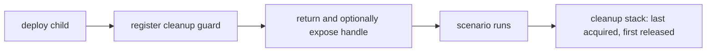

# Handle Ownership and Teardown

Handles provide typed access to deployed applications. The scenario runtime owns managed resource lifetime separately through a cleanup stack.

Cloning a handle preserves access to its shared state, but does not extend a process or cluster beyond the run that created it.

---

## Typed and Named Handles

The registry keys every handle by concrete type plus name (`TypeId` and a string). An empty name is the default handle for that type.

| Operation | Key | On conflict |
|---|---|---|
| `expose(handle)` | `(TypeId::of::<T>(), "")` | `AppDeployError::DuplicateHandle` |
| `expose_named(name, handle)` | `(TypeId::of::<T>(), name)` | `AppDeployError::DuplicateHandle` |

Duplicate exposure is an error rather than a replacement. Use distinct names when a scenario exposes multiple values of one handle type, then retrieve them with `app_named` or `require_app_named`.

Missing handles are typed runtime errors. `require::<T>()` and `require_named::<T>(name)` return `AppDeployError::HandleMissing` with the requested Rust type and instance name.

---

## What a Handle Means

```rust,ignore
pub trait AppHandle: Clone + Send + Sync + 'static {}

impl<T> AppHandle for T
where
    T: Clone + Send + Sync + 'static,
{}
```

An app handle can be a client, a control surface, or a domain aggregate such as `JobStackHandle`. Retrieval clones it so workloads can use it without borrowing the registry.

The registry lookup uses `TypeId`. Requesting the wrong concrete type is therefore a runtime miss, not a compile-time error. Prefer specific handle types or domain newtypes over primitives whose role is unclear.

Cloneability is about access, not ownership of the deployment. `LocalProcessHandle` clones share process state and controls; `ClusterHandle` clones share clients and control adapters. Scenario cleanup remains authoritative for managed lifetime.

---

## Managed Lifetime

Every framework adapter that acquires a managed resource registers a cleanup guard immediately. `DeployContext` collects those guards in acquisition order and transfers the stack to the scenario runtime after successful preparation.



This produces two parallel structures:

| Structure | Contains | Purpose | Release order |
|---|---|---|---|
| Handle registry | Cloneable typed access values | Workload and expectation lookup | Reverse exposure order |
| Cleanup stack | Private managed-resource guards | Stop processes, clusters, and other acquired resources | Reverse acquisition order |

The cleanup stack decides when managed resources stop. A handle clone retained outside the registry does not postpone cleanup; after cleanup, operations on a `LocalProcessHandle` fail because the run no longer owns the process.

---

## Dependency-Ordered Teardown

Deploy dependencies before dependents:

```rust,ignore
let queue = ctx.deploy_and_expose(QueueLocalApp::nodes(2)).await?;
let results = ctx.deploy_and_expose(KvLocalApp::nodes(2)).await?;
let worker = ctx
    .deploy_and_expose(JobWorkerApp::new(queue_url, results_url))
    .await?;
```

Each deployment registers cleanup as soon as it acquires its resource. LIFO cleanup therefore stops the worker first, then the result store, then the queue. The order is independent of which handles the final `JobStackHandle` embeds or how many clones workloads retain.

Exposure order usually follows acquisition order, but it is not the ownership mechanism. Expose a handle when test code needs to find it; register cleanup when the framework acquires a managed resource.

---

## Partial-Deployment Failure

If deployment fails halfway through, dropping `DeployContext` runs every cleanup guard already registered. The same LIFO rule applies, so successfully started dependents stop before their dependencies even though no scenario runner was created.

Readiness belongs inside deployment for the same reason. `LocalProcessApp::with_readiness` stops its just-started process if the check fails, while the context cleans up all earlier children.

Custom `AppDeployment` implementations should acquire managed resources through framework adapters such as `LocalProcessApp` and `deploy_cluster`. A raw process started directly by application code has no cleanup guard unless that code implements and registers an adapter.

---

## Manual Control During a Run

Automatic teardown does not prevent explicit control. A workload can call `stop`, `start`, or `restart` on a process handle, or the corresponding node methods on a cluster handle. Cleanup remains registered and idempotently closes whatever is still active when the run ends.

Managed applications therefore support both properties:

- test code can deliberately change runtime state;
- every exit path still has a final owner that cleans up.

---

## Keeping Artifacts

Managed cleanup normally removes generated working directories. Use `LocalProcessApp::keep_tempdir(true)` or `LocalProcessHandle::keep_tempdir()` for a process. Primary-cluster artifact retention is controlled by the deployment policy described in [Readiness, Retry, and Cleanup](deployment-policies.md).

---

## See Also

- [AppDeployment and DeployContext](app-deployment.md): where children, handles, and cleanup are assembled.
- [One Binary: LocalProcessApp](local-process-app.md): a managed process and its control handle.
- [Shared Cluster Provisioning](cluster-provisioning.md): cluster handles across ownership modes.
