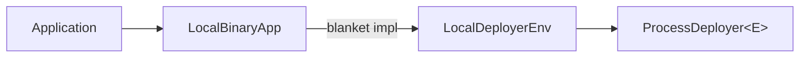

# Implementing Application

This chapter shows how to put your own node binary behind the framework so deployers can launch it as a uniform cluster.

---

## The Application Trait

Every environment starts with `Application` (`testing-framework/core/src/env.rs`). It bundles the backend-agnostic types the scenario engine needs:

```rust,ignore
pub trait Application: Send + Sync + 'static {
    type Deployment: DeploymentDescriptor + Clone + 'static;
    type NodeClient: Clone + Send + Sync + 'static;
    type NodeConfig: Clone + Send + Sync + 'static;

    fn external_node_client(source: &ExternalNodeSource) -> Result<Self::NodeClient, DynError>;
    fn build_node_client(access: &NodeAccess) -> Result<Self::NodeClient, DynError>;
    fn node_readiness_path() -> &'static str;
}
```

The associated types and methods are:

| Member | Role | Default |
|---|---|---|
| `Deployment` | Cluster shape descriptor (see [Topology](topology.md)) | required |
| `NodeClient` | Cheap-to-clone client handed to workloads and expectations | required |
| `NodeConfig` | Per-node configuration value the deployer materializes | required |
| `external_node_client` | Builds a client from a static external endpoint | errors ("not supported") |
| `build_node_client` | Builds a client from deployer-provided `NodeAccess` (host, API port, named ports) | errors ("not supported") |
| `node_readiness_path` | Path probed during default HTTP readiness checks | `"/"` |

Workloads and expectations use only these types, so the same scenario code can run against local processes, Compose containers, and Kubernetes services. Each backend still requires its corresponding deployment integration.

`Application` does not specify how nodes run. Each deployer adds a backend-specific integration trait.

---

## Local Integration: Two Paths

The local deployer (`testing-framework/deployers/local/src/env/mod.rs`) offers two traits.

**`LocalBinaryApp`** covers apps that launch one binary per node, write one config file per node, and expose one HTTP API port. You implement five methods; a blanket implementation supplies `LocalDeployerEnv`:

| Method | Purpose |
|---|---|
| `initial_node_name_prefix()` | Prefix for generated config/artifact names (`kv-node-0`, ...); control APIs always address nodes as `node-<index>` |
| `build_local_node_config_with_peers(...)` | Produce a `NodeConfig` from reserved ports and peer views |
| `local_process_spec()` | Binary provider, config file name/flag, env vars, extra args |
| `render_local_config(config)` | Serialize the config into the file written next to the process |
| `http_api_port(config)` | Main HTTP port used for discovery and readiness |

Optional overrides: `initial_local_port_names()` (extra named ports reserved per node), `readiness_endpoint_path()`, `readiness_probe()` (HTTP GET or plain TCP), and `wait_readiness_stable(nodes)` for app-specific stabilization after the port probe succeeds.

**`LocalDeployerEnv`** exposes the deployer-facing hooks directly: `build_node_config_from_template`, `build_initial_node_configs`, `build_launch_spec`, `node_endpoints`, `node_client`, `node_peer_port`, `local_process_spec_for_node` (per-node binary selection for mixed-version clusters), and `initial_persist_dir` / `initial_snapshot_dir` (see [Persistence](persistence.md)). Implement it directly when `LocalBinaryApp` does not cover the application's launch requirements.



---

## Worked Example: kvstore

The kvstore integration lives in `examples/kvstore/testing/integration/src/`. The environment type is an empty struct:

```rust,ignore
pub struct KvEnv;

#[async_trait]
impl Application for KvEnv {
    type Deployment = KvTopology;        // = ClusterTopology
    type NodeClient = KvHttpClient;
    type NodeConfig = KvNodeConfig;

    fn build_node_client(access: &NodeAccess) -> Result<Self::NodeClient, DynError> {
        Ok(KvHttpClient::new(access.api_base_url()?))
    }

    fn node_readiness_path() -> &'static str {
        "/health/ready"
    }
}
```

**Client construction.** `build_node_client` receives `NodeAccess`, a host plus API port (and optional testing/named ports) discovered by the deployer, and wraps its base URL in the app's HTTP client. The same function serves every backend: local processes, Compose containers, and K8s services all resolve to a `NodeAccess`.

**Readiness path.** `node_readiness_path` returns `/health/ready`. Deployers append it to `http://<host>:<api-port>` and poll until the node answers 2xx. See [Ports, Peers, Node Config, and Readiness](node-config.md) for the probe implementation.

The local side (`local_env.rs`) implements `LocalBinaryApp`:

```rust,ignore
impl LocalBinaryApp for KvEnv {
    fn initial_node_name_prefix() -> &'static str {
        "kv-node"
    }

    fn build_local_node_config_with_peers(
        _topology: &Self::Deployment,
        index: usize,
        ports: &LocalNodePorts,
        peers: &[LocalPeerNode],
        _peer_ports_by_name: &HashMap<String, u16>,
        _options: &StartNodeOptions<Self>,
        _template_config: Option<&KvNodeConfig>,
    ) -> Result<KvNodeConfig, DynError> {
        build_local_cluster_node_config::<Self>(index, ports, peers)
    }

    fn local_process_spec() -> LocalProcessSpec {
        LocalProcessSpec::new("KVSTORE_NODE_BIN")
            .with_binary_provider(kvstore_binary_provider())
            .with_rust_log("kvstore_node=info")
    }

    fn render_local_config(config: &KvNodeConfig) -> Result<Vec<u8>, DynError> {
        yaml_node_config(config)
    }

    fn http_api_port(config: &KvNodeConfig) -> u16 {
        config.http_port
    }
}
```

**Config generation.** kvstore delegates to `build_local_cluster_node_config::<Self>`, which works because `KvEnv` also implements `ClusterNodeConfigApplication` (`app.rs`): a backend-neutral hook that builds a `NodeConfig` from a `ClusterNodeView` (own index, host, ports) and `ClusterPeerView` list. Implementing that one trait gives kvstore local config generation *and* the static-artifact path used by Compose/K8s; see [Static Artifacts and cfgsync](cfgsync.md).

**Binary provider.** `kvstore_binary_provider()` returns a `FallbackBinaryProvider` chain: first `EnvBinaryProvider::new("KVSTORE_NODE_BIN")` (use a prebuilt binary if the env var is set), then `BuildBinaryProvider` running `cargo build -p kvstore-node --bin kvstore-node` in the workspace root. This is why kvstore examples need no manual setup. Providers are covered in [Binary Providers](binary-providers.md).

**Launch and config rendering.** At spawn time the framework renders the config with `render_local_config`, writes it as `config.yaml` into the node's working directory, and launches `<binary> --config config.yaml` with the spec's env vars. `LocalProcessSpec` supports different file names, positional config arguments, and extra args (see [node-config.md](node-config.md)).

Finally, `lib.rs` exports ready-made deployer aliases:

```rust,ignore
pub type KvLocalDeployer = testing_framework_runner_local::ProcessDeployer<KvEnv>;
pub type KvComposeDeployer = testing_framework_runner_compose::ComposeDeployer<KvEnv>;
pub type KvK8sDeployer = testing_framework_runner_k8s::K8sDeployer<KvEnv>;
```

---

## Other Backends

The same `KvEnv` gains container support in two short files:

- `compose_env.rs` implements `ComposeBinaryApp`: a `BinaryConfigNodeSpec` naming the in-container binary path, config path, and exposed ports. See [Compose Deployer](deployer-compose.md).
- `k8s_env.rs` implements `K8sBinaryApp`: a `BinaryConfigK8sSpec` with release name, node-name prefix, binary and config paths, and service ports. See [Kubernetes Deployer](deployer-k8s.md).

Both backends deliver generated configs through cfgsync rather than the local filesystem ([Static Artifacts and cfgsync](cfgsync.md)).

Implement traits only for the backends you use. An `Application` implementation plus `LocalBinaryApp` is sufficient for local scenarios.
