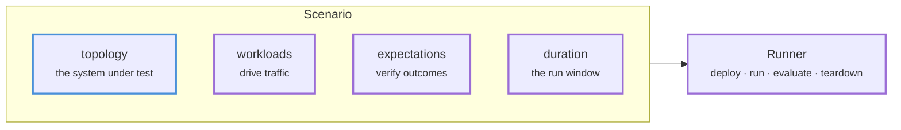
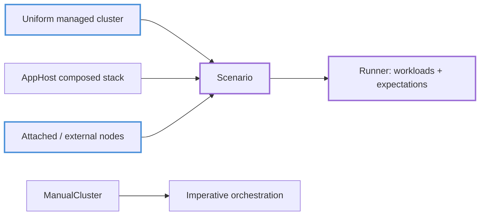

# Testing Framework

System-level testing for networked applications from Rust.

The testing framework deploys and controls processes, containers, and clusters. Tests can run several nodes over network connections for a bounded period. Application-specific configuration and clients stay outside the framework, so the runtime can be used with a key-value store, a Raft cluster, a message queue, or a blockchain.

[**Get Started**](quickstart.md)

---

## Scenarios

A declarative test is represented by a `Scenario` containing:

- **Topology** — the system under test (a uniform cluster, a composed application stack, or attached external nodes)
- **Workloads** — traffic and conditions that exercise the system
- **Expectations** — success criteria verified after execution
- **Duration** — the time window for the experiment



The scenario runtime executes these parts in the same order for each declarative entry pattern. The entry pattern determines how the system is supplied.

---

## Entry Patterns



Three entry patterns use the scenario runtime:

1. **Uniform managed cluster** — the framework generates configs and launches N identical nodes from a topology. See [Part IV](part-iv.md).
2. **AppHost composed stack** — the app layer deploys heterogeneous components (processes, child clusters, in-process services) as one system and exposes typed handles to workloads. See [Part II](part-ii.md).
3. **Attached and external nodes** — the scenario targets clusters you already run, or plain URLs. See [Existing and External Clusters](external-clusters.md).

**[ManualCluster](manual-cluster.md)** is the imperative alternative. It provides direct start, stop, restart, and readiness operations without the scenario runner, including for step-driven BDD harnesses.

If you are not sure which to use, read [Choosing an Entry Pattern](entry-patterns.md).

---

## Provided APIs

**Declarative API**
- Express tests as topology + workloads + expectations
- Reuse the same definition across local, Compose, and Kubernetes deployers
- Compose stacks from reusable application deployments

**Application layer**
- Deploy heterogeneous systems as one root `AppDeployment`
- Typed, named handles connect workloads to components
- Deterministic cleanup, including on partial-deployment failure

**Runtime capabilities**
- Capability-gated node control: restart nodes from workloads, portably
- Continuous observation: snapshots, history, and event streams of application state
- Telemetry: metrics, logs, and tracing endpoints

**Operations**
- Binary providers resolve node binaries from paths, env vars, builds, or downloads
- Reproducible deployments via seeds
- Artifact preservation for post-mortem debugging

---

## Quick Example

```rust,ignore
use testing_framework_app::{AppHost, AppHostLocalDeployer, AppScenarioBuilderExt as _};
use testing_framework_core::scenario::Deployer as _;

let mut scenario = AppHost::scenario()
    .with_app(KvLocalApp::nodes(3))
    .with_workload(KvAppHostConvergence::new(3))
    .build()?;

let runner = AppHostLocalDeployer::default().deploy(&scenario).await?;
runner.run(&mut scenario).await?;
```

This deploys a three-node key-value store cluster, runs a convergence workload against it (including a node restart), and tears everything down. The remaining chapters cover each part of this pattern in detail.

[View the example apps](running-examples.md)

---

## The Example Apps

The repository includes small applications under `examples/` that exercise the framework APIs:

| App | Demonstrates |
|-----|--------------|
| `kvstore` | Uniform clusters, app hosting, convergence testing, all three deployers |
| `openraft_kv` | Node control, failover, continuous observation |
| `multi_app` | Composing heterogeneous stacks with typed handles |
| `nats`, `redis_streams` | Testing third-party binaries you did not write |
| `pubsub`, `queue`, `metrics_counter` | Additional workload and expectation patterns |

Some chapters also link to adopter repositories. The examples listed in this table run from this workspace.

---

## Documentation Structure

| Section | Description |
|---------|-------------|
| **[Part I — Mental Model](part-i.md)** | The core abstractions and how to choose between entry patterns |
| **[Part II — Composing Applications](part-ii.md)** | The app layer: deployments, handles, teardown |
| **[Part III — Scenario Runtime](part-iii.md)** | Workloads, expectations, capabilities, observation |
| **[Part IV — Uniform Clusters](part-iv.md)** | Implementing `Application`, topology, config, manual control |
| **[Part V — Deployers and Sources](part-v.md)** | Local, Compose, Kubernetes, external clusters, binaries |
| **[Part VI — Extending](part-vi.md)** | Extension points, crate map, boundaries |
| **[Part VII — Operations](part-vii.md)** | Running examples, CI, diagnostics, troubleshooting |

---

Start with the **[Quickstart](quickstart.md)**.
