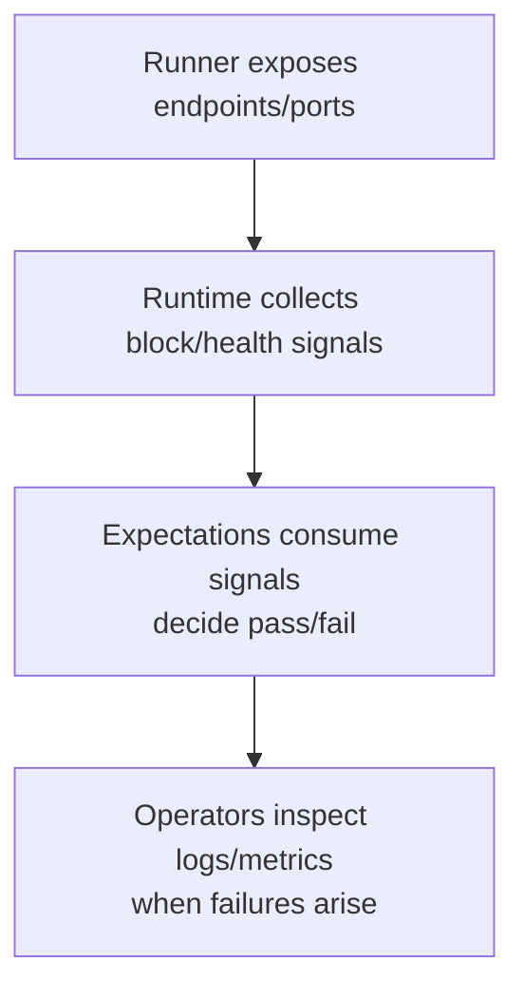

# Logging & Observability

Comprehensive guide to log collection, metrics, and debugging across all runners.

## Node Logging vs Framework Logging

**Critical distinction:** Node logs and framework logs use different configuration mechanisms.

| Component | Controlled By | Purpose |
|-----------|--------------|---------|
| **Framework binaries** (`cargo run -p runner-examples --bin local_runner`) | `RUST_LOG` | Runner orchestration, deployment logs |
| **Node processes** (validators, executors spawned by runner) | `NOMOS_LOG_LEVEL`, `NOMOS_LOG_FILTER` (+ `NOMOS_LOG_DIR` on host runner) | Consensus, DA, mempool, network logs |

**Common mistake:** Setting `RUST_LOG=debug` only increases verbosity of the runner binary itself. Node logs remain at their default level unless you also set `NOMOS_LOG_LEVEL=debug`.

**Example:**

```bash
# This only makes the RUNNER verbose, not the nodes:
RUST_LOG=debug cargo run -p runner-examples --bin local_runner

# This makes the NODES verbose:
NOMOS_LOG_LEVEL=debug cargo run -p runner-examples --bin local_runner

# Both verbose (typically not needed):
RUST_LOG=debug NOMOS_LOG_LEVEL=debug cargo run -p runner-examples --bin local_runner
```

## Logging Environment Variables

See [Environment Variables Reference](environment-variables.md) for complete details. Quick summary:

| Variable | Default | Effect |
|----------|---------|--------|
| `NOMOS_LOG_DIR` | None (console only) | Host runner: directory for per-node log files. Compose/k8s: use `cfgsync.yaml` |
| `NOMOS_LOG_LEVEL` | `info` | Global log level: `error`, `warn`, `info`, `debug`, `trace` |
| `NOMOS_LOG_FILTER` | None | Fine-grained target filtering (e.g., `cryptarchia=trace,nomos_da_sampling=debug`) |
| `NOMOS_TESTS_TRACING` | false | Enable debug tracing preset |
| `NOMOS_OTLP_ENDPOINT` | None | OTLP trace endpoint (optional) |
| `NOMOS_OTLP_METRICS_ENDPOINT` | None | OTLP metrics endpoint (optional) |

**Example:** Full debug logging to files:

```bash
NOMOS_TESTS_TRACING=true \
NOMOS_LOG_DIR=/tmp/test-logs \
NOMOS_LOG_LEVEL=debug \
NOMOS_LOG_FILTER="cryptarchia=trace,nomos_da_sampling=debug,nomos_da_dispersal=debug,nomos_da_verifier=debug" \
POL_PROOF_DEV_MODE=true \
cargo run -p runner-examples --bin local_runner
```

## Per-Node Log Files

When `NOMOS_LOG_DIR` is set, each node writes logs to separate files:

**File naming pattern:**
- **Validators**: Prefix `nomos-node-0`, `nomos-node-1`, etc. (may include timestamp suffix)
- **Executors**: Prefix `nomos-executor-0`, `nomos-executor-1`, etc. (may include timestamp suffix)

**Example filenames:**
- `nomos-node-0.2024-12-18T14-30-00.log`
- `nomos-node-1.2024-12-18T14-30-00.log`
- `nomos-executor-0.2024-12-18T14-30-00.log`

**Local runner note:** The local runner uses per-run temporary directories under the current working directory and removes them after the run unless `NOMOS_TESTS_KEEP_LOGS=1`. Use `NOMOS_LOG_DIR=/path/to/logs` to write per-node log files to a stable location.

## Filter Target Names

Common target prefixes for `NOMOS_LOG_FILTER`:

| Target Prefix | Subsystem |
|---------------|-----------|
| `cryptarchia` | Consensus (Cryptarchia) |
| `nomos_da_sampling` | DA sampling service |
| `nomos_da_dispersal` | DA dispersal service |
| `nomos_da_verifier` | DA verification |
| `nomos_blend` | Mix network/privacy layer |
| `chain_service` | Chain service (node APIs/state) |
| `chain_network` | P2P networking |
| `chain_leader` | Leader election |

**Example filter:**

```bash
NOMOS_LOG_FILTER="cryptarchia=trace,nomos_da_sampling=debug,chain_service=info,chain_network=info"
```

---

## Accessing Logs by Runner

### Local Runner (Host Processes)

**Default (temporary directories, auto-cleanup):**

```bash
POL_PROOF_DEV_MODE=true cargo run -p runner-examples --bin local_runner
# Logs written to temporary directories in working directory
# Automatically cleaned up after test completes
```

**Persistent file output:**

```bash
NOMOS_LOG_DIR=/tmp/local-logs \
POL_PROOF_DEV_MODE=true \
cargo run -p runner-examples --bin local_runner

# After test completes:
ls /tmp/local-logs/
# Files with prefix: nomos-node-0*, nomos-node-1*, nomos-executor-0*
# May include timestamps in filename
```

**Tip:** Use `NOMOS_LOG_DIR` for persistent per-node log files, and `NOMOS_TESTS_KEEP_LOGS=1` if you want to keep the per-run temporary directories (configs/state) for post-mortem inspection.

### Compose Runner (Docker Containers)

**Via Docker logs (default, recommended):**

```bash
# List containers (note the UUID prefix in names)
docker ps --filter "name=nomos-compose-"

# Stream logs from specific container
docker logs -f <container-id-or-name>

# Or use name pattern matching:
docker logs -f $(docker ps --filter "name=nomos-compose-.*-validator-0" -q | head -1)

# Show last 100 lines
docker logs --tail 100 <container-id>
```

**Via file collection (advanced):**

To write per-node log files inside containers, set `tracing_settings.logger: !File` in `testing-framework/assets/stack/cfgsync.yaml` (and ensure the directory is writable). To access them, you must either:

1. **Copy files out after the run:**

```bash
# Ensure cfgsync.yaml is configured to log to /logs
NOMOS_TESTNET_IMAGE=logos-blockchain-testing:local \
POL_PROOF_DEV_MODE=true \
cargo run -p runner-examples --bin compose_runner

# After test, copy files from containers:
docker ps --filter "name=nomos-compose-"
docker cp <container-id>:/logs/node* /tmp/
```

2. **Mount a host volume** (requires modifying compose template):

```yaml
volumes:
  - /tmp/host-logs:/logs  # Add to docker-compose.yml.tera
```

**Recommendation:** Use `docker logs` by default. File collection inside containers is complex and rarely needed.

**Keep containers for debugging:**

```bash
COMPOSE_RUNNER_PRESERVE=1 \
NOMOS_TESTNET_IMAGE=logos-blockchain-testing:local \
cargo run -p runner-examples --bin compose_runner
# Containers remain running after test—inspect with docker logs or docker exec
```

**Compose debugging variables:**
- `COMPOSE_RUNNER_HOST=127.0.0.1` — host used for readiness probes
- `COMPOSE_RUNNER_HOST_GATEWAY=host.docker.internal:host-gateway` — controls `extra_hosts` entry (set to `disable` to omit)
- `TESTNET_RUNNER_PRESERVE=1` — alias for `COMPOSE_RUNNER_PRESERVE=1`
- `COMPOSE_RUNNER_HTTP_TIMEOUT_SECS=<secs>` — override HTTP readiness timeout

**Note:** Container names follow pattern `nomos-compose-{uuid}-validator-{index}-1` where `{uuid}` changes per run.

### K8s Runner (Kubernetes Pods)

**Via kubectl logs (use label selectors):**

```bash
# List pods
kubectl get pods

# Stream logs using label selectors (recommended)
# Helm chart labels:
# - nomos/logical-role=validator|executor
# - nomos/validator-index / nomos/executor-index
kubectl logs -l nomos/logical-role=validator -f
kubectl logs -l nomos/logical-role=executor -f

# Stream logs from specific pod
kubectl logs -f nomos-validator-0

# Previous logs from crashed pods
kubectl logs --previous -l nomos/logical-role=validator
```

**Download logs for offline analysis:**

```bash
# Using label selectors
kubectl logs -l nomos/logical-role=validator --tail=1000 > all-validators.log
kubectl logs -l nomos/logical-role=executor --tail=1000 > all-executors.log

# Specific pods
kubectl logs nomos-validator-0 > validator-0.log
kubectl logs nomos-executor-1 > executor-1.log
```

**K8s debugging variables:**
- `K8S_RUNNER_DEBUG=1` — logs Helm stdout/stderr for install commands
- `K8S_RUNNER_PRESERVE=1` — keep namespace/release after run
- `K8S_RUNNER_NODE_HOST=<ip|hostname>` — override NodePort host resolution
- `K8S_RUNNER_NAMESPACE=<name>` / `K8S_RUNNER_RELEASE=<name>` — pin namespace/release (useful for debugging)

**Specify namespace (if not using default):**

```bash
kubectl logs -n my-namespace -l nomos/logical-role=validator -f
```

**Note:** K8s runner is optimized for local clusters (Docker Desktop K8s, minikube, kind). Remote clusters require additional setup.

---

## OTLP and Telemetry

**OTLP exporters are optional.** If you see errors about unreachable OTLP endpoints, it's safe to ignore them unless you're actively collecting traces/metrics.

**To enable OTLP:**

```bash
NOMOS_OTLP_ENDPOINT=http://localhost:4317 \
NOMOS_OTLP_METRICS_ENDPOINT=http://localhost:4318 \
cargo run -p runner-examples --bin local_runner
```

**To silence OTLP errors:** Simply leave these variables unset (the default).

---

## Observability: Prometheus and Node APIs

Runners expose metrics and node HTTP endpoints for expectation code and debugging.

### Prometheus-Compatible Metrics Querying (Optional)

- Runners do **not** provision Prometheus automatically
- For a ready-to-run stack, use `scripts/setup/setup-observability.sh`:
  - Compose: `scripts/setup/setup-observability.sh compose up` then `scripts/setup/setup-observability.sh compose env`
  - K8s: `scripts/setup/setup-observability.sh k8s install` then `scripts/setup/setup-observability.sh k8s env`
- Provide `NOMOS_METRICS_QUERY_URL` (PromQL base URL) to enable `ctx.telemetry()` queries
- Access from expectations when configured: `ctx.telemetry().prometheus().map(|p| p.base_url())`

**Example:**

```bash
# Start observability stack (Compose)
scripts/setup/setup-observability.sh compose up

# Get environment variables
eval $(scripts/setup/setup-observability.sh compose env)

# Run scenario with metrics
POL_PROOF_DEV_MODE=true \
scripts/run/run-examples.sh -t 60 -v 3 -e 1 compose
```

### Grafana (Optional)

- Runners do **not** provision Grafana automatically (but `scripts/setup/setup-observability.sh` can)
- If you set `NOMOS_GRAFANA_URL`, the deployer prints it in `TESTNET_ENDPOINTS`
- Dashboards live in `testing-framework/assets/stack/monitoring/grafana/dashboards/` for import into your Grafana

**Example:**

```bash
export NOMOS_GRAFANA_URL=http://localhost:3000
POL_PROOF_DEV_MODE=true scripts/run/run-examples.sh -t 60 -v 3 -e 1 compose
```

### Node APIs

- Access from expectations: `ctx.node_clients().validator_clients().get(0)`
- Endpoints: consensus info, network info, DA membership, etc.
- See `testing-framework/core/src/nodes/api_client.rs` for available methods

**Example usage in expectations:**

```rust,ignore
use testing_framework_core::scenario::{DynError, RunContext};

async fn evaluate(ctx: &RunContext) -> Result<(), DynError> {
    let client = &ctx.node_clients().validator_clients()[0];

    let info = client.consensus_info().await?;
    tracing::info!(height = info.height, "consensus info from validator 0");

    Ok(())
}
```

---

## Observability Flow



---

## Quick Reference

### Debug Logging (Host)

```bash
NOMOS_LOG_DIR=/tmp/logs \
NOMOS_LOG_LEVEL=debug \
NOMOS_LOG_FILTER="cryptarchia=trace" \
POL_PROOF_DEV_MODE=true \
scripts/run/run-examples.sh -t 60 -v 3 -e 1 host
```

### Compose with Observability

```bash
# Start observability stack
scripts/setup/setup-observability.sh compose up
eval $(scripts/setup/setup-observability.sh compose env)

# Run with metrics
POL_PROOF_DEV_MODE=true \
scripts/run/run-examples.sh -t 60 -v 3 -e 1 compose

# Access Grafana at http://localhost:3000
```

### K8s with Debug

```bash
K8S_RUNNER_NAMESPACE=nomos-debug \
K8S_RUNNER_DEBUG=1 \
K8S_RUNNER_PRESERVE=1 \
POL_PROOF_DEV_MODE=true \
scripts/run/run-examples.sh -t 60 -v 3 -e 1 k8s

# Inspect logs
kubectl logs -n nomos-debug -l nomos/logical-role=validator
```

---

## See Also

- [Environment Variables](environment-variables.md) — Complete variable reference
- [Troubleshooting](troubleshooting.md) — Log-related debugging (see "Where to Find Logs")
- [Running Examples](running-examples.md) — Runner-specific logging details
- [Prerequisites & Setup](prerequisites.md) — Setup before running
