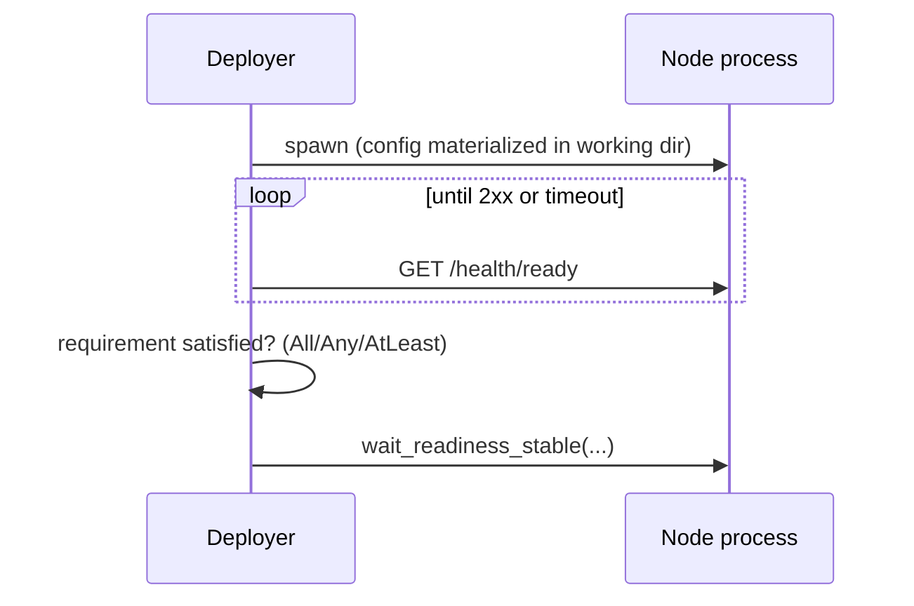

# Ports, Peers, Node Config, and Readiness

This chapter describes how the local deployer allocates ports, wires peers, materializes per-node configs, and decides when a cluster is ready.

---

## Port Allocation

All local ports come from the OS. `preallocate_ports` (in `testing-framework/deployers/local/src/env/helpers.rs`) binds `127.0.0.1:0`, records the assigned port, and releases the listener. `reserve_local_node_ports(count, names, label)` does this for every node up front and returns one `LocalNodePorts` per node:

| `LocalNodePorts` method | Returns |
|---|---|
| `network_port()` | The main reserved port for peer traffic |
| `get(name)` / `require(name)` | A reserved *named* port (`Option` / `Result`) |
| `iter()` | All named ports |

Named ports exist for apps that need more than one listener per node. Declare them via `LocalBinaryApp::initial_local_port_names()` (or `LocalDeployerEnv::local_port_names()`); the deployer reserves one port per name per node.

Ports are reserved by bind-and-release, so they are free at reservation time but are not deterministic across runs. See [Seeds and Reproducibility](seeds.md).

---

## Peer Wiring

Peer wiring is why up-front port reservation matters: because every node's ports are reserved before any config is built, each node's config can reference the real addresses of all its peers before a single process starts.

For each node index the deployer builds peer views of every *other* node:

- `LocalPeerNode`: `index()`, `network_port()`, `http_address()` / `authority()` (`127.0.0.1:<port>`).
- `build_local_peer_nodes(peer_ports, self_index)`: full peer views, skipping self.
- `build_indexed_http_peers(node_count, self_index, peer_ports, build_peer)`: map peers through your own constructor.

These flow into the app's config hook together with the node's own ports:

```rust,ignore
fn build_local_node_config_with_peers(
    topology: &Self::Deployment,
    index: usize,
    ports: &LocalNodePorts,
    peers: &[LocalPeerNode],
    peer_ports_by_name: &HashMap<String, u16>,
    options: &StartNodeOptions<Self>,
    template_config: Option<&Self::NodeConfig>,
) -> Result<Self::NodeConfig, DynError>;
```

For initial cluster startup the deployer calls this once per index with every other node as a peer (a full mesh view); the layout your nodes actually form is up to the config your app builds from those views. `LocalBuildContext` carries the same fields when you customize `build_initial_node_configs` on the full `LocalDeployerEnv` path. Apps that implement `ClusterNodeConfigApplication` can delegate the whole hook to `build_local_cluster_node_config::<E>(index, ports, peers)`, the same abstraction the container backends reuse (see [cfgsync](cfgsync.md)).

---

## Config Templates: LocalProcessSpec

`LocalProcessSpec` describes how one rendered config becomes a running process:

| Field / builder | Meaning |
|---|---|
| `LocalProcessSpec::new(env_var)` | Start from an `EnvBinaryProvider` for `env_var` |
| `with_binary_path(path)` / `with_binary_provider(p)` / `with_binary_provider_ref(p)` | Choose the binary source ([Binary Providers](binary-providers.md)) |
| `config_file_name` (default `config.yaml`) | File written into the node working directory |
| `with_config_file(name, arg)` | Pass as a flag pair, e.g. `--config app.yaml` |
| `with_positional_config_file(name)` | Pass the path as a positional argument (`LocalConfigArgMode::Positional`) |
| `with_env(key, value)` / `with_rust_log(value)` | Child process environment |
| `with_args(args)` | Extra CLI args appended after the config argument |

Rendering helpers: `yaml_node_config` (serialize to YAML bytes), `text_node_config` (already-rendered text), `yaml_config_launch_spec` / `text_config_launch_spec` / `default_yaml_launch_spec` (build a full `LaunchSpec` in one call). The resulting `LaunchSpec` lists the binary, the files to materialize, args, and env; the deployer writes the files into the node's working directory and spawns the process there.

---

## StartNodeOptions: Overrides at Start Time

Dynamically started nodes (node-control workloads and [ManualCluster](manual-cluster.md)) accept `StartNodeOptions<E>`; the full field table lives in the [ManualCluster chapter](manual-cluster.md). The two config-shaping fields deserve care:

**`config_override`** replaces the complete generated config. **`config_patch`** (set via `create_patch(|config| ...)`) transforms the generated config, retaining framework-assigned ports and peers unless the callback changes them. A full override must provide every required port itself.

Where they are honored differs by path:

- **Local dynamic starts** (`NodeManager::start_node_with`): the framework builds the config through the env hooks (which receive the full `options`) and then applies `config_patch` itself. `config_override` and `peers` are visible to your `build_local_node_config_with_peers` implementation but are not interpreted centrally by the local path.
- **Static-artifact path** (used by the container backends through `StaticNodeConfigProvider::build_node_artifacts_for_options`, `core/src/scenario/config.rs`): the framework interprets everything: `PeerSelection` picks the peer set, then `config_override` replaces, then `config_patch` transforms, and the result is served as an override artifact.

**`PeerSelection`** variants (`core/src/scenario/capabilities.rs`):

| Variant | Effect (static-artifact path) |
|---|---|
| `DefaultLayout` | Peer view of all other nodes (same as omitting `peers`) |
| `None` | Start with an empty peer list |
| `Named(vec!["node-0", ...])` | Only the named nodes (names follow the `node-<index>` convention) |

---

## Readiness

**Per-node probe.** The local deployer probes each node's API port using `LocalDeployerEnv::readiness_probe()`:

- `LocalReadinessProbe::HttpGet { path }` (default): GET `http://127.0.0.1:<api-port><path>` until it returns 2xx. The path defaults to `Application::node_readiness_path()` (`"/"` unless overridden; kvstore uses `/health/ready`).
- `LocalReadinessProbe::Tcp`: the port merely accepts TCP connections. Use for nodes without an HTTP surface.

**Cluster requirement.** `HttpReadinessRequirement` (`core/src/scenario/runtime/readiness.rs`) decides how many nodes must pass:

| Variant | Ready when |
|---|---|
| `AllNodesReady` | Every node answers (default) |
| `AnyNodeReady` | At least one node answers |
| `AtLeast(n)` | At least `n` nodes answer |

Set it on the scenario with `ScenarioBuilder::with_http_readiness_requirement(requirement)`, or as part of a full `DeploymentPolicy`; see [Readiness, Retry, and Artifact Preservation](deployment-policies.md).

**Waiting imperatively.** `ManualCluster` (and `LocalAppCluster`) expose:

- `wait_network_ready()`: polls every started node's API port with `AllNodesReady`.
- `wait_node_ready(name)`: polls one node, honoring that node's `NodeRuntimeOptions::start_timeout` if one was set via `StartNodeOptions::with_start_timeout`.

Default probe timeout is 60 seconds with a 200 ms poll interval; setting `SLOW_TEST_ENV=true` doubles timeouts. Timeouts fail with a message listing the endpoints that never answered.

**App-specific stabilization.** After the port probe succeeds during deployment, the local deployer calls `wait_readiness_stable(nodes)`, a hook where an app can wait for cluster-level convergence (membership settled, leader elected) before workloads start. The default is a no-op.


