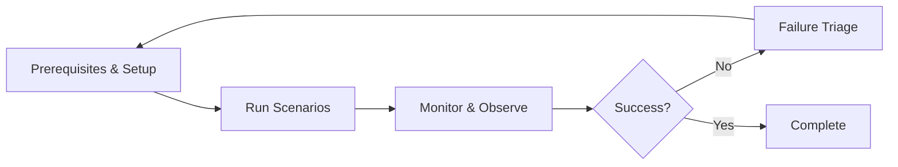

# Operations & Deployment Overview

Operational readiness focuses on prerequisites, environment fit, and clear signals that ensure your test scenarios run reliably across different deployment targets.

## Core Principles

- **Prerequisites First**: Ensure all required files, binaries, and assets are in place before attempting to run scenarios
- **Environment Fit**: Choose the right deployment target (host, compose, k8s) based on your isolation, reproducibility, and resource needs
- **Clear Signals**: Verify runners report node readiness before starting workloads to avoid false negatives
- **Failure Triage**: Map failures to specific causes—missing prerequisites, platform issues, or unmet expectations

## Key Operational Concerns

**Prerequisites:**
- `versions.env` file at repository root (required by helper scripts)
- Node binaries (`nomos-node`) available or built on demand
- Platform requirements met (Docker for compose, cluster access for k8s)
- Circuit assets for DA workloads

**Artifacts:**
- KZG parameters (circuit assets) for Data Availability scenarios
- Docker images for compose/k8s deployments
- Binary bundles for reproducible builds

**Environment Configuration:**
- `POL_PROOF_DEV_MODE=true` is **REQUIRED for all runners** to avoid expensive proof generation
- Logging configured via `NOMOS_LOG_*` variables
- Observability endpoints (Prometheus, Grafana) optional but useful

**Readiness & Health:**
- Runners verify node readiness before starting workloads
- Health checks prevent premature workload execution
- Consensus liveness expectations validate basic operation

## Runner-Agnostic Design

The framework is intentionally **runner-agnostic**: the same scenario plan runs across all deployment targets. Understanding which operational concerns apply to each runner helps you choose the right fit.

| Concern | Host | Compose | Kubernetes |
|---------|------|---------|------------|
| **Topology** | Full support | Full support | Full support |
| **Workloads** | All workloads | All workloads | All workloads |
| **Expectations** | All expectations | All expectations | All expectations |
| **Chaos / Node Control** | Not supported | Supported | Not yet |
| **Metrics / Observability** | Manual setup | External stack | Cluster-wide |
| **Log Collection** | Temp files | Container logs | Pod logs |
| **Isolation** | Process-level | Container | Pod + namespace |
| **Setup Time** | < 1 min | 2-5 min | 5-10 min |
| **CI Recommended?** | Smoke tests | Primary | Large-scale only |

**Key insight:** Operational concerns (prerequisites, environment variables) are largely **consistent** across runners, while deployment-specific concerns (isolation, chaos support) vary by backend.

## Operational Workflow

1. **Setup**: Verify prerequisites, configure environment, prepare assets
2. **Run**: Execute scenarios using appropriate runner (host/compose/k8s)
3. **Monitor**: Collect logs, metrics, and observability signals
4. **Triage**: When failures occur, map to root causes and fix prerequisites

## Documentation Structure

This Operations & Deployment section covers:

- [Prerequisites & Setup](prerequisites.md) — Required files, binaries, and environment setup
- [Running Examples](running-examples.md) — How to run scenarios across different runners
- [CI Integration](ci-integration.md) — Automating tests in continuous integration pipelines
- [Environment Variables](environment-variables.md) — Complete reference of configuration variables
- [Logging & Observability](logging-observability.md) — Log collection, metrics, and debugging

**Philosophy:** Treat operational hygiene—assets present, prerequisites satisfied, observability reachable—as the first step to reliable scenario outcomes.

