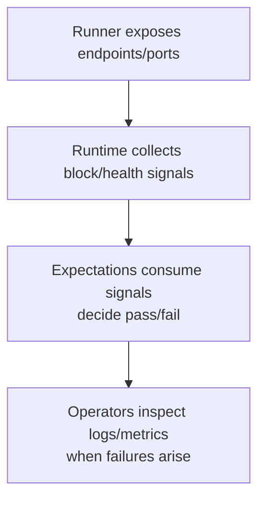

# Operations

Operational readiness focuses on prerequisites, environment fit, and clear
signals:

- **Prerequisites**: keep a sibling `nomos-node` checkout available; ensure the
  chosen runner’s platform needs are met (local binaries for host runs, Docker
  for compose, cluster access for k8s).
- **Artifacts**: some scenarios depend on prover or circuit assets; fetch them
  ahead of time with the provided helper scripts when needed.
- **Environment flags**: use slow-environment toggles to relax timeouts, enable
  tracing when debugging, and adjust observability ports to avoid clashes.
- **Readiness checks**: verify runners report node readiness before starting
  workloads; this avoids false negatives from starting too early.
- **Failure triage**: map failures to missing prerequisites (wallet seeding,
  node control availability), runner platform issues, or unmet expectations.
  Start with liveness signals, then dive into workload-specific assertions.

Treat operational hygiene—assets present, prerequisites satisfied, observability
reachable—as the first step to reliable scenario outcomes.

Metrics and observability flow:
```
Runner exposes endpoints/ports
    │
    ▼
Runtime collects block/health signals
    │
    ▼
Expectations consume signals to decide pass/fail
    │
    ▼
Operators inspect logs/metrics when failures arise
```

Mermaid view:

