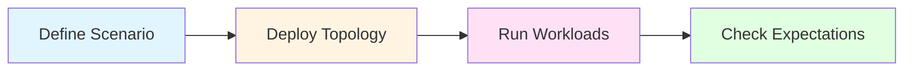

# Nomos Testing Framework

**Declarative, multi-node blockchain testing for the Logos network**

The Nomos Testing Framework enables you to test consensus, data availability, and transaction workloads across local processes, Docker Compose, and Kubernetes deployments—all with a unified scenario API.

[**Get Started**](quickstart.md)

---

## How It Works



1. **Define Scenario** — Describe your test: topology, workloads, and success criteria
2. **Deploy Topology** — Launch validators and executors using host, compose, or k8s runners
3. **Run Workloads** — Drive transactions, DA traffic, and chaos operations
4. **Check Expectations** — Verify consensus liveness, inclusion, and system health

---

## Key Features

**Declarative API**
- Express scenarios as topology + workloads + expectations
- Reuse the same test definition across different deployment targets
- Compose complex tests from modular components

**Multiple Deployment Modes**
- **Host Runner**: Local processes for fast iteration
- **Compose Runner**: Containerized environments with node control
- **Kubernetes Runner**: Production-like cluster testing

**Built-in Workloads**
- Transaction submission with configurable rates
- Data availability (DA) blob dispersal and sampling
- Chaos testing with controlled node restarts

**Comprehensive Observability**
- Real-time block feed for monitoring consensus progress
- Prometheus/Grafana integration for metrics
- Per-node log collection and debugging

---

## Quick Example

```rust
use testing_framework_core::scenario::ScenarioBuilder;
use testing_framework_runner_local::LocalDeployer;
use testing_framework_workflows::ScenarioBuilderExt;

#[tokio::main]
async fn main() -> anyhow::Result<()> {
    let mut scenario = ScenarioBuilder::topology_with(|t| {
        t.network_star()
            .validators(3)
            .executors(1)
    })
    .transactions_with(|tx| tx.rate(10.0).users(5))
    .expect_consensus_liveness()
    .with_run_duration(Duration::from_secs(60))
    .build();

    let deployer = LocalDeployer::default();
    let runner = deployer.deploy(&scenario).await?;
    runner.run(&mut scenario).await?;

    Ok(())
}
```

[View complete examples](examples.md)

---

## Choose Your Path

### New to the Framework?

Start with the **[Quickstart Guide](quickstart.md)** for a hands-on introduction that gets you running tests in minutes.

### Ready to Write Tests?

Explore the **[User Guide](part-ii.md)** to learn about authoring scenarios, workloads, expectations, and deployment strategies.

### Setting Up CI/CD?

Jump to **[Operations & Deployment](part-v.md)** for prerequisites, environment configuration, and continuous integration patterns.

### Extending the Framework?

Check the **[Developer Reference](part-iii.md)** to implement custom workloads, expectations, and runners.

---

## Project Context

**Logos** is a modular blockchain protocol composed of validators, executors, and a data-availability (DA) subsystem:

- **Validators** participate in consensus and produce blocks
- **Executors** are validators with the DA dispersal service enabled. They perform all validator functions plus submit blob data to the DA network
- **Data Availability (DA)** ensures that blob data submitted via channel operations in transactions is published and retrievable by the network

These roles interact tightly, which is why meaningful testing must be performed in multi-node environments that include real networking, timing, and DA interaction.

The Nomos Testing Framework provides the infrastructure to orchestrate these multi-node scenarios reliably across development, CI, and production-like environments.

---

## Documentation Structure

| Section | Description |
|---------|-------------|
| **[Foundations](part-i.md)** | Architecture, philosophy, and design principles |
| **[User Guide](part-ii.md)** | Writing and running scenarios, workloads, and expectations |
| **[Developer Reference](part-iii.md)** | Extending the framework with custom components |
| **[Operations & Deployment](part-v.md)** | Setup, CI integration, and environment configuration |
| **[Appendix](part-vi.md)** | Quick reference, troubleshooting, FAQ, and glossary |

---

## Quick Links

- **[What You Will Learn](what-you-will-learn.md)** — Overview of book contents and learning path
- **[Quickstart](quickstart.md)** — Get up and running in 10 minutes
- **[Examples](examples.md)** — Concrete scenario patterns
- **[Troubleshooting](troubleshooting.md)** — Common issues and solutions
- **[Environment Variables](environment-variables.md)** — Complete configuration reference

---

**Ready to start?** Head to the **[Quickstart](quickstart.md)**
