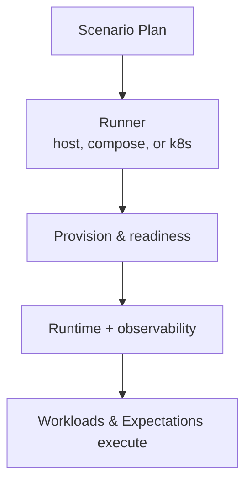

# Runners

Runners turn a scenario plan into a live environment while keeping the plan
unchanged. Choose based on feedback speed, reproducibility, and fidelity. For
environment and operational considerations, see [Operations](operations.md).

**Important:** All runners require `POL_PROOF_DEV_MODE=true` to avoid expensive Groth16 proof generation that causes timeouts.

## Host runner (local processes)
- Launches node processes directly on the host (via `LocalDeployer`).
- Binary: `local_runner.rs`, script mode: `host`
- Fastest feedback loop and minimal orchestration overhead.
- Best for development-time iteration and debugging.
- **Can run in CI** for fast smoke tests.
- **Node control:** Not supported (chaos workloads not available)

**Run with:** `scripts/run-examples.sh -t 60 -v 1 -e 1 host`

## Docker Compose runner
- Starts nodes in containers to provide a reproducible multi-node stack on a
  single machine (via `ComposeDeployer`).
- Binary: `compose_runner.rs`, script mode: `compose`
- Discovers service ports and wires observability for convenient inspection.
- Good balance between fidelity and ease of setup.
- **Recommended for CI pipelines** (isolated environment, reproducible).
- **Node control:** Supported (can restart nodes for chaos testing)

**Run with:** `scripts/run-examples.sh -t 60 -v 1 -e 1 compose`

## Kubernetes runner
- Deploys nodes onto a cluster for higher-fidelity, longer-running scenarios (via `K8sDeployer`).
- Binary: `k8s_runner.rs`, script mode: `k8s`
- Suits CI with cluster access or shared test environments where cluster behavior
  and scheduling matter.
- **Node control:** Not supported yet (chaos workloads not available)

**Run with:** `scripts/run-examples.sh -t 60 -v 1 -e 1 k8s`

### Common expectations
- All runners require at least one validator and, for transaction scenarios,
  access to seeded wallets.
- Readiness probes gate workload start so traffic begins only after nodes are
  reachable.
- Environment flags can relax timeouts or increase tracing when diagnostics are
  needed.

