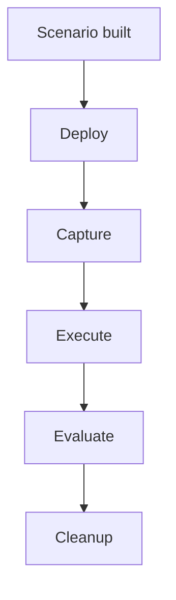

# Running Scenarios

This page focuses on how scenarios are executed (deploy → run → evaluate → cleanup), what artifacts you get back, and how that differs across runners.

For “just run something that works” commands, see [Running Examples](running-examples.md).

---

## Execution Flow (High Level)

When you run a built scenario via a deployer, the run follows the same shape:



- **Deploy**: provision infrastructure and start nodes (processes/containers/pods)
- **Capture**: establish clients/observability and capture initial state
- **Execute**: run workloads for the configured wall-clock duration
- **Evaluate**: run expectations (after the execution window ends)
- **Cleanup**: stop resources and finalize artifacts

---

## The Core API

```rust,ignore
use std::time::Duration;

use testing_framework_core::scenario::{Deployer as _, ScenarioBuilder};
use testing_framework_runner_local::LocalDeployer;
use testing_framework_workflows::ScenarioBuilderExt;

async fn run_once() -> anyhow::Result<()> {
    let mut scenario = ScenarioBuilder::topology_with(|t| t.network_star().nodes(3))
        .wallets(20)
        .transactions_with(|tx| tx.rate(1).users(5))
        .expect_consensus_liveness()
        .with_run_duration(Duration::from_secs(60))
        .build()?;

    let runner = LocalDeployer::default().deploy(&scenario).await?;
    runner.run(&mut scenario).await?;

    Ok(())
}
```

Notes:
- `with_run_duration(...)` is wall-clock time, not “number of blocks”.
- `.transactions_with(...)` rates are per-block.
- Most users should run scenarios via `scripts/run/run-examples.sh` unless they are embedding the framework in their own test crate.

---

## Runner Differences

### Local (Host) Runner

- **Best for**: fast iteration and debugging
- **Logs/state**: stored under a temporary run directory unless you set `LOGOS_BLOCKCHAIN_TESTS_KEEP_LOGS=1` and/or `LOGOS_BLOCKCHAIN_LOG_DIR=...`
- **Limitations**: no node-control capability (chaos workflows that require node control won’t work here)

Run the built-in local examples:

```bash
POL_PROOF_DEV_MODE=true \
scripts/run/run-examples.sh -t 60 -n 3 host
```

### Compose Runner

- **Best for**: reproducible multi-node environments and node control
- **Logs**: primarily via `docker compose logs` (and any node-level log configuration you apply)
- **Debugging**: set `COMPOSE_RUNNER_PRESERVE=1` to keep the environment up after a run

Run the built-in compose examples:

```bash
POL_PROOF_DEV_MODE=true \
scripts/run/run-examples.sh -t 60 -n 3 compose
```

### K8s Runner

- **Best for**: production-like behavior, cluster scheduling/networking
- **Logs**: `kubectl logs ...`
- **Debugging**: set `K8S_RUNNER_PRESERVE=1` and `K8S_RUNNER_NAMESPACE=...` to keep resources around

Run the built-in k8s examples:

```bash
POL_PROOF_DEV_MODE=true \
scripts/run/run-examples.sh -t 60 -n 3 k8s
```

---

## Artifacts & Where to Look

- **Node logs**: configure via `LOGOS_BLOCKCHAIN_LOG_DIR`, `LOGOS_BLOCKCHAIN_LOG_LEVEL`, `LOGOS_BLOCKCHAIN_LOG_FILTER` (see [Logging & Observability](logging-observability.md))
- **Runner logs**: controlled by `RUST_LOG` (runner process only)
- **Keep run directories**: set `LOGOS_BLOCKCHAIN_TESTS_KEEP_LOGS=1`
- **Compose environment preservation**: set `COMPOSE_RUNNER_PRESERVE=1`
- **K8s environment preservation**: set `K8S_RUNNER_PRESERVE=1`

---

## See Also

- [Scenario Lifecycle](scenario-lifecycle.md)
- [Running Examples](running-examples.md)
- [Troubleshooting Scenarios](troubleshooting.md)
