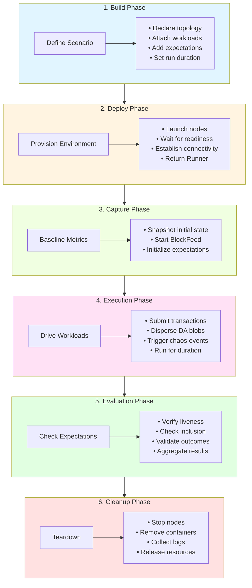

# Scenario Lifecycle

A scenario progresses through six distinct phases, each with a specific responsibility:

## Phase Details

### 1. Build the Plan

Declare a topology, attach workloads and expectations, and set the run window. The plan is the single source of truth for what will happen.

**Key actions:**
- Define cluster shape (validators, executors, network topology)
- Configure workloads (transaction rate, DA traffic, chaos patterns)
- Attach expectations (liveness, inclusion, custom checks)
- Set timing parameters (run duration, cooldown period)

**Output:** Immutable `Scenario` plan

### 2. Deploy

Hand the plan to a deployer. It provisions the environment on the chosen backend, waits for nodes to signal readiness, and returns a runner.

**Key actions:**
- Provision infrastructure (processes, containers, or pods)
- Launch validator and executor nodes
- Wait for readiness probes (HTTP endpoints respond)
- Establish node connectivity and metrics endpoints
- Spawn BlockFeed for real-time block observation

**Output:** `Runner` + `RunContext` (with node clients, metrics, control handles)

### 3. Capture Baseline

Expectations snapshot initial state before workloads begin.

**Key actions:**
- Record starting block height
- Initialize counters and trackers
- Subscribe to BlockFeed
- Capture baseline metrics

**Output:** Captured state for later comparison

### 4. Drive Workloads

The runner starts traffic and behaviors for the planned duration.

**Key actions:**
- Submit transactions at configured rates
- Disperse and sample DA blobs
- Trigger chaos events (node restarts, network partitions)
- Run concurrently for the specified duration
- Observe blocks and metrics in real-time

**Duration:** Controlled by `with_run_duration()`

### 5. Evaluate Expectations

Once activity stops (and optional cooldown completes), the runner checks liveness and workload-specific outcomes.

**Key actions:**
- Verify consensus liveness (minimum block production)
- Check transaction inclusion rates
- Validate DA dispersal and sampling
- Assess system recovery after chaos events
- Aggregate pass/fail results

**Output:** Success or detailed failure report

### 6. Cleanup

Tear down resources so successive runs start fresh and do not inherit leaked state.

**Key actions:**
- Stop all node processes/containers/pods
- Remove temporary directories and volumes
- Collect and archive logs (if `NOMOS_TESTS_KEEP_LOGS=1`)
- Release ports and network resources
- Cleanup observability stack (if spawned)

**Guarantee:** Runs even on panic via `CleanupGuard`
