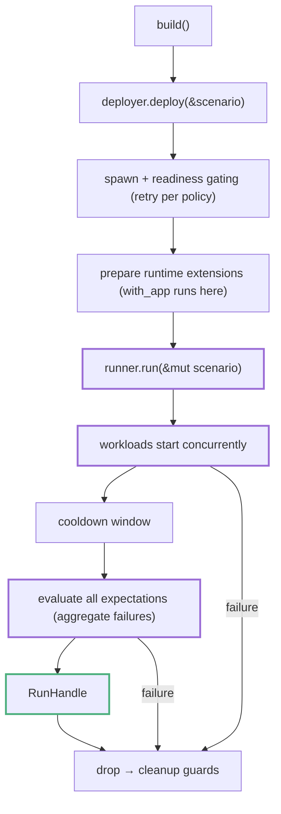

# Scenario Model and Lifecycle

A scenario records a topology, workloads, expectations, runtime settings, and deployment policy. The runner executes the phases described below.

---

## What a Scenario Is

You assemble a scenario with `ScenarioBuilder<E>` and hand it to a deployer. The essential ingredients:

| Ingredient | Builder method | Meaning |
|---|---|---|
| Topology | `with_deployment(...)` / `new(provider)` | Which nodes exist and how they relate |
| Workloads | `with_workload(...)` | Traffic and actions driven during the run |
| Expectations | `with_expectation(...)` | What success means, checked against the run |
| Duration | `with_run_duration(...)` | How long workloads get to run |
| Cooldown | `with_expectation_cooldown(...)` | Extra settle window before evaluation |
| Policy | `with_deployment_policy(...)` | Readiness gating, retries, artifact retention |

Because the whole plan is declared up front, `build()` can validate it and fail before any process is spawned.

Workloads implement `Workload<E>` (`name()`, `init(...)`, `async start(&self, ctx)`); expectations implement `Expectation<E>` (`start_capture`, optional `check_during_capture`, `evaluate`). A workload can also contribute its own expectations; `with_workload` collects them automatically. Both receive the shared `RunContext<E>`, which carries the deployment descriptor, node clients, telemetry, and typed runtime extensions. See [Workloads and Concurrency](workloads.md) and [Expectations and Evaluation](expectations.md).

---

## The Lifecycle



### 1. Build

`build()` finalizes the plan. It resolves the deployment from the topology provider (honoring `with_deployment_seed`), validates the source configuration (for example, external-only scenarios must declare at least one external node, and node control is rejected for uncontrolled external clusters), and calls `init` on every workload and expectation. Failures surface as `ScenarioBuildError` before anything is deployed.

**Note:** `build()` enforces a minimum run duration of 10 seconds and defaults the expectation cooldown to 10 seconds when you have not set one.

### 2. Deploy

`deployer.deploy(&scenario)` provisions the environment and returns a `Runner<E>`. For the local deployer this means spawning node processes, then **readiness gating**: each node's readiness probe (HTTP path or plain TCP, per the app) is retried until the policy's readiness requirement holds, with retry and backoff per `DeploymentPolicy`. Only after the cluster is ready are **runtime extensions** (typed services prepared once per run and handed to workloads, see [Runtime Extensions](runtime-extensions.md)) prepared; `with_app` deployments deploy at this point. Registering two extensions of the same type fails here with a "duplicate runtime extension type registered" error. Failure-path cleanup already applies at this stage through ownership: when deployment errors partway, partially deployed app resources are released as their handles drop, and spawned node processes stop when their process handles drop.

### 3. Run: workloads

`runner.run(&mut scenario)` first calls `start_capture` on every expectation, then spawns **all workloads concurrently**, each in its own task. Workload panics are caught and converted into workload errors instead of aborting the process. The run window lasts for the configured duration, during which the runner also ticks `check_during_capture` on every expectation once per second, so an expectation can fail during the run instead of waiting for final evaluation.

A workload returning early with `Ok(())` is fine; the window keeps running while other workloads are still active. The duration is a **maximum**: once every workload has finished, the window ends early and cooldown begins. A workload error ends the run immediately with `ScenarioError::Workload`.

### 4. Cooldown and settle

When the duration elapses, workloads are not cut off abruptly. The runner keeps the run alive through a **cooldown window** derived from `with_expectation_cooldown`; clusters whose lifecycle the framework owns get a 30-second minimum so restarted nodes and runtime extensions observe stabilized state. Remaining workload tasks are then drained, and a short settle wait (at least 2 seconds when a cooldown or node control is in play) runs before evaluation.

### 5. Evaluation

Every expectation's `evaluate` runs, including after another expectation fails. Failures are aggregated into one `ScenarioError::Expectations` report with one line per failed expectation.

### 6. Teardown

A successful run returns a `RunHandle<E>`. Teardown is guard-based. When the handle drops, its `CleanupGuard` chain runs, stopping node processes, aborting extension tasks, and executing app cleanup stacks (see [Handle Ownership and Teardown](handles-teardown.md)). The same guards run **on the failure path**: any step that errors inside `run` triggers immediate cleanup before the error is returned, so failed runs do not leak managed processes or temp directories.

```rust,ignore
let mut scenario = KvScenarioBuilder::deployment_with(|t| t)
    .with_run_duration(Duration::from_secs(30))
    .with_expectation_cooldown(Duration::from_secs(5))
    .with_workload(KvWriteWorkload::new().operations(300))
    .with_expectation(KvConverges::new("demo", 30))
    .build()?;

let deployer = KvLocalDeployer::default();
let runner = deployer.deploy(&scenario).await?;
let _handle = runner.run(&mut scenario).await?;
// dropping _handle tears the cluster down
```

Source: `testing-framework/core/src/scenario/runtime/runner.rs` and `runtime/context.rs`.

---

## Errors by Phase

| Phase | Error | Typical cause |
|---|---|---|
| Build | `ScenarioBuildError` | Bad source configuration, workload/expectation `init` failure |
| Deploy | Deployer error | Spawn failure, readiness timeout, duplicate extension, app deploy failure |
| Run | `ScenarioError::Workload` | Workload error or panic |
| Run | `ScenarioError::ExpectationFailedDuringCapture` | Fail-fast check tripped mid-run |
| Run | `ScenarioError::Expectations` | Aggregated end-of-run evaluation failures |

---

## Where to Go Next

- [Application, AppDeployment, and Environments](application-model.md): the type parameter behind `ScenarioBuilder<E>`.
- [Choosing an Entry Pattern](entry-patterns.md): the ways to reach this one lifecycle.
- [Readiness, Retry, and Artifact Preservation](deployment-policies.md): tuning the deploy phase.
- [Part III — Scenario Runtime](part-iii.md): workloads, expectations, and capabilities in depth.
