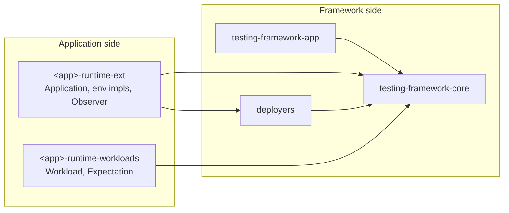

# Framework vs Application Boundaries

This chapter covers the rules that keep the framework application-agnostic and how they are enforced in practice.

[Ownership and Design Boundaries](boundaries.md) explains the ownership split. This chapter covers the concrete rules, enforcement mechanisms, and signs that code is in the wrong layer.

---

## The Rule

Dependencies point in exactly one direction: application repositories depend on framework crates, never the reverse. The framework knows applications only through the traits in [Public Extension Points](extension-points.md); everything app-specific (node configs, HTTP clients, readiness semantics, observers, workloads) lives in the application's own integration crates.

The in-repo `examples/` workspace models the application side: each app has an integration crate (`<app>-runtime-ext`) implementing `Application` and the per-backend environment traits, and a workloads crate (`<app>-runtime-workloads`) implementing `Workload` and `Expectation`. No framework crate names an example app in its `Cargo.toml`; see the dependency diagram in [Crate and API Map](crate-map.md).

Traits cross the boundary; concrete application types never do.

**What belongs where:**

| Concern | Framework | Application repo |
|---|---|---|
| Process supervision, port allocation, tempdirs, teardown ordering | yes | — |
| Scenario scheduling, expectations lifecycle, readiness/retry policy | yes | — |
| Observation runtime (cycles, history, failure tracking) | yes | — |
| `Application` impl, node config types, config rendering | — | yes |
| Domain node clients and typed app handles | — | yes |
| Readiness closures with domain semantics (leader elected, stream exists) | — | yes |
| `Observer` impls and their snapshot/event types | — | yes |
| Binary provider *configuration* (env var names, build commands) | — | yes |
| Config templates for a specific application | — | yes |

---

## Enforcement Mechanisms

**The type system.** The scenario engine is generic over `Application`, so core code physically cannot reference your node client or config, because there is no concrete type to name. The app layer goes further: `AppHostEnv` sets `NodeClient = ()` and its `build_node_client` returns an error, forcing application clients to travel as typed handles owned by the app side rather than leaking into the environment.

**Runtime registration errors.** Two rules are enforced with hard errors instead of silent replacement:

- Registering two runtime extension factories that produce the same type fails at prepare time with `duplicate runtime extension type registered: ...`. This is also why a scenario takes exactly one `with_app`; compose multiple apps inside one root `AppDeployment` instead.
- Exposing a handle twice under the same type and name fails with `app handle is already exposed: ...` (`AppDeployError::DuplicateHandle`).

**The boundary check script.** `scripts/run/check-boundaries.sh` guards the adopter side of the line. What it actually does:

- resolves a sibling adopter checkout at `../nomos-node/tests/testing_framework/lb-topology` and fails if it is missing;
- greps that crate's `src/` and `Cargo.toml` for extension-specific identifiers (`cfgsync`, `ComposeDeployEnv`, `K8sDeployEnv`, `runner-compose`, `runner-k8s`, `DEFAULT_CFGSYNC_PORT`, `DEFAULT_ASSETS_STACK_DIR`) and fails on any hit.

The same rule can be applied to other integration crates: a topology-level crate remains backend-agnostic, so references to a specific deployer or cfgsync internals are treated as violations. Backend names belong in the per-backend environment modules; compare `local_env.rs`, `compose_env.rs`, and `k8s_env.rs` in `examples/openraft_kv/testing/integration/src/`.

**Crate docs as contract.** `testing-framework-app` states the ownership boundary in its crate docs: implement `AppDeployment` in the application repository, compose children through `DeployContext`, and let handles own deployed resources. The `multi_app` README says the same from the other direction: for composed systems, prefer the app-layer shape "instead of building a fake outer cluster or adding app-specific code to TF".

---

## Signs Your Code Is on the Wrong Side

Symptoms that application code has leaked into the framework:

- A config template, launch flag, or port convention for one specific application sitting in `testing-framework/` or `cfgsync/`.
- A framework crate importing an example (or adopter) crate, or matching on an application name.
- A "generic" helper in core whose only caller is one app and whose parameters mirror that app's config fields.

Symptoms that framework mechanics are being re-implemented in the application repo:

- Hand-rolled process spawn/kill/teardown code where `LocalProcessApp` or `LocalAppCluster` would do.
- A custom polling loop with history and error tracking that duplicates the observation runtime; implement `Observer` instead.
- Re-implementing binary resolution, caching, or fallback chains instead of configuring `BinaryProvider` types.
- A bespoke "wait until cluster healthy" loop instead of readiness closures plus `DeploymentPolicy` (see [Readiness, Retry, and Artifact Preservation](deployment-policies.md)).

A framework addition should compile and make sense with a different application plugged in. Application-specific code belongs in the application repository.

---

## Backend Scope of the App Layer

The composition layer is local-only today, and this is visible in the dependency graph: `testing-framework-app` depends on core and `testing-framework-runner-local` only, `AppHostLocalDeployer` is an alias for `ProcessDeployer<AppHostEnv>`, and `DeployContext::deploy_local_cluster` / `LocalAppCluster` require `LocalDeployerEnv`. The compose and k8s deployers remain single-application. Do not work around this by teaching the framework about your app's containers: run composed stacks locally, and use the [Compose](deployer-compose.md) or [Kubernetes](deployer-k8s.md) deployer for uniform clusters. Details in [Backend Scope](app-backend-scope.md).
