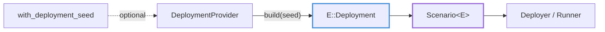

# Topology and Deployment Plans

This chapter explains how a scenario describes cluster shape and how a deployment provider turns that description into the concrete deployment the runner uses.

---

## DeploymentDescriptor

The core contract is defined in `testing-framework/core/src/topology/mod.rs`:

```rust,ignore
pub trait DeploymentDescriptor: Send + Sync {
    fn node_count(&self) -> usize;
}
```

Every `Application::Deployment` implements it. The scenario engine itself only needs the node count; everything richer (per-node configs, ids, network layout) belongs to the app's own deployment type and to the deployer that interprets it.

---

## Built-in Topology Types

The `topology` module ships a few concrete building blocks. Verify against `testing-framework/core/src/topology/`:

| Type | File | What it is |
|---|---|---|
| `ClusterTopology` | `simple.rs` | Uniform cluster of `node_count` indexed nodes; `node_indices()` returns `[0..n)` |
| `DeploymentPlan<TopologyShape, NodeConfig>` | `generated.rs` | Shape plus one `NodePlan` per node |
| `NodePlan<NodeConfig>` | `generated.rs` | `index`, a 32-byte `id`, and a `general` config value |
| `RuntimeTopology<Node>` | `generated.rs` | Runtime container of already-built node values |
| `SharedTopology<T>` | `generated.rs` | Alias for `Arc<T>` |
| `TopologyShapeBuilder` | `shape.rs` | Accumulates shape choices: `with_nodes(count)`, `with_star_network()`, read back via `node_count_or(fallback)` / `star_network_enabled()` |
| `DeploymentSeed` | `mod.rs` | 32-byte seed passed to providers (see [Seeds](seeds.md)) |

Every example app that runs as a uniform cluster aliases `ClusterTopology`:

```rust,ignore
pub type KvTopology = testing_framework_core::topology::ClusterTopology;

let topology = KvTopology::new(3); // 3 nodes, indices 0..3
```

`DeploymentPlan` and `NodePlan` implement `DeploymentDescriptor` too, for apps whose deployment must carry a prebuilt per-node config (`plans[i].general`) instead of deriving configs at spawn time. `TopologyShapeBuilder` and `DeploymentPlan` are available building blocks; the in-repo example apps currently build on `ClusterTopology` directly.

---

## Deployment Providers

A scenario does not have to hold a finished deployment. It holds a *provider*:

```rust,ignore
pub trait DeploymentProvider<D>: Send + Sync
where
    D: DeploymentDescriptor,
{
    fn build(&self, seed: Option<&DeploymentSeed>) -> Result<D, DynTopologyError>;
}
```

`FixedDeploymentProvider<D>` wraps a concrete deployment and clones it on every `build`, ignoring the seed. A custom provider can generate the deployment lazily: sized from the environment, randomized from the seed, or derived from an external inventory.

---

## Feeding the Builder

`ScenarioBuilder<E>` accepts a deployment in three ways (`core/src/scenario/definition/builder.rs`):

| Method | Use when |
|---|---|
| `ScenarioBuilder::with_deployment(deployment)` | You already have the concrete value; wraps it in `FixedDeploymentProvider` |
| `ScenarioBuilder::new(provider)` | You start from a boxed `DeploymentProvider` |
| `with_deployment_provider(provider)` | Replace the provider, keeping all accumulated builder state |
| `map_deployment_provider(f)` | Transform the current provider (wrap, decorate) without losing state |
| `with_deployment_seed(seed)` | Store a `DeploymentSeed` handed to the provider at build time |

Resolution happens once, inside `build()`: the builder calls `provider.build(seed)` and bakes the resulting deployment into the `Scenario`. Deployers and workloads then see a fixed descriptor for the rest of the run.



The typical example flow, from kvstore (`examples/kvstore/testing/integration/src/scenario.rs`):

```rust,ignore
pub trait KvBuilderExt: Sized {
    fn deployment_with(f: impl FnOnce(KvTopology) -> KvTopology) -> Self;
}

impl KvBuilderExt for KvScenarioBuilder {
    fn deployment_with(f: impl FnOnce(KvTopology) -> KvTopology) -> Self {
        KvScenarioBuilder::with_deployment(f(KvTopology::new(3)))
    }
}
```

`map_deployment_provider` and `with_deployment_provider` exist on all three builder forms (`ScenarioBuilder`, `NodeControlScenarioBuilder`, `ObservabilityScenarioBuilder`) and on the shared `CoreBuilderExt` used by app-specific builders. Wrapper builders can forward them through that shared extension.

---

## What the Deployment Does Downstream

- The **local deployer** reads `node_count()` and asks the environment to reserve ports and build one config per index; see [Ports, Peers, Node Config, and Readiness](node-config.md).
- The **container backends** iterate indices to produce per-node static artifacts delivered through cfgsync; see [Static Artifacts and cfgsync](cfgsync.md).
- **`ManualCluster`** treats the deployment as capacity: nodes are started on demand against the descriptor. See [ManualCluster](manual-cluster.md).
