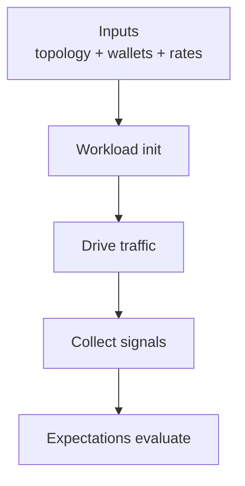

# Core Content: Workloads & Expectations

Workloads describe the activity a scenario generates; expectations describe the signals that must hold when that activity completes. This page is the **canonical reference** for all built-in workloads and expectations, including configuration knobs, defaults, prerequisites, and debugging guidance.

---

## Overview



**Key concepts:**
- **Workloads** run during the **execution phase** (generate traffic)
- **Expectations** run during the **evaluation phase** (check health signals)
- Each workload can attach its own expectations automatically
- Expectations can also be added explicitly

---

## Built-in Workloads

### 1. Transaction Workload

Submits user-level transactions at a configurable rate to exercise transaction processing and inclusion paths.

**Import:**
```rust,ignore
use testing_framework_workflows::workloads::transaction::Workload;
```

#### Configuration

| Parameter | Type | Default | Description |
|-----------|------|---------|-------------|
| `rate` | `u64` | **Required** | Transactions per block (not per second!) |
| `users` | `Option<usize>` | All wallets | Number of distinct wallet accounts to use |

#### DSL Usage

```rust,ignore
use testing_framework_workflows::ScenarioBuilderExt;

ScenarioBuilder::topology_with(|t| t.network_star().validators(3))
    .wallets(20)  // Seed 20 wallet accounts
    .transactions_with(|tx| {
        tx.rate(10)   // 10 transactions per block
          .users(5)   // Use only 5 of the 20 wallets
    })
    .with_run_duration(Duration::from_secs(60))
    .build();
```

#### Direct Instantiation

```rust,ignore
use testing_framework_workflows::workloads::transaction;

let tx_workload = transaction::Workload::with_rate(10)
    .expect("transaction rate must be non-zero");

ScenarioBuilder::topology_with(|t| t.network_star().validators(3))
    .wallets(20)
    .with_workload(tx_workload)
    .with_run_duration(Duration::from_secs(60))
    .build();
```

#### Prerequisites

1. **Wallet accounts must be seeded:**
   ```rust,ignore
   .wallets(N)  // Before .transactions_with()
   ```
   The workload will fail during `init()` if no wallets are configured.

2. **Proof generation must be fast:**
   ```bash
   export POL_PROOF_DEV_MODE=true
   ```
   Without this, proof generation takes ~30-60 seconds per transaction, causing timeouts.

3. **Circuit artifacts must be available:**
   - Automatically staged by `scripts/run/run-examples.sh`
   - Or manually via `scripts/setup/setup-circuits-stack.sh` (recommended) / `scripts/setup/setup-nomos-circuits.sh`

#### Attached Expectation

**TxInclusionExpectation** — Verifies that submitted transactions were included in blocks.

**What it checks:**
- At least `N` transactions were included on-chain (where N = rate × user count × expected block count)
- Uses BlockFeed to count transactions across all observed blocks

**Failure modes:**
- "Expected >= X transactions, observed Y" (Y < X)
- Common causes: proof generation timeouts, node crashes, insufficient duration

#### What Failure Looks Like

```text
Error: Expectation failed: TxInclusionExpectation
  Expected: >= 600 transactions (10 tx/block × 60 blocks)
  Observed: 127 transactions
  
  Possible causes:
  - POL_PROOF_DEV_MODE not set (proof generation too slow)
  - Duration too short (nodes still syncing)
  - Node crashes (check logs for panics/OOM)
  - Wallet accounts not seeded (check topology config)
```

**How to debug:**
1. Check logs for proof generation timing:
   ```bash
   grep "proof generation" $NOMOS_LOG_DIR/*/*.log
   ```
2. Verify `POL_PROOF_DEV_MODE=true` was set
3. Increase duration: `.with_run_duration(Duration::from_secs(120))`
4. Reduce rate: `.rate(5)` instead of `.rate(10)`

---

### 2. Data Availability (DA) Workload

Drives blob and channel activity to exercise data availability paths and storage.

**Import:**
```rust,ignore
use testing_framework_workflows::workloads::da::Workload;
```

#### Configuration

| Parameter | Type | Default | Description |
|-----------|------|---------|-------------|
| `blob_rate_per_block` | `NonZeroU64` | **Required** | Blobs to publish per block |
| `channel_rate_per_block` | `NonZeroU64` | **Required** | Channels to create per block |
| `headroom_percent` | `u64` | `20` | Extra capacity for channel planning (avoids saturation) |

#### DSL Usage

```rust,ignore
use testing_framework_workflows::ScenarioBuilderExt;

ScenarioBuilder::topology_with(|t| t.network_star().validators(3))
    .da_with(|da| {
        da.channel_rate(2)  // 2 channels per block
          .blob_rate(4)     // 4 blobs per block
    })
    .with_run_duration(Duration::from_secs(120))
    .build();
```

#### Direct Instantiation

```rust,ignore
use std::num::NonZeroU64;
use testing_framework_workflows::workloads::da;

let da_workload = da::Workload::with_rate(
    NonZeroU64::new(4).unwrap(),   // blob_rate_per_block
    NonZeroU64::new(2).unwrap(),   // channel_rate_per_block
    20,                            // headroom_percent
);

ScenarioBuilder::topology_with(|t| t.network_star().validators(3))
    .with_workload(da_workload)
    .with_run_duration(Duration::from_secs(120))
    .build();
```

#### Prerequisites

1. **Sufficient duration:**
   Channel creation and blob publishing are slower than transaction submission. Allow 120+ seconds.

2. **Circuit artifacts:**
   Same as transaction workload (POL_PROOF_DEV_MODE, circuits staged).

#### Attached Expectation

**DaWorkloadExpectation** — Verifies blobs and channels were created and published.

**What it checks:**
- At least `N` channels were created (where N = channel_rate × expected blocks)
- At least `M` blobs were published (where M = blob_rate × expected blocks × headroom)
- Uses BlockFeed API to verify

**Failure modes:**
- "Expected >= X channels, observed Y" (Y < X)
- "Expected >= X blobs, observed Y" (Y < X)
- Common causes: insufficient duration, DA saturation

#### What Failure Looks Like

```text
Error: Expectation failed: DaWorkloadExpectation
  Expected: >= 60 channels (2 channels/block × 30 blocks)
  Observed: 23 channels
  
  Possible causes:
  - Duration too short (channels still being created)
  - Blob publishing failed (check API errors)
  - Network issues (check validator connectivity)
```

**How to debug:**
1. Increase duration: `.with_run_duration(Duration::from_secs(180))`
2. Reduce rates: `.channel_rate(1).blob_rate(2)`

---

### 3. Chaos Workload (Random Restart)

Triggers controlled node restarts to test resilience and recovery behaviors.

**Import:**
```rust,ignore
use testing_framework_workflows::workloads::chaos::RandomRestartWorkload;
```

#### Configuration

| Parameter | Type | Default | Description |
|-----------|------|---------|-------------|
| `min_delay` | `Duration` | **Required** | Minimum time between restart attempts |
| `max_delay` | `Duration` | **Required** | Maximum time between restart attempts |
| `target_cooldown` | `Duration` | **Required** | Minimum time before restarting same node again |
| `include_validators` | `bool` | **Required** | Whether to restart validators |

#### Usage

```rust,ignore
use std::time::Duration;

use testing_framework_core::scenario::ScenarioBuilder;
use testing_framework_workflows::{ScenarioBuilderExt, workloads::chaos::RandomRestartWorkload};

let scenario = ScenarioBuilder::topology_with(|t| {
    t.network_star().validators(3)
})
.enable_node_control()  // REQUIRED for chaos
.with_workload(RandomRestartWorkload::new(
    Duration::from_secs(45),   // min_delay
    Duration::from_secs(75),   // max_delay
    Duration::from_secs(120),  // target_cooldown
    true,                      // include_validators
))
.expect_consensus_liveness()
.with_run_duration(Duration::from_secs(180))
.build();
```

#### Prerequisites

1. **Node control must be enabled:**
   ```rust,ignore
   .enable_node_control()
   ```
   This adds `NodeControlCapability` to the scenario.

2. **Runner must support node control:**
   - **Compose runner:** Supported
   - **Local runner:** Not supported
   - **K8s runner:** Not yet implemented

3. **Sufficient topology:**
   - For validators: Need >1 validator (workload skips if only 1)

4. **Realistic timing:**
   - Total duration should be 2-3× the max_delay + cooldown
   - Example: max_delay=75s, cooldown=120s → duration >= 180s

#### Attached Expectation

None. You must explicitly add expectations (typically `.expect_consensus_liveness()`).

**Why?** Chaos workloads are about testing recovery under disruption. The appropriate expectation depends on what you're testing:
- Consensus survives restarts → `.expect_consensus_liveness()`
- Height converges after chaos → Custom expectation checking BlockFeed

#### What Failure Looks Like

```text
Error: Workload failed: chaos_restart
  Cause: NodeControlHandle not available
  
  Possible causes:
  - Forgot .enable_node_control() in scenario builder
  - Using local runner (doesn't support node control)
  - Using k8s runner (doesn't support node control)
```

**Or:**

```text
Error: Expectation failed: ConsensusLiveness
  Expected: >= 20 blocks
  Observed: 8 blocks
  
  Possible causes:
  - Restart frequency too high (nodes can't recover)
  - Consensus timing too slow (increase duration)
  - Too many validators restarted simultaneously
  - Nodes crashed after restart (check logs)
```

**How to debug:**
1. Check restart events in logs:
   ```bash
   grep "restarting\|restart complete" $NOMOS_LOG_DIR/*/*.log
   ```
2. Verify node control is enabled:
   ```bash
   grep "NodeControlHandle" $NOMOS_LOG_DIR/*/*.log
   ```
3. Increase cooldown: `Duration::from_secs(180)`
4. Increase duration: `.with_run_duration(Duration::from_secs(300))`

---

## Built-in Expectations

### 1. Consensus Liveness

Verifies the system continues to produce blocks during the execution window.

**Import:**
```rust,ignore
use testing_framework_workflows::ScenarioBuilderExt;
```

#### DSL Usage

```rust,ignore
ScenarioBuilder::topology_with(|t| t.network_star().validators(3))
    .expect_consensus_liveness()
    .with_run_duration(Duration::from_secs(60))
    .build();
```

#### What It Checks

- At least `N` blocks were produced (where N = duration / expected_block_time)
- Uses BlockFeed to count observed blocks
- Compares against a minimum threshold (typically 50% of theoretical max)

#### Failure Modes

```text
Error: Expectation failed: ConsensusLiveness
  Expected: >= 30 blocks
  Observed: 3 blocks
  
  Possible causes:
  - Nodes crashed or never started (check logs)
  - Consensus timing misconfigured (CONSENSUS_SLOT_TIME too high)
  - Insufficient validators (need >= 2 for BFT consensus)
  - Duration too short (nodes still syncing)
```

#### How to Debug

1. Check if nodes started:
   ```bash
   grep "node started\|listening on" $NOMOS_LOG_DIR/*/*.log
   ```
2. Check block production:
   ```bash
   grep "block.*height" $NOMOS_LOG_DIR/validator-*/*.log
   ```
3. Check consensus participation:
   ```bash
   grep "consensus.*slot\|proposal" $NOMOS_LOG_DIR/validator-*/*.log
   ```
4. Increase duration: `.with_run_duration(Duration::from_secs(120))`
5. Check env vars: `echo $CONSENSUS_SLOT_TIME $CONSENSUS_ACTIVE_SLOT_COEFF`

---

### 2. Workload-Specific Expectations

Each workload automatically attaches its own expectation:

| Workload | Expectation | What It Checks |
|----------|-------------|----------------|
| Transaction | `TxInclusionExpectation` | Transactions were included in blocks |
| DA | `DaWorkloadExpectation` | Blobs and channels were created/published |
| Chaos | (None) | Add `.expect_consensus_liveness()` explicitly |

These expectations are added automatically when using the DSL (`.transactions_with()`, `.da_with()`).

---

## Configuration Quick Reference

### Transaction Workload

```rust,ignore
.wallets(20)
.transactions_with(|tx| tx.rate(10).users(5))
```

| What | Value | Unit |
|------|-------|------|
| Rate | 10 | tx/block |
| Users | 5 | wallet accounts |
| Wallets | 20 | total seeded |

### DA Workload

```rust,ignore
.da_with(|da| da.channel_rate(2).blob_rate(4))
```

| What | Value | Unit |
|------|-------|------|
| Channel rate | 2 | channels/block |
| Blob rate | 4 | blobs/block |
| Headroom | 20 | percent |

### Chaos Workload

```rust,ignore
.enable_node_control()
.with_workload(RandomRestartWorkload::new(
    Duration::from_secs(45),   // min
    Duration::from_secs(75),   // max
    Duration::from_secs(120),  // cooldown
    true,  // validators
))
```

---

## Common Patterns

### Pattern 1: Multiple Workloads

```rust,ignore
ScenarioBuilder::topology_with(|t| t.network_star().validators(3))
    .wallets(20)
    .transactions_with(|tx| tx.rate(5).users(10))
    .da_with(|da| da.channel_rate(2).blob_rate(2))
    .expect_consensus_liveness()
    .with_run_duration(Duration::from_secs(120))
    .build();
```

All workloads run concurrently. Expectations for each workload run after the execution window ends.

### Pattern 2: Custom Expectation

```rust,ignore
use testing_framework_core::scenario::Expectation;

struct MyCustomExpectation;

#[async_trait]
impl Expectation for MyCustomExpectation {
    async fn evaluate(&self, ctx: &RunContext) -> Result<(), DynError> {
        // Access BlockFeed, metrics, topology, etc.
        let block_count = ctx.block_feed()?.count();
        if block_count < 10 {
            return Err("Not enough blocks".into());
        }
        Ok(())
    }
}

ScenarioBuilder::topology_with(|t| t.network_star().validators(3))
    .with_expectation(MyCustomExpectation)
    .with_run_duration(Duration::from_secs(60))
    .build();
```

---

## Debugging Checklist

When a workload or expectation fails:

1. Check logs: `$NOMOS_LOG_DIR/*/` or `docker compose logs` or `kubectl logs`
2. Verify environment variables: `POL_PROOF_DEV_MODE`, `NOMOS_NODE_BIN`, etc.
3. Check prerequisites: wallets, node control, circuits
4. Increase duration: Double the run duration and retry
5. Reduce rates: Half the traffic rates and retry
6. Check metrics: Prometheus queries for block height, tx count, DA stats
7. Reproduce locally: Use local runner for faster iteration

---

## See Also

- **[Authoring Scenarios](authoring-scenarios.md)** — Step-by-step tutorial for building scenarios
- **[RunContext: BlockFeed & Node Control](node-control.md)** — Learn how to use BlockFeed in expectations and access node control
- **[Examples](examples.md)** — Concrete scenario patterns combining workloads and expectations
- **[Extending the Framework](extending.md)** — Implement custom workloads and expectations
- **[Troubleshooting](troubleshooting.md)** — Common failure scenarios and fixes
