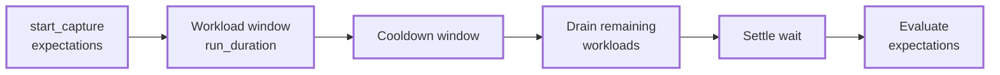

# Workloads and Concurrency

Workloads describe the activity a scenario generates: every workload runs as its own concurrent task against the shared `RunContext`, and the runner decides when the run window ends.

---

## The Workload Trait

A workload is any type implementing `Workload<E>` from `testing-framework-core` (`testing-framework/core/src/scenario/workload.rs`):

```rust,ignore
use async_trait::async_trait;
use testing_framework_core::scenario::{DynError, Expectation, RunContext, Workload};

#[async_trait]
pub trait Workload<E: Application>: Send + Sync {
    fn name(&self) -> &str;

    fn expectations(&self) -> Vec<Box<dyn Expectation<E>>> {
        Vec::new()
    }

    fn init(
        &mut self,
        _descriptors: &E::Deployment,
        _run_metrics: &RunMetrics,
    ) -> Result<(), DynError> {
        Ok(())
    }

    async fn start(&self, ctx: &RunContext<E>) -> Result<(), DynError>;
}
```

The trait methods are:
- **`name`** identifies the workload in logs and failure reports.
- **`expectations`** lets a workload attach its own checks. `with_workload` collects them into the scenario alongside explicitly added expectations (see [Expectations and Evaluation](expectations.md)).
- **`init`** runs synchronously at `build()` time, before anything is deployed. It receives the resolved deployment descriptors and the `RunMetrics` (run duration). A failing `init` aborts the build with a `WorkloadInit` error.
- **`start`** is the async body. It runs once per scenario run and must return when its work is done.

The runner schedules every workload and applies the same concurrency, panic capture, and run-window behavior described below.

Register workloads on any builder with `.with_workload(w)` or `.with_workload_boxed(boxed)`.

---

## How the Runner Executes Workloads

The runner (`testing-framework/core/src/scenario/runtime/runner.rs`) drives a run in fixed phases:


```mermaid
flowchart LR
    P[start_capture<br/>expectations]:::sc --> W[Workload window<br/>run_duration]:::sc
    W --> C[Cooldown window]:::sc
    C --> D[Drain remaining<br/>workloads]:::sc
    D --> S[Settle wait]:::sc
    S --> E[Evaluate<br/>expectations]:::sc

    classDef sc stroke:#9b6dd6,stroke-width:2.5px;
```

The runner uses the following concurrency rules:

- **All workloads run concurrently.** Each workload is spawned into its own Tokio task via a `JoinSet`; there is no ordering between them.
- **Panics become errors.** A panicking workload does not abort the process; the panic is caught and reported as `workload panicked: <message>`.
- **One failure fails the run.** The runner joins workload tasks as they finish. The first workload that returns `Err` (or panics) ends the run immediately with `ScenarioError::Workload`; expectations are not evaluated.
- **Finishing early ends the window early.** If every workload returns `Ok` before `with_run_duration` elapses, the workload phase completes without waiting out the timer.
- **The run duration sets the maximum workload window but does not cancel workloads.** When every workload finishes early, the window ends early and cooldown begins. When the timer expires while workloads are still running, the runner keeps driving them through the cooldown window and then *waits for them to finish* (`drain_workloads`). A workload that never returns blocks the run indefinitely.

Treat `with_run_duration` as the guaranteed run window, not as a workload timeout. A long-running workload should bound its own work, either by operation count or by reading `ctx.run_duration()` and stopping at the deadline.

After the workload window, managed deployments get a cooldown window (minimum 30 seconds when the framework owns the node lifecycle) plus a short settle wait so runtime extensions catch up before evaluation. Both are tuned with `with_expectation_cooldown`; see [Expectations and Evaluation](expectations.md).

---

## Worked Example: a Key/Value Write Workload

The kvstore example ships `KvWriteWorkload` (`examples/kvstore/testing/workloads/src/write.rs`), a rate-limited writer over the node HTTP clients:

```rust,ignore
use async_trait::async_trait;
use kvstore_runtime_ext::KvEnv;
use testing_framework_core::scenario::{DynError, RunContext, Workload};

#[async_trait]
impl Workload<KvEnv> for KvWriteWorkload {
    fn name(&self) -> &str {
        "kv_write_workload"
    }

    async fn start(&self, ctx: &RunContext<KvEnv>) -> Result<(), DynError> {
        let clients = ctx.node_clients().snapshot();
        let Some(leader) = clients.first() else {
            return Err("no kv node clients available".into());
        };

        for idx in 0..self.operations {
            let key = format!("{}-{}", self.key_prefix, idx % self.key_count);
            let response: PutResponse = leader
                .put(&format!("/kv/{key}"), &PutRequest { value: format!("value-{idx}"), expected_version: None })
                .await?;

            if !response.applied {
                return Err(format!("leader rejected write for key {key}").into());
            }

            if let Some(delay) = interval {
                tokio::time::sleep(delay).await;
            }
        }

        Ok(())
    }
}
```

This workload takes one client snapshot, runs a bounded number of operations, controls its rate with a sleep, and returns `Err` for an unexpected response so the runner stops the run.

The workload is bounded by `self.operations`, so it terminates on its own; the run duration only decides how long the scenario stays up around it.

---

## Accessing the RunContext

`RunContext<E>` (`testing-framework/core/src/scenario/runtime/context.rs`) gives a workload access to:

| Accessor | Returns | Use for |
|----------|---------|---------|
| `ctx.node_clients()` | `&NodeClients<E>` | Typed API clients for every node |
| `ctx.random_node_client()` | `Option<E::NodeClient>` | Spraying traffic across nodes |
| `ctx.cluster_client()` | `ClusterClient<'_, E>` | Fan-out queries over all clients |
| `ctx.descriptors()` | `&E::Deployment` | The resolved deployment plan |
| `ctx.run_duration()` | `Duration` | Bounding your own loop |
| `ctx.extension::<T>()` / `ctx.require_extension::<T>()` | `Option<T>` / `Result<T, _>` | Typed runtime extensions |
| `ctx.node_control()` | `Option<Arc<dyn NodeControlHandle<E>>>` | Restarting/stopping nodes |
| `ctx.telemetry()` | `&Metrics` | PromQL queries against external telemetry |

Notes on the client surface:

- `node_clients().snapshot()` clones the current client vector so you can iterate across `.await` points. Use `with_clients(|clients| ...)` for synchronous reads without the clone.
- `extension::<T>()` returns a *clone* of a value registered by a [runtime extension factory](runtime-extensions.md), for example an `ObservationHandle` from [Continuous Observation](observation.md).
- `node_control()` is only populated when the scenario was built with the node-control capability; see [Scenario Capabilities](capabilities.md) and [Chaos and Controlled Failure](chaos.md).

Workloads in app-layer scenarios additionally use `AppRunContextExt` (from `testing-framework-app`) to reach composed application handles:

```rust,ignore
use testing_framework_app::AppRunContextExt;

let cluster = ctx.require_app::<KvStoreCluster>()?;
```

`OpenRaftKvClusterAccessible` (`examples/openraft_kv/testing/workloads/src/handle_access.rs`) uses only `require_app` to assert that the exposed cluster handle matches the expected topology. See [AppHost and with_app](app-host.md) for the app layer itself.

---

## See Also

- [Expectations and Evaluation](expectations.md) — the checks that run after your traffic
- [Runtime Extensions](runtime-extensions.md) — sharing typed values with workloads
- [Chaos and Controlled Failure](chaos.md) — workloads that restart nodes
- [Continuous Observation](observation.md) — polling application state while workloads run
