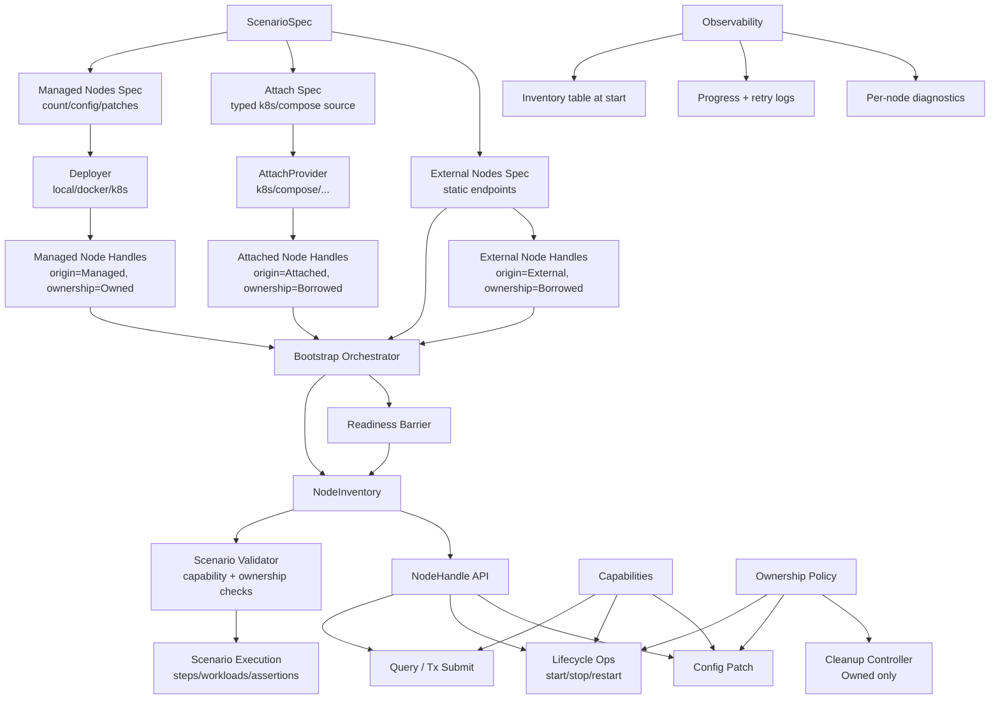
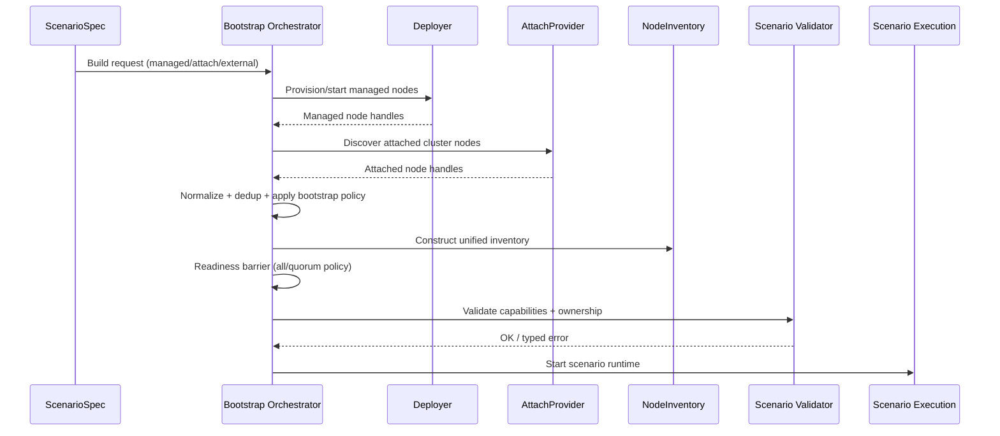

# External Network Integration Architecture (High-Level)

## Purpose

Extend the current testing framework without breaking existing scenarios:

- Keep existing managed deployer flow.
- Add optional support for attaching to existing clusters.
- Add optional support for explicit external nodes.
- Unify all nodes behind one runtime inventory and capability model.

## Architecture Diagram



## Component Responsibilities

- `ScenarioSpec`: declares managed, attached, and external node sources.
- `Deployer`: provisions nodes owned by the framework.
- `AttachProvider`: discovers pre-existing nodes from an external system.
- `External Nodes Spec`: explicit static endpoints for already-running nodes.
- `NodeInventory`: single runtime list of all nodes used by scenario steps.
- `NodeHandle`: unified node interface with origin, ownership, capabilities, and client.
- `Bootstrap Orchestrator`: coordinates provisioning, discovery, peer/bootstrap policy, and readiness.
- `Scenario Validator`: rejects unsupported operations before execution.
- `Cleanup Controller`: tears down only owned resources.

## Bootstrap Control Flow (Coordinator Responsibility)

`Bootstrap Orchestrator` owns deployment-time coordination:

1. Resolve `ScenarioSpec` inputs (`managed`, `attach`, `external`).
2. Ask `Deployer` to provision/start managed nodes.
3. Ask `AttachProvider` to discover attached nodes.
4. Normalize all outputs into `NodeHandle`s.
5. Merge into `NodeInventory` with stable IDs and dedup.
6. Apply bootstrap policy (seeds/peers/network join strategy).
7. Wait on readiness barrier (required nodes or quorum).
8. Run preflight validation (capability + ownership constraints).
9. Hand off to scenario execution.

### Bootstrap Flow Diagram



## Key Semantics

- Backward-compatible by default: managed-only scenarios work unchanged.
- `managed_count = 0` is valid for external-only or attach-only scenarios.
- Lifecycle and config patch operations are gated by capability + ownership.
- Steps operate on `NodeInventory`, not on deployer-specific logic.

## Ownership and Capability Model

- `Owned` nodes: may allow lifecycle and patch operations; included in cleanup.
- `Borrowed` nodes: default read-only lifecycle policy (query/submit only unless explicitly enabled).
- Capability checks happen before action execution and return typed, contextual errors.

## Manual Cluster Compatibility

Manual cluster mode maps naturally to the same model:

- If manual cluster starts processes itself: treat nodes as `Managed` + `Owned`.
- If manual cluster connects to existing nodes: treat nodes as `Attached/External` + `Borrowed`.

This keeps scenario logic reusable while preserving explicit safety boundaries.

## Critical Design Decisions To Lock Early

- **Identity/dedup rule**: define canonical node identity (peer id > endpoint) to prevent duplicate handles.
- **Bootstrap policy**: define how peers are selected across mixed sources (managed/attached/external).
- **Readiness semantics**: require all nodes, subset, or quorum; and per-step override rules.
- **Safety boundaries**: default deny lifecycle/patch operations for borrowed nodes.
- **Compatibility checks**: fail fast on incompatible network/genesis/protocol versions.
- **Failure policy**: decide when attach/discovery failures are fatal vs degradable.

## Recommended Default Policies

- **Node identity**: use `peer_id` as canonical key; fallback to `(host, port)` only when peer id is unavailable.
- **Dedup merge**: if same canonical identity appears from multiple sources, keep one handle and record all origins for diagnostics.
- **Bootstrap peers**: every managed node gets at least 2 seed peers from distinct origins when possible.
- **Readiness gate**: phase 1 default is `AllReady` (all known nodes must pass readiness). Keep policy extensible for `Quorum` and future `SourceAware` readiness.
- **Borrowed node safety**: lifecycle and config patch disabled by default for borrowed nodes; explicit opt-in required.
- **Compatibility preflight**: enforce matching chain/network id + protocol version before scenario start.
- **Failure handling**:
  - managed provisioning failure: fatal
  - attach discovery empty result: fatal if attach requested
  - partial attach discovery: warn + continue only if readiness quorum still satisfiable
- **Cleanup**: delete owned artifacts only; never mutate or delete borrowed node resources.

## Source Combination Modes

Use a typed source enum so invalid combinations are unrepresentable:

- `Managed { external }`: deployer-managed nodes with optional external overlays.
- `Attached { attach, external }`: attached cluster with optional external overlays.
- `ExternalOnly { external }`: explicit external-only mode.

Validation rules:

- `Managed` requires managed deployment to produce nodes (`managed_count > 0`).
- `Attached` requires managed deployment to produce zero nodes (`managed + attached` is disallowed).
- `ExternalOnly` requires non-empty `external` and zero managed nodes.

## Clean Codebase Layout (Recommended)

Use a layered module structure so responsibilities stay isolated.

### Module Map

```text
testing-framework/core/src/
  domain/
    scenario_spec.rs
    node_handle.rs
    node_inventory.rs
  bootstrap/
    orchestrator.rs
    readiness.rs
    validation.rs
  providers/
    deployer/
      mod.rs
      local.rs
      docker.rs
      k8s.rs
    attach/
      mod.rs
      static.rs
      k8s.rs
      compose.rs
  runtime/
    node_ops.rs
    scenario_runtime.rs
  errors/
    bootstrap.rs
    provider.rs
    validation.rs
```

### Layer Responsibilities

- `domain`: source-of-truth types and invariants (`ScenarioSpec`, `NodeHandle`, `NodeInventory`).
- `bootstrap`: deployment-time coordination flow, readiness barrier, and preflight checks.
- `providers/deployer`: create and control owned nodes.
- `providers/attach`: discover existing non-owned nodes.
- `runtime`: step-facing operations over `NodeInventory`.
- `errors`: typed errors grouped by layer for explicit failure context.

### Guardrails To Keep It Clean

- Steps/workloads must depend on `runtime` + `domain`, never on provider internals.
- `Deployer` and `AttachProvider` are adapters only; orchestration logic belongs in `bootstrap/orchestrator`.
- Capability and ownership checks run centrally in bootstrap/validation, not ad hoc in step code.
- Keep env/config parsing in one place; expose typed config downstream.
- Keep cleanup ownership-aware: only owned artifacts are mutable/deletable.

## Non-Breaking Changes To Start Now

These changes help future external-network support while preserving current public API behavior.

- Introduce internal `NodeHandle` + `NodeInventory` and route existing managed-only flow through them.
- Add `AttachProvider` trait internally with default no-op wiring (`None`), without exposing new required API.
- Add optional config/spec fields (`attach`, `external`, `readiness_policy`) with safe defaults.
- Centralize readiness and capability checks behind one internal validation entry point.
- Add internal node metadata (`origin`, `ownership`, `capabilities`) defaulted to managed semantics.
- Standardize node identity and dedup helpers (`peer_id` preferred, endpoint fallback).
- Keep current env vars/flags intact, but parse via a single typed config layer.
- Add a single source-orchestration match path (`ScenarioSources`) inside deployers; unsupported source modes fail fast with typed errors until attach/external registration lands.

## Open Risks and Required Clarifications

Before full rollout, lock these semantics explicitly:

- **Source enum precedence**: typed `ScenarioSources` variants are the primary control plane. Runtime counts validate, but never redefine, source intent.
- **Ownership conflict resolution**: define behavior when a deduped node appears from multiple sources with different ownership (for example, fail-fast by default; optional override if needed).
- **Source-aware readiness**: avoid quorum rules that can hide managed deployment failures. Require per-source readiness constraints (for example, minimum managed-ready + global quorum).
- **Readiness rollout**: phase 1 uses `AllReady`; later rollout can add `SourceAware` constraints once mixed-source behavior is validated.
- **Bootstrap mutation boundary**: peer/bootstrap policy mutates managed nodes only unless an attach provider explicitly supports controlled mutation.
- **Compatibility contract expansion**: preflight checks should include API/auth/genesis compatibility class, not only network/protocol identifiers.
- **Deterministic membership policy**: define strict vs degradable attach behavior so partial discovery does not silently change scenario semantics.
- **Step migration boundary**: after `NodeInventory` handoff, scenario steps must not read deployer-specific state directly.
